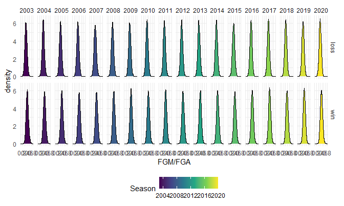
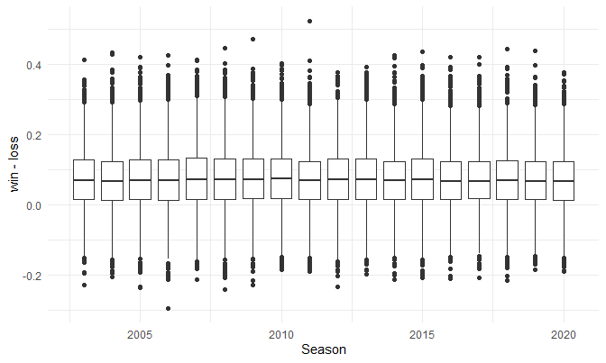
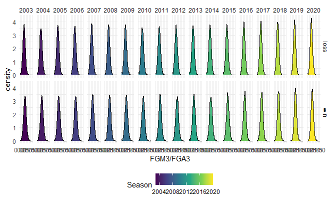
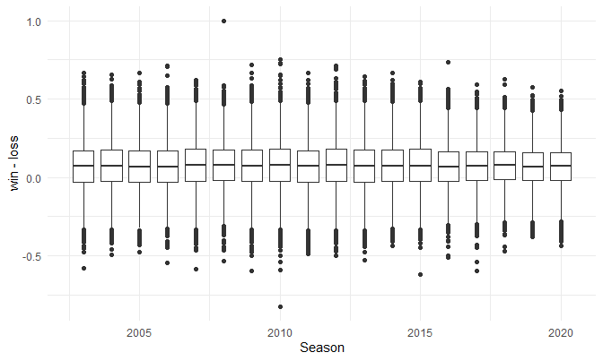

Predicting the Winner of 2021 D1 NCAA Basketball Tournament
================
David Nemirovsky
3/22/21

## **EDA**

``` r
season_df = 
  read_csv("./data/MRegularSeasonDetailedResults.csv") %>% 
  rowid_to_column("game_id") %>% 
  relocate(WLoc:NumOT, .after = DayNum) %>% 
  pivot_longer(
    WTeamID:LPF,
    names_to = "stat",
    values_to = "count"
  ) %>% 
  mutate(outcome = case_when(
    str_detect(stat, "^W") ~ "win", 
    str_detect(stat, "^L") ~ "loss"
  )) %>% 
  mutate(stat = substr(stat, 2, nchar(stat))) %>% 
  pivot_wider(
    names_from = stat,
    values_from = count
  ) %>% 
  unnest()

View(season_df)
```

``` r
# FG% Dist. per Season by W/L
season_df %>% 
  group_by(Season, outcome) %>% 
  ggplot(aes(x = FGM/FGA, fill = Season)) +
  geom_density() +  
  facet_grid(outcome ~ Season)
```



``` r
# FG% Difference Plot
season_df %>% 
  mutate(fg_pct = FGM/FGA) %>% 
  pivot_wider(
    names_from = outcome,
    values_from = fg_pct
  ) %>% 
  mutate(loss = lead(loss)) %>% 
  drop_na() %>% 
  ggplot(aes(x = Season, y = win - loss, group = Season)) +
  geom_boxplot()
```



``` r
# 3pt-FG% Dist. per Season by W/L
season_df %>% 
  group_by(Season, outcome) %>% 
  ggplot(aes(x = FGM3/FGA3, fill = Season)) +
  geom_density() +  
  facet_grid(outcome ~ Season)
```



``` r
# 3pt-FG% Difference Plot
season_df %>% 
  mutate(fg3_pct = FGM3/FGA3) %>% 
  pivot_wider(
    names_from = outcome,
    values_from = fg3_pct
  ) %>% 
  mutate(loss = lead(loss)) %>% 
  drop_na() %>% 
  ggplot(aes(x = Season, y = win - loss, group = Season)) +
  geom_boxplot()
```


