Predicting the Winner of 2021 D1 NCAA Basketball Tournament
================
David Nemirovsky
3/22/21

## **EDA**

  - Build data frames for exploratory data analysis and model
    construction:

<!-- end list -->

``` r
season_df = 
  read_csv("./data/MRegularSeasonDetailedResults.csv") %>% 
  rowid_to_column("game_id") %>% 
  relocate(WLoc:NumOT, .after = DayNum) %>% 
  pivot_longer(
    WTeamID:LPF,
    names_to = "stat",
    values_to = "count"
  ) %>% 
  mutate(outcome = case_when(
    str_detect(stat, "^W") ~ "win", 
    str_detect(stat, "^L") ~ "loss"
  )) %>% 
  mutate(stat = substr(stat, 2, nchar(stat))) %>% 
  pivot_wider(
    names_from = stat,
    values_from = count
  ) %>% 
  mutate(TeamID = as.factor(TeamID)) %>% 
  filter(Season > 2014) %>% 
  mutate(
    Season = as.factor(Season), 
    outcome = as.factor(outcome), 
    fg_pct = FGM/FGA, 
    fg3_pct = FGM3/FGA3, 
    ft_pct = FTM/FTA) %>% 
  select(-(FGM:FTA)) %>% 
  unnest()

opp_df = 
  season_df %>% 
  group_by(game_id) %>% 
  arrange(outcome, .by_group = T) %>% 
  ungroup() %>% 
  select(OR:ft_pct) %>% 
  rename_all(~paste0("opp", .x))

train_df = 
  season_df %>% 
  cbind(opp_df) %>% 
  as_tibble() %>% 
  mutate(
    OR_diff = OR - oppOR,
    DR_diff = DR - oppDR,
    Ast_diff = Ast - oppAst,
    TO_diff = TO - oppTO,
    Stl_diff = Stl - oppStl,
    Blk_diff = Blk - oppBlk,
    PF_diff = PF - oppPF,
    FGpct_diff = fg_pct - oppfg_pct,
    FG3pct_diff = fg3_pct - oppfg3_pct,
    FTpct_diff = ft_pct - oppft_pct
  ) %>% 
  select(Season, outcome, TeamID, OR_diff:FTpct_diff)

tourney_df = 
  read_csv("./data/MNCAATourneyDetailedResults.csv") %>% 
  rowid_to_column("game_id") %>% 
  relocate(WLoc:NumOT, .after = DayNum) %>% 
  pivot_longer(
    WTeamID:LPF,
    names_to = "stat",
    values_to = "count"
  ) %>% 
  mutate(outcome = case_when(
    str_detect(stat, "^W") ~ "win", 
    str_detect(stat, "^L") ~ "loss"
  )) %>% 
  mutate(stat = substr(stat, 2, nchar(stat))) %>% 
  pivot_wider(
    names_from = stat,
    values_from = count
  ) %>% 
  mutate(TeamID = as.factor(TeamID)) %>% 
  filter(Season > 2014) %>% 
  mutate(
    Season = as.factor(Season), 
    outcome = as.factor(outcome), 
    fg_pct = FGM/FGA, 
    fg3_pct = FGM3/FGA3, 
    ft_pct = FTM/FTA) %>% 
  select(-(FGM:FTA)) %>% 
  unnest()

opp_tourney = 
  tourney_df %>% 
  group_by(game_id) %>% 
  arrange(outcome, .by_group = T) %>% 
  ungroup() %>% 
  select(OR:ft_pct) %>% 
  rename_all(~paste0("opp", .x))

test_df = 
  tourney_df %>% 
  cbind(opp_tourney) %>% 
  as_tibble() %>% 
  mutate(
    OR_diff = OR - oppOR,
    DR_diff = DR - oppDR,
    Ast_diff = Ast - oppAst,
    TO_diff = TO - oppTO,
    Stl_diff = Stl - oppStl,
    Blk_diff = Blk - oppBlk,
    PF_diff = PF - oppPF,
    FGpct_diff = fg_pct - oppfg_pct,
    FG3pct_diff = fg3_pct - oppfg3_pct,
    FTpct_diff = ft_pct - oppft_pct
  ) %>% 
  select(Season, outcome, TeamID, OR_diff:FTpct_diff)

total_games_df = 
  season_df %>% 
  group_by(Season, TeamID) %>% 
  summarize(n_games = n())

win_pct_df = 
  season_df %>% 
  group_by(Season, TeamID) %>% 
  filter(outcome == "win") %>% 
  summarize(n_wins = n()) %>% 
  left_join(total_games_df) %>% 
  mutate(win_pct = n_wins/n_games)

regstats_df = 
  season_df %>% 
  select(Season, TeamID, OR:ft_pct) %>% 
  group_by(Season, TeamID) %>% 
  summarize_at(vars(OR:ft_pct), ~mean(.x))

regszn_df = 
  win_pct_df %>% 
  left_join(regstats_df) %>% 
  drop_na() %>% 
  group_split(Season)
```

  - Scatter plots of win probability across different seasonal stats:

<!-- end list -->

``` r
x = model.matrix(win_pct ~ ., regszn_df[[1]] %>% dplyr::select(-(Season:n_games)))[ ,-1]
y = regszn_df[[1]]$win_pct

theme1 = trellis.par.get()
theme1$plot.symbol$col = rgb(.2, .4, .2, .5)
theme1$plot.symbol$pch = 16
theme1$plot.line$col = rgb(.8, .1, .1, 1)
theme1$plot.line$lwd = 2
theme1$strip.background$col = rgb(.0, .2, .6, .2)
trellis.par.set(theme1)
featurePlot(x, y, plot = "scatter", labels = c("", "Win %"), type = c("p"), layout = c(5, 2))
```

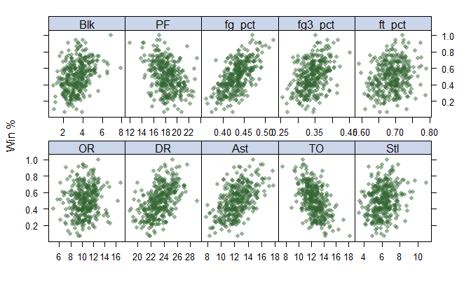

  - Distributions of game stat differences, grouped by outcome:

<!-- end list -->

``` r
featurePlot(x = train_df[, 4:13], 
            y = train_df$outcome,
            scales = list(x = list(relation = "free"), 
                          y = list(relation = "free")),
            plot = "box", 
            auto.key = list(columns = 2))
```

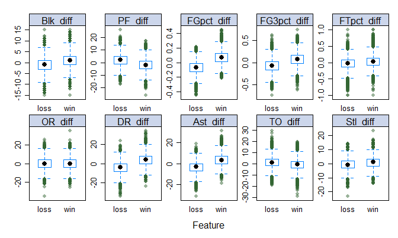

  - Test three different models (simple logistic regression, MARS, and
    KNN) using 10-fold cross-validation:

<!-- end list -->

``` r
set.seed(37564)

ctrl = trainControl(method = "cv", summaryFunction = twoClassSummary, classProbs = T, number = 10)

mods_df = 
  tibble(Year = c(2015:2020)) %>% 
  mutate(train = map(.x = Year, ~filter(train_df, Season == .x)), 
         test = map(.x = Year, ~filter(test_df, Season == .x))) %>% 
  mutate(mod_glm = map(.x = train, ~train(outcome ~ . -Season -TeamID,
                                       na.action = na.exclude, 
                                       data = .x, 
                                       method = "glm", 
                                       family = "binomial", 
                                       metric = "ROC", 
                                       trControl = ctrl)), 
         mod_mars = map(.x = train, ~train(outcome ~ . -Season -TeamID,
                                       na.action = na.exclude, 
                                       data = .x, 
                                       method = "earth",
                                       tuneGrid = expand.grid(degree = 1, nprune = 13:20), 
                                       metric = "ROC", 
                                       trControl = ctrl)), 
         mod_knn = map(.x = train, ~train(outcome ~ . -Season -TeamID,
                                       na.action = na.exclude, 
                                       data = .x, 
                                       method = "knn",
                                       metric = "ROC", 
                                       preProcess = c("center","scale"),
                                       tuneGrid = data.frame(k = seq(30, 80, by = 5)),
                                       trControl = ctrl)))
```

    ## Warning: Problem with `mutate()` input `mod_glm`.
    ## i glm.fit: fitted probabilities numerically 0 or 1 occurred
    ## i Input `mod_glm` is `map(...)`.

    ## Warning: glm.fit: fitted probabilities numerically 0 or 1 occurred

    ## Warning: Problem with `mutate()` input `mod_glm`.
    ## i glm.fit: fitted probabilities numerically 0 or 1 occurred
    ## i Input `mod_glm` is `map(...)`.

    ## Warning: glm.fit: fitted probabilities numerically 0 or 1 occurred

    ## Warning: Problem with `mutate()` input `mod_glm`.
    ## i glm.fit: fitted probabilities numerically 0 or 1 occurred
    ## i Input `mod_glm` is `map(...)`.

    ## Warning: glm.fit: fitted probabilities numerically 0 or 1 occurred

    ## Warning: Problem with `mutate()` input `mod_glm`.
    ## i glm.fit: fitted probabilities numerically 0 or 1 occurred
    ## i Input `mod_glm` is `map(...)`.

    ## Warning: glm.fit: fitted probabilities numerically 0 or 1 occurred

    ## Warning: Problem with `mutate()` input `mod_glm`.
    ## i glm.fit: fitted probabilities numerically 0 or 1 occurred
    ## i Input `mod_glm` is `map(...)`.

    ## Warning: glm.fit: fitted probabilities numerically 0 or 1 occurred

    ## Warning: Problem with `mutate()` input `mod_glm`.
    ## i glm.fit: fitted probabilities numerically 0 or 1 occurred
    ## i Input `mod_glm` is `map(...)`.

    ## Warning: glm.fit: fitted probabilities numerically 0 or 1 occurred

    ## Warning: Problem with `mutate()` input `mod_glm`.
    ## i glm.fit: fitted probabilities numerically 0 or 1 occurred
    ## i Input `mod_glm` is `map(...)`.

    ## Warning: glm.fit: fitted probabilities numerically 0 or 1 occurred

    ## Warning: Problem with `mutate()` input `mod_glm`.
    ## i glm.fit: fitted probabilities numerically 0 or 1 occurred
    ## i Input `mod_glm` is `map(...)`.

    ## Warning: glm.fit: fitted probabilities numerically 0 or 1 occurred

    ## Warning: Problem with `mutate()` input `mod_glm`.
    ## i glm.fit: fitted probabilities numerically 0 or 1 occurred
    ## i Input `mod_glm` is `map(...)`.

    ## Warning: glm.fit: fitted probabilities numerically 0 or 1 occurred

    ## Warning: Problem with `mutate()` input `mod_glm`.
    ## i glm.fit: fitted probabilities numerically 0 or 1 occurred
    ## i Input `mod_glm` is `map(...)`.

    ## Warning: glm.fit: fitted probabilities numerically 0 or 1 occurred

    ## Warning: Problem with `mutate()` input `mod_glm`.
    ## i glm.fit: fitted probabilities numerically 0 or 1 occurred
    ## i Input `mod_glm` is `map(...)`.

    ## Warning: glm.fit: fitted probabilities numerically 0 or 1 occurred

    ## Warning: Problem with `mutate()` input `mod_glm`.
    ## i glm.fit: fitted probabilities numerically 0 or 1 occurred
    ## i Input `mod_glm` is `map(...)`.

    ## Warning: glm.fit: fitted probabilities numerically 0 or 1 occurred

    ## Warning: Problem with `mutate()` input `mod_glm`.
    ## i glm.fit: fitted probabilities numerically 0 or 1 occurred
    ## i Input `mod_glm` is `map(...)`.

    ## Warning: glm.fit: fitted probabilities numerically 0 or 1 occurred

    ## Warning: Problem with `mutate()` input `mod_glm`.
    ## i glm.fit: fitted probabilities numerically 0 or 1 occurred
    ## i Input `mod_glm` is `map(...)`.

    ## Warning: glm.fit: fitted probabilities numerically 0 or 1 occurred

    ## Warning: Problem with `mutate()` input `mod_glm`.
    ## i glm.fit: fitted probabilities numerically 0 or 1 occurred
    ## i Input `mod_glm` is `map(...)`.

    ## Warning: glm.fit: fitted probabilities numerically 0 or 1 occurred

    ## Warning: Problem with `mutate()` input `mod_glm`.
    ## i glm.fit: fitted probabilities numerically 0 or 1 occurred
    ## i Input `mod_glm` is `map(...)`.

    ## Warning: glm.fit: fitted probabilities numerically 0 or 1 occurred

    ## Warning: Problem with `mutate()` input `mod_glm`.
    ## i glm.fit: fitted probabilities numerically 0 or 1 occurred
    ## i Input `mod_glm` is `map(...)`.

    ## Warning: glm.fit: fitted probabilities numerically 0 or 1 occurred

    ## Warning: Problem with `mutate()` input `mod_glm`.
    ## i glm.fit: fitted probabilities numerically 0 or 1 occurred
    ## i Input `mod_glm` is `map(...)`.

    ## Warning: glm.fit: fitted probabilities numerically 0 or 1 occurred

    ## Warning: Problem with `mutate()` input `mod_glm`.
    ## i glm.fit: fitted probabilities numerically 0 or 1 occurred
    ## i Input `mod_glm` is `map(...)`.

    ## Warning: glm.fit: fitted probabilities numerically 0 or 1 occurred

    ## Warning: Problem with `mutate()` input `mod_glm`.
    ## i glm.fit: fitted probabilities numerically 0 or 1 occurred
    ## i Input `mod_glm` is `map(...)`.

    ## Warning: glm.fit: fitted probabilities numerically 0 or 1 occurred

    ## Warning: Problem with `mutate()` input `mod_glm`.
    ## i glm.fit: fitted probabilities numerically 0 or 1 occurred
    ## i Input `mod_glm` is `map(...)`.

    ## Warning: glm.fit: fitted probabilities numerically 0 or 1 occurred

    ## Warning: Problem with `mutate()` input `mod_glm`.
    ## i glm.fit: fitted probabilities numerically 0 or 1 occurred
    ## i Input `mod_glm` is `map(...)`.

    ## Warning: glm.fit: fitted probabilities numerically 0 or 1 occurred

    ## Warning: Problem with `mutate()` input `mod_glm`.
    ## i glm.fit: fitted probabilities numerically 0 or 1 occurred
    ## i Input `mod_glm` is `map(...)`.

    ## Warning: glm.fit: fitted probabilities numerically 0 or 1 occurred

    ## Warning: Problem with `mutate()` input `mod_glm`.
    ## i glm.fit: fitted probabilities numerically 0 or 1 occurred
    ## i Input `mod_glm` is `map(...)`.

    ## Warning: glm.fit: fitted probabilities numerically 0 or 1 occurred

    ## Warning: Problem with `mutate()` input `mod_glm`.
    ## i glm.fit: fitted probabilities numerically 0 or 1 occurred
    ## i Input `mod_glm` is `map(...)`.

    ## Warning: glm.fit: fitted probabilities numerically 0 or 1 occurred

    ## Warning: Problem with `mutate()` input `mod_glm`.
    ## i glm.fit: fitted probabilities numerically 0 or 1 occurred
    ## i Input `mod_glm` is `map(...)`.

    ## Warning: glm.fit: fitted probabilities numerically 0 or 1 occurred

    ## Warning: Problem with `mutate()` input `mod_glm`.
    ## i glm.fit: fitted probabilities numerically 0 or 1 occurred
    ## i Input `mod_glm` is `map(...)`.

    ## Warning: glm.fit: fitted probabilities numerically 0 or 1 occurred

    ## Warning: Problem with `mutate()` input `mod_glm`.
    ## i glm.fit: fitted probabilities numerically 0 or 1 occurred
    ## i Input `mod_glm` is `map(...)`.

    ## Warning: glm.fit: fitted probabilities numerically 0 or 1 occurred

    ## Warning: Problem with `mutate()` input `mod_glm`.
    ## i glm.fit: fitted probabilities numerically 0 or 1 occurred
    ## i Input `mod_glm` is `map(...)`.

    ## Warning: glm.fit: fitted probabilities numerically 0 or 1 occurred

    ## Warning: Problem with `mutate()` input `mod_glm`.
    ## i glm.fit: fitted probabilities numerically 0 or 1 occurred
    ## i Input `mod_glm` is `map(...)`.

    ## Warning: glm.fit: fitted probabilities numerically 0 or 1 occurred

    ## Warning: Problem with `mutate()` input `mod_glm`.
    ## i glm.fit: fitted probabilities numerically 0 or 1 occurred
    ## i Input `mod_glm` is `map(...)`.

    ## Warning: glm.fit: fitted probabilities numerically 0 or 1 occurred

    ## Warning: Problem with `mutate()` input `mod_glm`.
    ## i glm.fit: fitted probabilities numerically 0 or 1 occurred
    ## i Input `mod_glm` is `map(...)`.

    ## Warning: glm.fit: fitted probabilities numerically 0 or 1 occurred

    ## Warning: Problem with `mutate()` input `mod_glm`.
    ## i glm.fit: fitted probabilities numerically 0 or 1 occurred
    ## i Input `mod_glm` is `map(...)`.

    ## Warning: glm.fit: fitted probabilities numerically 0 or 1 occurred

    ## Warning: Problem with `mutate()` input `mod_glm`.
    ## i glm.fit: fitted probabilities numerically 0 or 1 occurred
    ## i Input `mod_glm` is `map(...)`.

    ## Warning: glm.fit: fitted probabilities numerically 0 or 1 occurred

    ## Warning: Problem with `mutate()` input `mod_glm`.
    ## i glm.fit: fitted probabilities numerically 0 or 1 occurred
    ## i Input `mod_glm` is `map(...)`.

    ## Warning: glm.fit: fitted probabilities numerically 0 or 1 occurred

    ## Warning: Problem with `mutate()` input `mod_glm`.
    ## i glm.fit: fitted probabilities numerically 0 or 1 occurred
    ## i Input `mod_glm` is `map(...)`.

    ## Warning: glm.fit: fitted probabilities numerically 0 or 1 occurred

    ## Warning: Problem with `mutate()` input `mod_glm`.
    ## i glm.fit: fitted probabilities numerically 0 or 1 occurred
    ## i Input `mod_glm` is `map(...)`.

    ## Warning: glm.fit: fitted probabilities numerically 0 or 1 occurred

    ## Warning: Problem with `mutate()` input `mod_glm`.
    ## i glm.fit: fitted probabilities numerically 0 or 1 occurred
    ## i Input `mod_glm` is `map(...)`.

    ## Warning: glm.fit: fitted probabilities numerically 0 or 1 occurred

    ## Warning: Problem with `mutate()` input `mod_glm`.
    ## i glm.fit: fitted probabilities numerically 0 or 1 occurred
    ## i Input `mod_glm` is `map(...)`.

    ## Warning: glm.fit: fitted probabilities numerically 0 or 1 occurred

    ## Warning: Problem with `mutate()` input `mod_glm`.
    ## i glm.fit: fitted probabilities numerically 0 or 1 occurred
    ## i Input `mod_glm` is `map(...)`.

    ## Warning: glm.fit: fitted probabilities numerically 0 or 1 occurred

    ## Warning: Problem with `mutate()` input `mod_glm`.
    ## i glm.fit: fitted probabilities numerically 0 or 1 occurred
    ## i Input `mod_glm` is `map(...)`.

    ## Warning: glm.fit: fitted probabilities numerically 0 or 1 occurred

    ## Warning: Problem with `mutate()` input `mod_glm`.
    ## i glm.fit: fitted probabilities numerically 0 or 1 occurred
    ## i Input `mod_glm` is `map(...)`.

    ## Warning: glm.fit: fitted probabilities numerically 0 or 1 occurred

    ## Warning: Problem with `mutate()` input `mod_glm`.
    ## i glm.fit: fitted probabilities numerically 0 or 1 occurred
    ## i Input `mod_glm` is `map(...)`.

    ## Warning: glm.fit: fitted probabilities numerically 0 or 1 occurred

    ## Warning: Problem with `mutate()` input `mod_glm`.
    ## i glm.fit: fitted probabilities numerically 0 or 1 occurred
    ## i Input `mod_glm` is `map(...)`.

    ## Warning: glm.fit: fitted probabilities numerically 0 or 1 occurred

    ## Warning: Problem with `mutate()` input `mod_glm`.
    ## i glm.fit: fitted probabilities numerically 0 or 1 occurred
    ## i Input `mod_glm` is `map(...)`.

    ## Warning: glm.fit: fitted probabilities numerically 0 or 1 occurred

    ## Warning: Problem with `mutate()` input `mod_glm`.
    ## i glm.fit: fitted probabilities numerically 0 or 1 occurred
    ## i Input `mod_glm` is `map(...)`.

    ## Warning: glm.fit: fitted probabilities numerically 0 or 1 occurred

    ## Warning: Problem with `mutate()` input `mod_glm`.
    ## i glm.fit: fitted probabilities numerically 0 or 1 occurred
    ## i Input `mod_glm` is `map(...)`.

    ## Warning: glm.fit: fitted probabilities numerically 0 or 1 occurred

    ## Warning: Problem with `mutate()` input `mod_glm`.
    ## i glm.fit: fitted probabilities numerically 0 or 1 occurred
    ## i Input `mod_glm` is `map(...)`.

    ## Warning: glm.fit: fitted probabilities numerically 0 or 1 occurred

    ## Warning: Problem with `mutate()` input `mod_glm`.
    ## i glm.fit: fitted probabilities numerically 0 or 1 occurred
    ## i Input `mod_glm` is `map(...)`.

    ## Warning: glm.fit: fitted probabilities numerically 0 or 1 occurred

    ## Warning: Problem with `mutate()` input `mod_glm`.
    ## i glm.fit: fitted probabilities numerically 0 or 1 occurred
    ## i Input `mod_glm` is `map(...)`.

    ## Warning: glm.fit: fitted probabilities numerically 0 or 1 occurred

    ## Warning: Problem with `mutate()` input `mod_glm`.
    ## i glm.fit: fitted probabilities numerically 0 or 1 occurred
    ## i Input `mod_glm` is `map(...)`.

    ## Warning: glm.fit: fitted probabilities numerically 0 or 1 occurred

    ## Warning: Problem with `mutate()` input `mod_glm`.
    ## i glm.fit: fitted probabilities numerically 0 or 1 occurred
    ## i Input `mod_glm` is `map(...)`.

    ## Warning: glm.fit: fitted probabilities numerically 0 or 1 occurred

    ## Warning: Problem with `mutate()` input `mod_glm`.
    ## i glm.fit: fitted probabilities numerically 0 or 1 occurred
    ## i Input `mod_glm` is `map(...)`.

    ## Warning: glm.fit: fitted probabilities numerically 0 or 1 occurred

    ## Warning: Problem with `mutate()` input `mod_glm`.
    ## i glm.fit: fitted probabilities numerically 0 or 1 occurred
    ## i Input `mod_glm` is `map(...)`.

    ## Warning: glm.fit: fitted probabilities numerically 0 or 1 occurred

    ## Warning: Problem with `mutate()` input `mod_glm`.
    ## i glm.fit: fitted probabilities numerically 0 or 1 occurred
    ## i Input `mod_glm` is `map(...)`.

    ## Warning: glm.fit: fitted probabilities numerically 0 or 1 occurred

    ## Warning: Problem with `mutate()` input `mod_glm`.
    ## i glm.fit: fitted probabilities numerically 0 or 1 occurred
    ## i Input `mod_glm` is `map(...)`.

    ## Warning: glm.fit: fitted probabilities numerically 0 or 1 occurred

    ## Warning: Problem with `mutate()` input `mod_glm`.
    ## i glm.fit: fitted probabilities numerically 0 or 1 occurred
    ## i Input `mod_glm` is `map(...)`.

    ## Warning: glm.fit: fitted probabilities numerically 0 or 1 occurred

    ## Warning: Problem with `mutate()` input `mod_glm`.
    ## i glm.fit: fitted probabilities numerically 0 or 1 occurred
    ## i Input `mod_glm` is `map(...)`.

    ## Warning: glm.fit: fitted probabilities numerically 0 or 1 occurred

    ## Warning: Problem with `mutate()` input `mod_glm`.
    ## i glm.fit: fitted probabilities numerically 0 or 1 occurred
    ## i Input `mod_glm` is `map(...)`.

    ## Warning: glm.fit: fitted probabilities numerically 0 or 1 occurred

    ## Warning: Problem with `mutate()` input `mod_glm`.
    ## i glm.fit: fitted probabilities numerically 0 or 1 occurred
    ## i Input `mod_glm` is `map(...)`.

    ## Warning: glm.fit: fitted probabilities numerically 0 or 1 occurred

    ## Warning: Problem with `mutate()` input `mod_glm`.
    ## i glm.fit: fitted probabilities numerically 0 or 1 occurred
    ## i Input `mod_glm` is `map(...)`.

    ## Warning: glm.fit: fitted probabilities numerically 0 or 1 occurred

    ## Warning: Problem with `mutate()` input `mod_glm`.
    ## i glm.fit: fitted probabilities numerically 0 or 1 occurred
    ## i Input `mod_glm` is `map(...)`.

    ## Warning: glm.fit: fitted probabilities numerically 0 or 1 occurred

    ## Warning: Problem with `mutate()` input `mod_glm`.
    ## i glm.fit: fitted probabilities numerically 0 or 1 occurred
    ## i Input `mod_glm` is `map(...)`.

    ## Warning: glm.fit: fitted probabilities numerically 0 or 1 occurred

    ## Warning: Problem with `mutate()` input `mod_glm`.
    ## i glm.fit: fitted probabilities numerically 0 or 1 occurred
    ## i Input `mod_glm` is `map(...)`.

    ## Warning: glm.fit: fitted probabilities numerically 0 or 1 occurred

    ## Warning: Problem with `mutate()` input `mod_glm`.
    ## i glm.fit: fitted probabilities numerically 0 or 1 occurred
    ## i Input `mod_glm` is `map(...)`.

    ## Warning: glm.fit: fitted probabilities numerically 0 or 1 occurred

    ## Warning: Problem with `mutate()` input `mod_glm`.
    ## i glm.fit: fitted probabilities numerically 0 or 1 occurred
    ## i Input `mod_glm` is `map(...)`.

    ## Warning: glm.fit: fitted probabilities numerically 0 or 1 occurred

    ## Warning: Problem with `mutate()` input `mod_mars`.
    ## i glm.fit: fitted probabilities numerically 0 or 1 occurred
    ## i Input `mod_mars` is `map(...)`.

    ## Warning: glm.fit: fitted probabilities numerically 0 or 1 occurred

    ## Warning: Problem with `mutate()` input `mod_mars`.
    ## i glm.fit: fitted probabilities numerically 0 or 1 occurred
    ## i Input `mod_mars` is `map(...)`.

    ## Warning: glm.fit: fitted probabilities numerically 0 or 1 occurred

    ## Warning: Problem with `mutate()` input `mod_mars`.
    ## i glm.fit: fitted probabilities numerically 0 or 1 occurred
    ## i Input `mod_mars` is `map(...)`.

    ## Warning: glm.fit: fitted probabilities numerically 0 or 1 occurred

    ## Warning: Problem with `mutate()` input `mod_mars`.
    ## i glm.fit: fitted probabilities numerically 0 or 1 occurred
    ## i Input `mod_mars` is `map(...)`.

    ## Warning: glm.fit: fitted probabilities numerically 0 or 1 occurred

    ## Warning: Problem with `mutate()` input `mod_mars`.
    ## i glm.fit: fitted probabilities numerically 0 or 1 occurred
    ## i Input `mod_mars` is `map(...)`.

    ## Warning: glm.fit: fitted probabilities numerically 0 or 1 occurred

    ## Warning: Problem with `mutate()` input `mod_mars`.
    ## i glm.fit: fitted probabilities numerically 0 or 1 occurred
    ## i Input `mod_mars` is `map(...)`.

    ## Warning: glm.fit: fitted probabilities numerically 0 or 1 occurred

    ## Warning: Problem with `mutate()` input `mod_mars`.
    ## i glm.fit: fitted probabilities numerically 0 or 1 occurred
    ## i Input `mod_mars` is `map(...)`.

    ## Warning: glm.fit: fitted probabilities numerically 0 or 1 occurred

    ## Warning: Problem with `mutate()` input `mod_mars`.
    ## i glm.fit: fitted probabilities numerically 0 or 1 occurred
    ## i Input `mod_mars` is `map(...)`.

    ## Warning: glm.fit: fitted probabilities numerically 0 or 1 occurred

    ## Warning: Problem with `mutate()` input `mod_mars`.
    ## i glm.fit: fitted probabilities numerically 0 or 1 occurred
    ## i Input `mod_mars` is `map(...)`.

    ## Warning: glm.fit: fitted probabilities numerically 0 or 1 occurred

    ## Warning: Problem with `mutate()` input `mod_mars`.
    ## i glm.fit: fitted probabilities numerically 0 or 1 occurred
    ## i Input `mod_mars` is `map(...)`.

    ## Warning: glm.fit: fitted probabilities numerically 0 or 1 occurred

    ## Warning: Problem with `mutate()` input `mod_mars`.
    ## i glm.fit: fitted probabilities numerically 0 or 1 occurred
    ## i Input `mod_mars` is `map(...)`.

    ## Warning: glm.fit: fitted probabilities numerically 0 or 1 occurred

    ## Warning: Problem with `mutate()` input `mod_mars`.
    ## i glm.fit: fitted probabilities numerically 0 or 1 occurred
    ## i Input `mod_mars` is `map(...)`.

    ## Warning: glm.fit: fitted probabilities numerically 0 or 1 occurred

    ## Warning: Problem with `mutate()` input `mod_mars`.
    ## i glm.fit: fitted probabilities numerically 0 or 1 occurred
    ## i Input `mod_mars` is `map(...)`.

    ## Warning: glm.fit: fitted probabilities numerically 0 or 1 occurred

    ## Warning: Problem with `mutate()` input `mod_mars`.
    ## i glm.fit: fitted probabilities numerically 0 or 1 occurred
    ## i Input `mod_mars` is `map(...)`.

    ## Warning: glm.fit: fitted probabilities numerically 0 or 1 occurred

    ## Warning: Problem with `mutate()` input `mod_mars`.
    ## i glm.fit: fitted probabilities numerically 0 or 1 occurred
    ## i Input `mod_mars` is `map(...)`.

    ## Warning: glm.fit: fitted probabilities numerically 0 or 1 occurred

    ## Warning: Problem with `mutate()` input `mod_mars`.
    ## i glm.fit: fitted probabilities numerically 0 or 1 occurred
    ## i Input `mod_mars` is `map(...)`.

    ## Warning: glm.fit: fitted probabilities numerically 0 or 1 occurred

    ## Warning: Problem with `mutate()` input `mod_mars`.
    ## i glm.fit: fitted probabilities numerically 0 or 1 occurred
    ## i Input `mod_mars` is `map(...)`.

    ## Warning: glm.fit: fitted probabilities numerically 0 or 1 occurred

    ## Warning: Problem with `mutate()` input `mod_mars`.
    ## i glm.fit: fitted probabilities numerically 0 or 1 occurred
    ## i Input `mod_mars` is `map(...)`.

    ## Warning: glm.fit: fitted probabilities numerically 0 or 1 occurred

    ## Warning: Problem with `mutate()` input `mod_mars`.
    ## i glm.fit: fitted probabilities numerically 0 or 1 occurred
    ## i Input `mod_mars` is `map(...)`.

    ## Warning: glm.fit: fitted probabilities numerically 0 or 1 occurred

    ## Warning: Problem with `mutate()` input `mod_mars`.
    ## i glm.fit: fitted probabilities numerically 0 or 1 occurred
    ## i Input `mod_mars` is `map(...)`.

    ## Warning: glm.fit: fitted probabilities numerically 0 or 1 occurred

    ## Warning: Problem with `mutate()` input `mod_mars`.
    ## i glm.fit: fitted probabilities numerically 0 or 1 occurred
    ## i Input `mod_mars` is `map(...)`.

    ## Warning: glm.fit: fitted probabilities numerically 0 or 1 occurred

    ## Warning: Problem with `mutate()` input `mod_mars`.
    ## i glm.fit: fitted probabilities numerically 0 or 1 occurred
    ## i Input `mod_mars` is `map(...)`.

    ## Warning: glm.fit: fitted probabilities numerically 0 or 1 occurred

    ## Warning: Problem with `mutate()` input `mod_mars`.
    ## i glm.fit: fitted probabilities numerically 0 or 1 occurred
    ## i Input `mod_mars` is `map(...)`.

    ## Warning: glm.fit: fitted probabilities numerically 0 or 1 occurred

    ## Warning: Problem with `mutate()` input `mod_mars`.
    ## i glm.fit: fitted probabilities numerically 0 or 1 occurred
    ## i Input `mod_mars` is `map(...)`.

    ## Warning: glm.fit: fitted probabilities numerically 0 or 1 occurred

    ## Warning: Problem with `mutate()` input `mod_mars`.
    ## i glm.fit: fitted probabilities numerically 0 or 1 occurred
    ## i Input `mod_mars` is `map(...)`.

    ## Warning: glm.fit: fitted probabilities numerically 0 or 1 occurred

    ## Warning: Problem with `mutate()` input `mod_mars`.
    ## i glm.fit: fitted probabilities numerically 0 or 1 occurred
    ## i Input `mod_mars` is `map(...)`.

    ## Warning: glm.fit: fitted probabilities numerically 0 or 1 occurred

    ## Warning: Problem with `mutate()` input `mod_mars`.
    ## i glm.fit: fitted probabilities numerically 0 or 1 occurred
    ## i Input `mod_mars` is `map(...)`.

    ## Warning: glm.fit: fitted probabilities numerically 0 or 1 occurred

    ## Warning: Problem with `mutate()` input `mod_mars`.
    ## i glm.fit: fitted probabilities numerically 0 or 1 occurred
    ## i Input `mod_mars` is `map(...)`.

    ## Warning: glm.fit: fitted probabilities numerically 0 or 1 occurred

    ## Warning: Problem with `mutate()` input `mod_mars`.
    ## i glm.fit: fitted probabilities numerically 0 or 1 occurred
    ## i Input `mod_mars` is `map(...)`.

    ## Warning: glm.fit: fitted probabilities numerically 0 or 1 occurred

    ## Warning: Problem with `mutate()` input `mod_mars`.
    ## i glm.fit: fitted probabilities numerically 0 or 1 occurred
    ## i Input `mod_mars` is `map(...)`.

    ## Warning: glm.fit: fitted probabilities numerically 0 or 1 occurred

    ## Warning: Problem with `mutate()` input `mod_mars`.
    ## i glm.fit: fitted probabilities numerically 0 or 1 occurred
    ## i Input `mod_mars` is `map(...)`.

    ## Warning: glm.fit: fitted probabilities numerically 0 or 1 occurred

    ## Warning: Problem with `mutate()` input `mod_mars`.
    ## i glm.fit: fitted probabilities numerically 0 or 1 occurred
    ## i Input `mod_mars` is `map(...)`.

    ## Warning: glm.fit: fitted probabilities numerically 0 or 1 occurred

    ## Warning: Problem with `mutate()` input `mod_mars`.
    ## i glm.fit: fitted probabilities numerically 0 or 1 occurred
    ## i Input `mod_mars` is `map(...)`.

    ## Warning: glm.fit: fitted probabilities numerically 0 or 1 occurred

    ## Warning: Problem with `mutate()` input `mod_mars`.
    ## i glm.fit: fitted probabilities numerically 0 or 1 occurred
    ## i Input `mod_mars` is `map(...)`.

    ## Warning: glm.fit: fitted probabilities numerically 0 or 1 occurred

    ## Warning: Problem with `mutate()` input `mod_mars`.
    ## i glm.fit: fitted probabilities numerically 0 or 1 occurred
    ## i Input `mod_mars` is `map(...)`.

    ## Warning: glm.fit: fitted probabilities numerically 0 or 1 occurred

    ## Warning: Problem with `mutate()` input `mod_mars`.
    ## i glm.fit: fitted probabilities numerically 0 or 1 occurred
    ## i Input `mod_mars` is `map(...)`.

    ## Warning: glm.fit: fitted probabilities numerically 0 or 1 occurred

    ## Warning: Problem with `mutate()` input `mod_mars`.
    ## i glm.fit: fitted probabilities numerically 0 or 1 occurred
    ## i Input `mod_mars` is `map(...)`.

    ## Warning: glm.fit: fitted probabilities numerically 0 or 1 occurred

    ## Warning: Problem with `mutate()` input `mod_mars`.
    ## i glm.fit: fitted probabilities numerically 0 or 1 occurred
    ## i Input `mod_mars` is `map(...)`.

    ## Warning: glm.fit: fitted probabilities numerically 0 or 1 occurred

    ## Warning: Problem with `mutate()` input `mod_mars`.
    ## i glm.fit: fitted probabilities numerically 0 or 1 occurred
    ## i Input `mod_mars` is `map(...)`.

    ## Warning: glm.fit: fitted probabilities numerically 0 or 1 occurred

    ## Warning: Problem with `mutate()` input `mod_mars`.
    ## i glm.fit: fitted probabilities numerically 0 or 1 occurred
    ## i Input `mod_mars` is `map(...)`.

    ## Warning: glm.fit: fitted probabilities numerically 0 or 1 occurred

    ## Warning: Problem with `mutate()` input `mod_mars`.
    ## i glm.fit: fitted probabilities numerically 0 or 1 occurred
    ## i Input `mod_mars` is `map(...)`.

    ## Warning: glm.fit: fitted probabilities numerically 0 or 1 occurred

    ## Warning: Problem with `mutate()` input `mod_mars`.
    ## i glm.fit: fitted probabilities numerically 0 or 1 occurred
    ## i Input `mod_mars` is `map(...)`.

    ## Warning: glm.fit: fitted probabilities numerically 0 or 1 occurred

    ## Warning: Problem with `mutate()` input `mod_mars`.
    ## i glm.fit: fitted probabilities numerically 0 or 1 occurred
    ## i Input `mod_mars` is `map(...)`.

    ## Warning: glm.fit: fitted probabilities numerically 0 or 1 occurred

    ## Warning: Problem with `mutate()` input `mod_mars`.
    ## i glm.fit: fitted probabilities numerically 0 or 1 occurred
    ## i Input `mod_mars` is `map(...)`.

    ## Warning: glm.fit: fitted probabilities numerically 0 or 1 occurred

    ## Warning: Problem with `mutate()` input `mod_mars`.
    ## i glm.fit: fitted probabilities numerically 0 or 1 occurred
    ## i Input `mod_mars` is `map(...)`.

    ## Warning: glm.fit: fitted probabilities numerically 0 or 1 occurred

    ## Warning: Problem with `mutate()` input `mod_mars`.
    ## i glm.fit: fitted probabilities numerically 0 or 1 occurred
    ## i Input `mod_mars` is `map(...)`.

    ## Warning: glm.fit: fitted probabilities numerically 0 or 1 occurred

    ## Warning: Problem with `mutate()` input `mod_mars`.
    ## i glm.fit: fitted probabilities numerically 0 or 1 occurred
    ## i Input `mod_mars` is `map(...)`.

    ## Warning: glm.fit: fitted probabilities numerically 0 or 1 occurred

    ## Warning: Problem with `mutate()` input `mod_mars`.
    ## i glm.fit: fitted probabilities numerically 0 or 1 occurred
    ## i Input `mod_mars` is `map(...)`.

    ## Warning: glm.fit: fitted probabilities numerically 0 or 1 occurred

    ## Warning: Problem with `mutate()` input `mod_mars`.
    ## i glm.fit: fitted probabilities numerically 0 or 1 occurred
    ## i Input `mod_mars` is `map(...)`.

    ## Warning: glm.fit: fitted probabilities numerically 0 or 1 occurred

    ## Warning: Problem with `mutate()` input `mod_mars`.
    ## i glm.fit: fitted probabilities numerically 0 or 1 occurred
    ## i Input `mod_mars` is `map(...)`.

    ## Warning: glm.fit: fitted probabilities numerically 0 or 1 occurred

    ## Warning: Problem with `mutate()` input `mod_mars`.
    ## i glm.fit: fitted probabilities numerically 0 or 1 occurred
    ## i Input `mod_mars` is `map(...)`.

    ## Warning: glm.fit: fitted probabilities numerically 0 or 1 occurred

    ## Warning: Problem with `mutate()` input `mod_mars`.
    ## i glm.fit: fitted probabilities numerically 0 or 1 occurred
    ## i Input `mod_mars` is `map(...)`.

    ## Warning: glm.fit: fitted probabilities numerically 0 or 1 occurred

    ## Warning: Problem with `mutate()` input `mod_mars`.
    ## i glm.fit: fitted probabilities numerically 0 or 1 occurred
    ## i Input `mod_mars` is `map(...)`.

    ## Warning: glm.fit: fitted probabilities numerically 0 or 1 occurred

    ## Warning: Problem with `mutate()` input `mod_mars`.
    ## i glm.fit: fitted probabilities numerically 0 or 1 occurred
    ## i Input `mod_mars` is `map(...)`.

    ## Warning: glm.fit: fitted probabilities numerically 0 or 1 occurred

    ## Warning: Problem with `mutate()` input `mod_mars`.
    ## i glm.fit: fitted probabilities numerically 0 or 1 occurred
    ## i Input `mod_mars` is `map(...)`.

    ## Warning: glm.fit: fitted probabilities numerically 0 or 1 occurred

    ## Warning: Problem with `mutate()` input `mod_mars`.
    ## i glm.fit: fitted probabilities numerically 0 or 1 occurred
    ## i Input `mod_mars` is `map(...)`.

    ## Warning: glm.fit: fitted probabilities numerically 0 or 1 occurred

    ## Warning: Problem with `mutate()` input `mod_mars`.
    ## i glm.fit: fitted probabilities numerically 0 or 1 occurred
    ## i Input `mod_mars` is `map(...)`.

    ## Warning: glm.fit: fitted probabilities numerically 0 or 1 occurred

    ## Warning: Problem with `mutate()` input `mod_mars`.
    ## i glm.fit: fitted probabilities numerically 0 or 1 occurred
    ## i Input `mod_mars` is `map(...)`.

    ## Warning: glm.fit: fitted probabilities numerically 0 or 1 occurred

    ## Warning: Problem with `mutate()` input `mod_mars`.
    ## i glm.fit: fitted probabilities numerically 0 or 1 occurred
    ## i Input `mod_mars` is `map(...)`.

    ## Warning: glm.fit: fitted probabilities numerically 0 or 1 occurred

    ## Warning: Problem with `mutate()` input `mod_mars`.
    ## i glm.fit: fitted probabilities numerically 0 or 1 occurred
    ## i Input `mod_mars` is `map(...)`.

    ## Warning: glm.fit: fitted probabilities numerically 0 or 1 occurred

    ## Warning: Problem with `mutate()` input `mod_mars`.
    ## i glm.fit: fitted probabilities numerically 0 or 1 occurred
    ## i Input `mod_mars` is `map(...)`.

    ## Warning: glm.fit: fitted probabilities numerically 0 or 1 occurred

    ## Warning: Problem with `mutate()` input `mod_mars`.
    ## i glm.fit: fitted probabilities numerically 0 or 1 occurred
    ## i Input `mod_mars` is `map(...)`.

    ## Warning: glm.fit: fitted probabilities numerically 0 or 1 occurred

    ## Warning: Problem with `mutate()` input `mod_mars`.
    ## i glm.fit: fitted probabilities numerically 0 or 1 occurred
    ## i Input `mod_mars` is `map(...)`.

    ## Warning: glm.fit: fitted probabilities numerically 0 or 1 occurred

    ## Warning: Problem with `mutate()` input `mod_mars`.
    ## i glm.fit: fitted probabilities numerically 0 or 1 occurred
    ## i Input `mod_mars` is `map(...)`.

    ## Warning: glm.fit: fitted probabilities numerically 0 or 1 occurred

    ## Warning: Problem with `mutate()` input `mod_mars`.
    ## i glm.fit: fitted probabilities numerically 0 or 1 occurred
    ## i Input `mod_mars` is `map(...)`.

    ## Warning: glm.fit: fitted probabilities numerically 0 or 1 occurred

    ## Warning: Problem with `mutate()` input `mod_mars`.
    ## i glm.fit: fitted probabilities numerically 0 or 1 occurred
    ## i Input `mod_mars` is `map(...)`.

    ## Warning: glm.fit: fitted probabilities numerically 0 or 1 occurred

    ## Warning: Problem with `mutate()` input `mod_mars`.
    ## i glm.fit: fitted probabilities numerically 0 or 1 occurred
    ## i Input `mod_mars` is `map(...)`.

    ## Warning: glm.fit: fitted probabilities numerically 0 or 1 occurred

    ## Warning: Problem with `mutate()` input `mod_mars`.
    ## i glm.fit: fitted probabilities numerically 0 or 1 occurred
    ## i Input `mod_mars` is `map(...)`.

    ## Warning: glm.fit: fitted probabilities numerically 0 or 1 occurred

    ## Warning: Problem with `mutate()` input `mod_mars`.
    ## i glm.fit: fitted probabilities numerically 0 or 1 occurred
    ## i Input `mod_mars` is `map(...)`.

    ## Warning: glm.fit: fitted probabilities numerically 0 or 1 occurred

    ## Warning: Problem with `mutate()` input `mod_mars`.
    ## i glm.fit: fitted probabilities numerically 0 or 1 occurred
    ## i Input `mod_mars` is `map(...)`.

    ## Warning: glm.fit: fitted probabilities numerically 0 or 1 occurred

    ## Warning: Problem with `mutate()` input `mod_mars`.
    ## i glm.fit: fitted probabilities numerically 0 or 1 occurred
    ## i Input `mod_mars` is `map(...)`.

    ## Warning: glm.fit: fitted probabilities numerically 0 or 1 occurred

    ## Warning: Problem with `mutate()` input `mod_mars`.
    ## i glm.fit: fitted probabilities numerically 0 or 1 occurred
    ## i Input `mod_mars` is `map(...)`.

    ## Warning: glm.fit: fitted probabilities numerically 0 or 1 occurred

    ## Warning: Problem with `mutate()` input `mod_mars`.
    ## i glm.fit: fitted probabilities numerically 0 or 1 occurred
    ## i Input `mod_mars` is `map(...)`.

    ## Warning: glm.fit: fitted probabilities numerically 0 or 1 occurred

    ## Warning: Problem with `mutate()` input `mod_mars`.
    ## i glm.fit: fitted probabilities numerically 0 or 1 occurred
    ## i Input `mod_mars` is `map(...)`.

    ## Warning: glm.fit: fitted probabilities numerically 0 or 1 occurred

    ## Warning: Problem with `mutate()` input `mod_mars`.
    ## i glm.fit: fitted probabilities numerically 0 or 1 occurred
    ## i Input `mod_mars` is `map(...)`.

    ## Warning: glm.fit: fitted probabilities numerically 0 or 1 occurred

    ## Warning: Problem with `mutate()` input `mod_mars`.
    ## i glm.fit: fitted probabilities numerically 0 or 1 occurred
    ## i Input `mod_mars` is `map(...)`.

    ## Warning: glm.fit: fitted probabilities numerically 0 or 1 occurred

    ## Warning: Problem with `mutate()` input `mod_mars`.
    ## i glm.fit: fitted probabilities numerically 0 or 1 occurred
    ## i Input `mod_mars` is `map(...)`.

    ## Warning: glm.fit: fitted probabilities numerically 0 or 1 occurred

    ## Warning: Problem with `mutate()` input `mod_mars`.
    ## i glm.fit: fitted probabilities numerically 0 or 1 occurred
    ## i Input `mod_mars` is `map(...)`.

    ## Warning: glm.fit: fitted probabilities numerically 0 or 1 occurred

    ## Warning: Problem with `mutate()` input `mod_mars`.
    ## i glm.fit: fitted probabilities numerically 0 or 1 occurred
    ## i Input `mod_mars` is `map(...)`.

    ## Warning: glm.fit: fitted probabilities numerically 0 or 1 occurred

    ## Warning: Problem with `mutate()` input `mod_mars`.
    ## i glm.fit: fitted probabilities numerically 0 or 1 occurred
    ## i Input `mod_mars` is `map(...)`.

    ## Warning: glm.fit: fitted probabilities numerically 0 or 1 occurred

    ## Warning: Problem with `mutate()` input `mod_mars`.
    ## i glm.fit: fitted probabilities numerically 0 or 1 occurred
    ## i Input `mod_mars` is `map(...)`.

    ## Warning: glm.fit: fitted probabilities numerically 0 or 1 occurred

    ## Warning: Problem with `mutate()` input `mod_mars`.
    ## i glm.fit: fitted probabilities numerically 0 or 1 occurred
    ## i Input `mod_mars` is `map(...)`.

    ## Warning: glm.fit: fitted probabilities numerically 0 or 1 occurred

    ## Warning: Problem with `mutate()` input `mod_mars`.
    ## i glm.fit: fitted probabilities numerically 0 or 1 occurred
    ## i Input `mod_mars` is `map(...)`.

    ## Warning: glm.fit: fitted probabilities numerically 0 or 1 occurred

    ## Warning: Problem with `mutate()` input `mod_mars`.
    ## i glm.fit: fitted probabilities numerically 0 or 1 occurred
    ## i Input `mod_mars` is `map(...)`.

    ## Warning: glm.fit: fitted probabilities numerically 0 or 1 occurred

    ## Warning: Problem with `mutate()` input `mod_mars`.
    ## i glm.fit: fitted probabilities numerically 0 or 1 occurred
    ## i Input `mod_mars` is `map(...)`.

    ## Warning: glm.fit: fitted probabilities numerically 0 or 1 occurred

    ## Warning: Problem with `mutate()` input `mod_mars`.
    ## i glm.fit: fitted probabilities numerically 0 or 1 occurred
    ## i Input `mod_mars` is `map(...)`.

    ## Warning: glm.fit: fitted probabilities numerically 0 or 1 occurred

    ## Warning: Problem with `mutate()` input `mod_mars`.
    ## i glm.fit: fitted probabilities numerically 0 or 1 occurred
    ## i Input `mod_mars` is `map(...)`.

    ## Warning: glm.fit: fitted probabilities numerically 0 or 1 occurred

    ## Warning: Problem with `mutate()` input `mod_mars`.
    ## i glm.fit: fitted probabilities numerically 0 or 1 occurred
    ## i Input `mod_mars` is `map(...)`.

    ## Warning: glm.fit: fitted probabilities numerically 0 or 1 occurred

    ## Warning: Problem with `mutate()` input `mod_mars`.
    ## i glm.fit: fitted probabilities numerically 0 or 1 occurred
    ## i Input `mod_mars` is `map(...)`.

    ## Warning: glm.fit: fitted probabilities numerically 0 or 1 occurred

    ## Warning: Problem with `mutate()` input `mod_mars`.
    ## i glm.fit: fitted probabilities numerically 0 or 1 occurred
    ## i Input `mod_mars` is `map(...)`.

    ## Warning: glm.fit: fitted probabilities numerically 0 or 1 occurred

    ## Warning: Problem with `mutate()` input `mod_mars`.
    ## i glm.fit: fitted probabilities numerically 0 or 1 occurred
    ## i Input `mod_mars` is `map(...)`.

    ## Warning: glm.fit: fitted probabilities numerically 0 or 1 occurred

    ## Warning: Problem with `mutate()` input `mod_mars`.
    ## i glm.fit: fitted probabilities numerically 0 or 1 occurred
    ## i Input `mod_mars` is `map(...)`.

    ## Warning: glm.fit: fitted probabilities numerically 0 or 1 occurred

    ## Warning: Problem with `mutate()` input `mod_mars`.
    ## i glm.fit: fitted probabilities numerically 0 or 1 occurred
    ## i Input `mod_mars` is `map(...)`.

    ## Warning: glm.fit: fitted probabilities numerically 0 or 1 occurred

    ## Warning: Problem with `mutate()` input `mod_mars`.
    ## i glm.fit: fitted probabilities numerically 0 or 1 occurred
    ## i Input `mod_mars` is `map(...)`.

    ## Warning: glm.fit: fitted probabilities numerically 0 or 1 occurred

    ## Warning: Problem with `mutate()` input `mod_mars`.
    ## i glm.fit: fitted probabilities numerically 0 or 1 occurred
    ## i Input `mod_mars` is `map(...)`.

    ## Warning: glm.fit: fitted probabilities numerically 0 or 1 occurred

    ## Warning: Problem with `mutate()` input `mod_mars`.
    ## i glm.fit: fitted probabilities numerically 0 or 1 occurred
    ## i Input `mod_mars` is `map(...)`.

    ## Warning: glm.fit: fitted probabilities numerically 0 or 1 occurred

    ## Warning: Problem with `mutate()` input `mod_mars`.
    ## i glm.fit: fitted probabilities numerically 0 or 1 occurred
    ## i Input `mod_mars` is `map(...)`.

    ## Warning: glm.fit: fitted probabilities numerically 0 or 1 occurred

    ## Warning: Problem with `mutate()` input `mod_mars`.
    ## i glm.fit: fitted probabilities numerically 0 or 1 occurred
    ## i Input `mod_mars` is `map(...)`.

    ## Warning: glm.fit: fitted probabilities numerically 0 or 1 occurred

    ## Warning: Problem with `mutate()` input `mod_mars`.
    ## i glm.fit: fitted probabilities numerically 0 or 1 occurred
    ## i Input `mod_mars` is `map(...)`.

    ## Warning: glm.fit: fitted probabilities numerically 0 or 1 occurred

    ## Warning: Problem with `mutate()` input `mod_mars`.
    ## i glm.fit: fitted probabilities numerically 0 or 1 occurred
    ## i Input `mod_mars` is `map(...)`.

    ## Warning: glm.fit: fitted probabilities numerically 0 or 1 occurred

    ## Warning: Problem with `mutate()` input `mod_mars`.
    ## i glm.fit: fitted probabilities numerically 0 or 1 occurred
    ## i Input `mod_mars` is `map(...)`.

    ## Warning: glm.fit: fitted probabilities numerically 0 or 1 occurred

    ## Warning: Problem with `mutate()` input `mod_mars`.
    ## i glm.fit: fitted probabilities numerically 0 or 1 occurred
    ## i Input `mod_mars` is `map(...)`.

    ## Warning: glm.fit: fitted probabilities numerically 0 or 1 occurred

    ## Warning: Problem with `mutate()` input `mod_mars`.
    ## i glm.fit: fitted probabilities numerically 0 or 1 occurred
    ## i Input `mod_mars` is `map(...)`.

    ## Warning: glm.fit: fitted probabilities numerically 0 or 1 occurred

    ## Warning: Problem with `mutate()` input `mod_mars`.
    ## i glm.fit: fitted probabilities numerically 0 or 1 occurred
    ## i Input `mod_mars` is `map(...)`.

    ## Warning: glm.fit: fitted probabilities numerically 0 or 1 occurred

    ## Warning: Problem with `mutate()` input `mod_mars`.
    ## i glm.fit: fitted probabilities numerically 0 or 1 occurred
    ## i Input `mod_mars` is `map(...)`.

    ## Warning: glm.fit: fitted probabilities numerically 0 or 1 occurred

    ## Warning: Problem with `mutate()` input `mod_mars`.
    ## i glm.fit: fitted probabilities numerically 0 or 1 occurred
    ## i Input `mod_mars` is `map(...)`.

    ## Warning: glm.fit: fitted probabilities numerically 0 or 1 occurred

    ## Warning: Problem with `mutate()` input `mod_mars`.
    ## i glm.fit: fitted probabilities numerically 0 or 1 occurred
    ## i Input `mod_mars` is `map(...)`.

    ## Warning: glm.fit: fitted probabilities numerically 0 or 1 occurred

    ## Warning: Problem with `mutate()` input `mod_mars`.
    ## i glm.fit: fitted probabilities numerically 0 or 1 occurred
    ## i Input `mod_mars` is `map(...)`.

    ## Warning: glm.fit: fitted probabilities numerically 0 or 1 occurred

    ## Warning: Problem with `mutate()` input `mod_mars`.
    ## i glm.fit: fitted probabilities numerically 0 or 1 occurred
    ## i Input `mod_mars` is `map(...)`.

    ## Warning: glm.fit: fitted probabilities numerically 0 or 1 occurred

    ## Warning: Problem with `mutate()` input `mod_mars`.
    ## i glm.fit: fitted probabilities numerically 0 or 1 occurred
    ## i Input `mod_mars` is `map(...)`.

    ## Warning: glm.fit: fitted probabilities numerically 0 or 1 occurred

    ## Warning: Problem with `mutate()` input `mod_mars`.
    ## i glm.fit: fitted probabilities numerically 0 or 1 occurred
    ## i Input `mod_mars` is `map(...)`.

    ## Warning: glm.fit: fitted probabilities numerically 0 or 1 occurred

    ## Warning: Problem with `mutate()` input `mod_mars`.
    ## i glm.fit: fitted probabilities numerically 0 or 1 occurred
    ## i Input `mod_mars` is `map(...)`.

    ## Warning: glm.fit: fitted probabilities numerically 0 or 1 occurred

    ## Warning: Problem with `mutate()` input `mod_mars`.
    ## i glm.fit: fitted probabilities numerically 0 or 1 occurred
    ## i Input `mod_mars` is `map(...)`.

    ## Warning: glm.fit: fitted probabilities numerically 0 or 1 occurred

    ## Warning: Problem with `mutate()` input `mod_mars`.
    ## i glm.fit: fitted probabilities numerically 0 or 1 occurred
    ## i Input `mod_mars` is `map(...)`.

    ## Warning: glm.fit: fitted probabilities numerically 0 or 1 occurred

    ## Warning: Problem with `mutate()` input `mod_mars`.
    ## i glm.fit: fitted probabilities numerically 0 or 1 occurred
    ## i Input `mod_mars` is `map(...)`.

    ## Warning: glm.fit: fitted probabilities numerically 0 or 1 occurred

    ## Warning: Problem with `mutate()` input `mod_mars`.
    ## i glm.fit: fitted probabilities numerically 0 or 1 occurred
    ## i Input `mod_mars` is `map(...)`.

    ## Warning: glm.fit: fitted probabilities numerically 0 or 1 occurred

    ## Warning: Problem with `mutate()` input `mod_mars`.
    ## i glm.fit: fitted probabilities numerically 0 or 1 occurred
    ## i Input `mod_mars` is `map(...)`.

    ## Warning: glm.fit: fitted probabilities numerically 0 or 1 occurred

    ## Warning: Problem with `mutate()` input `mod_mars`.
    ## i glm.fit: fitted probabilities numerically 0 or 1 occurred
    ## i Input `mod_mars` is `map(...)`.

    ## Warning: glm.fit: fitted probabilities numerically 0 or 1 occurred

    ## Warning: Problem with `mutate()` input `mod_mars`.
    ## i glm.fit: fitted probabilities numerically 0 or 1 occurred
    ## i Input `mod_mars` is `map(...)`.

    ## Warning: glm.fit: fitted probabilities numerically 0 or 1 occurred

    ## Warning: Problem with `mutate()` input `mod_mars`.
    ## i glm.fit: fitted probabilities numerically 0 or 1 occurred
    ## i Input `mod_mars` is `map(...)`.

    ## Warning: glm.fit: fitted probabilities numerically 0 or 1 occurred

    ## Warning: Problem with `mutate()` input `mod_mars`.
    ## i glm.fit: fitted probabilities numerically 0 or 1 occurred
    ## i Input `mod_mars` is `map(...)`.

    ## Warning: glm.fit: fitted probabilities numerically 0 or 1 occurred

    ## Warning: Problem with `mutate()` input `mod_mars`.
    ## i glm.fit: fitted probabilities numerically 0 or 1 occurred
    ## i Input `mod_mars` is `map(...)`.

    ## Warning: glm.fit: fitted probabilities numerically 0 or 1 occurred

    ## Warning: Problem with `mutate()` input `mod_mars`.
    ## i glm.fit: fitted probabilities numerically 0 or 1 occurred
    ## i Input `mod_mars` is `map(...)`.

    ## Warning: glm.fit: fitted probabilities numerically 0 or 1 occurred

    ## Warning: Problem with `mutate()` input `mod_mars`.
    ## i glm.fit: fitted probabilities numerically 0 or 1 occurred
    ## i Input `mod_mars` is `map(...)`.

    ## Warning: glm.fit: fitted probabilities numerically 0 or 1 occurred

    ## Warning: Problem with `mutate()` input `mod_mars`.
    ## i glm.fit: fitted probabilities numerically 0 or 1 occurred
    ## i Input `mod_mars` is `map(...)`.

    ## Warning: glm.fit: fitted probabilities numerically 0 or 1 occurred

    ## Warning: Problem with `mutate()` input `mod_mars`.
    ## i glm.fit: fitted probabilities numerically 0 or 1 occurred
    ## i Input `mod_mars` is `map(...)`.

    ## Warning: glm.fit: fitted probabilities numerically 0 or 1 occurred

    ## Warning: Problem with `mutate()` input `mod_mars`.
    ## i glm.fit: fitted probabilities numerically 0 or 1 occurred
    ## i Input `mod_mars` is `map(...)`.

    ## Warning: glm.fit: fitted probabilities numerically 0 or 1 occurred

    ## Warning: Problem with `mutate()` input `mod_mars`.
    ## i glm.fit: fitted probabilities numerically 0 or 1 occurred
    ## i Input `mod_mars` is `map(...)`.

    ## Warning: glm.fit: fitted probabilities numerically 0 or 1 occurred

    ## Warning: Problem with `mutate()` input `mod_mars`.
    ## i glm.fit: fitted probabilities numerically 0 or 1 occurred
    ## i Input `mod_mars` is `map(...)`.

    ## Warning: glm.fit: fitted probabilities numerically 0 or 1 occurred

    ## Warning: Problem with `mutate()` input `mod_mars`.
    ## i glm.fit: fitted probabilities numerically 0 or 1 occurred
    ## i Input `mod_mars` is `map(...)`.

    ## Warning: glm.fit: fitted probabilities numerically 0 or 1 occurred

    ## Warning: Problem with `mutate()` input `mod_mars`.
    ## i glm.fit: fitted probabilities numerically 0 or 1 occurred
    ## i Input `mod_mars` is `map(...)`.

    ## Warning: glm.fit: fitted probabilities numerically 0 or 1 occurred

    ## Warning: Problem with `mutate()` input `mod_mars`.
    ## i glm.fit: fitted probabilities numerically 0 or 1 occurred
    ## i Input `mod_mars` is `map(...)`.

    ## Warning: glm.fit: fitted probabilities numerically 0 or 1 occurred

    ## Warning: Problem with `mutate()` input `mod_mars`.
    ## i glm.fit: fitted probabilities numerically 0 or 1 occurred
    ## i Input `mod_mars` is `map(...)`.

    ## Warning: glm.fit: fitted probabilities numerically 0 or 1 occurred

    ## Warning: Problem with `mutate()` input `mod_mars`.
    ## i glm.fit: fitted probabilities numerically 0 or 1 occurred
    ## i Input `mod_mars` is `map(...)`.

    ## Warning: glm.fit: fitted probabilities numerically 0 or 1 occurred

    ## Warning: Problem with `mutate()` input `mod_mars`.
    ## i glm.fit: fitted probabilities numerically 0 or 1 occurred
    ## i Input `mod_mars` is `map(...)`.

    ## Warning: glm.fit: fitted probabilities numerically 0 or 1 occurred

    ## Warning: Problem with `mutate()` input `mod_mars`.
    ## i glm.fit: fitted probabilities numerically 0 or 1 occurred
    ## i Input `mod_mars` is `map(...)`.

    ## Warning: glm.fit: fitted probabilities numerically 0 or 1 occurred

    ## Warning: Problem with `mutate()` input `mod_mars`.
    ## i glm.fit: fitted probabilities numerically 0 or 1 occurred
    ## i Input `mod_mars` is `map(...)`.

    ## Warning: glm.fit: fitted probabilities numerically 0 or 1 occurred

    ## Warning: Problem with `mutate()` input `mod_mars`.
    ## i glm.fit: fitted probabilities numerically 0 or 1 occurred
    ## i Input `mod_mars` is `map(...)`.

    ## Warning: glm.fit: fitted probabilities numerically 0 or 1 occurred

    ## Warning: Problem with `mutate()` input `mod_mars`.
    ## i glm.fit: fitted probabilities numerically 0 or 1 occurred
    ## i Input `mod_mars` is `map(...)`.

    ## Warning: glm.fit: fitted probabilities numerically 0 or 1 occurred

    ## Warning: Problem with `mutate()` input `mod_mars`.
    ## i glm.fit: fitted probabilities numerically 0 or 1 occurred
    ## i Input `mod_mars` is `map(...)`.

    ## Warning: glm.fit: fitted probabilities numerically 0 or 1 occurred

    ## Warning: Problem with `mutate()` input `mod_mars`.
    ## i glm.fit: fitted probabilities numerically 0 or 1 occurred
    ## i Input `mod_mars` is `map(...)`.

    ## Warning: glm.fit: fitted probabilities numerically 0 or 1 occurred

    ## Warning: Problem with `mutate()` input `mod_mars`.
    ## i glm.fit: fitted probabilities numerically 0 or 1 occurred
    ## i Input `mod_mars` is `map(...)`.

    ## Warning: glm.fit: fitted probabilities numerically 0 or 1 occurred

    ## Warning: Problem with `mutate()` input `mod_mars`.
    ## i glm.fit: fitted probabilities numerically 0 or 1 occurred
    ## i Input `mod_mars` is `map(...)`.

    ## Warning: glm.fit: fitted probabilities numerically 0 or 1 occurred

    ## Warning: Problem with `mutate()` input `mod_mars`.
    ## i glm.fit: fitted probabilities numerically 0 or 1 occurred
    ## i Input `mod_mars` is `map(...)`.

    ## Warning: glm.fit: fitted probabilities numerically 0 or 1 occurred

    ## Warning: Problem with `mutate()` input `mod_mars`.
    ## i glm.fit: fitted probabilities numerically 0 or 1 occurred
    ## i Input `mod_mars` is `map(...)`.

    ## Warning: glm.fit: fitted probabilities numerically 0 or 1 occurred

    ## Warning: Problem with `mutate()` input `mod_mars`.
    ## i glm.fit: fitted probabilities numerically 0 or 1 occurred
    ## i Input `mod_mars` is `map(...)`.

    ## Warning: glm.fit: fitted probabilities numerically 0 or 1 occurred

    ## Warning: Problem with `mutate()` input `mod_mars`.
    ## i glm.fit: fitted probabilities numerically 0 or 1 occurred
    ## i Input `mod_mars` is `map(...)`.

    ## Warning: glm.fit: fitted probabilities numerically 0 or 1 occurred

    ## Warning: Problem with `mutate()` input `mod_mars`.
    ## i glm.fit: fitted probabilities numerically 0 or 1 occurred
    ## i Input `mod_mars` is `map(...)`.

    ## Warning: glm.fit: fitted probabilities numerically 0 or 1 occurred

    ## Warning: Problem with `mutate()` input `mod_mars`.
    ## i glm.fit: fitted probabilities numerically 0 or 1 occurred
    ## i Input `mod_mars` is `map(...)`.

    ## Warning: glm.fit: fitted probabilities numerically 0 or 1 occurred

    ## Warning: Problem with `mutate()` input `mod_mars`.
    ## i glm.fit: fitted probabilities numerically 0 or 1 occurred
    ## i Input `mod_mars` is `map(...)`.

    ## Warning: glm.fit: fitted probabilities numerically 0 or 1 occurred

    ## Warning: Problem with `mutate()` input `mod_mars`.
    ## i glm.fit: fitted probabilities numerically 0 or 1 occurred
    ## i Input `mod_mars` is `map(...)`.

    ## Warning: glm.fit: fitted probabilities numerically 0 or 1 occurred

    ## Warning: Problem with `mutate()` input `mod_mars`.
    ## i glm.fit: fitted probabilities numerically 0 or 1 occurred
    ## i Input `mod_mars` is `map(...)`.

    ## Warning: glm.fit: fitted probabilities numerically 0 or 1 occurred

    ## Warning: Problem with `mutate()` input `mod_mars`.
    ## i glm.fit: fitted probabilities numerically 0 or 1 occurred
    ## i Input `mod_mars` is `map(...)`.

    ## Warning: glm.fit: fitted probabilities numerically 0 or 1 occurred

    ## Warning: Problem with `mutate()` input `mod_mars`.
    ## i glm.fit: fitted probabilities numerically 0 or 1 occurred
    ## i Input `mod_mars` is `map(...)`.

    ## Warning: glm.fit: fitted probabilities numerically 0 or 1 occurred

    ## Warning: Problem with `mutate()` input `mod_mars`.
    ## i glm.fit: fitted probabilities numerically 0 or 1 occurred
    ## i Input `mod_mars` is `map(...)`.

    ## Warning: glm.fit: fitted probabilities numerically 0 or 1 occurred

    ## Warning: Problem with `mutate()` input `mod_mars`.
    ## i glm.fit: fitted probabilities numerically 0 or 1 occurred
    ## i Input `mod_mars` is `map(...)`.

    ## Warning: glm.fit: fitted probabilities numerically 0 or 1 occurred

    ## Warning: Problem with `mutate()` input `mod_mars`.
    ## i glm.fit: fitted probabilities numerically 0 or 1 occurred
    ## i Input `mod_mars` is `map(...)`.

    ## Warning: glm.fit: fitted probabilities numerically 0 or 1 occurred

    ## Warning: Problem with `mutate()` input `mod_mars`.
    ## i glm.fit: fitted probabilities numerically 0 or 1 occurred
    ## i Input `mod_mars` is `map(...)`.

    ## Warning: glm.fit: fitted probabilities numerically 0 or 1 occurred

    ## Warning: Problem with `mutate()` input `mod_mars`.
    ## i glm.fit: fitted probabilities numerically 0 or 1 occurred
    ## i Input `mod_mars` is `map(...)`.

    ## Warning: glm.fit: fitted probabilities numerically 0 or 1 occurred

    ## Warning: Problem with `mutate()` input `mod_mars`.
    ## i glm.fit: fitted probabilities numerically 0 or 1 occurred
    ## i Input `mod_mars` is `map(...)`.

    ## Warning: glm.fit: fitted probabilities numerically 0 or 1 occurred

    ## Warning: Problem with `mutate()` input `mod_mars`.
    ## i glm.fit: fitted probabilities numerically 0 or 1 occurred
    ## i Input `mod_mars` is `map(...)`.

    ## Warning: glm.fit: fitted probabilities numerically 0 or 1 occurred

    ## Warning: Problem with `mutate()` input `mod_mars`.
    ## i glm.fit: fitted probabilities numerically 0 or 1 occurred
    ## i Input `mod_mars` is `map(...)`.

    ## Warning: glm.fit: fitted probabilities numerically 0 or 1 occurred

    ## Warning: Problem with `mutate()` input `mod_mars`.
    ## i glm.fit: fitted probabilities numerically 0 or 1 occurred
    ## i Input `mod_mars` is `map(...)`.

    ## Warning: glm.fit: fitted probabilities numerically 0 or 1 occurred

    ## Warning: Problem with `mutate()` input `mod_mars`.
    ## i glm.fit: fitted probabilities numerically 0 or 1 occurred
    ## i Input `mod_mars` is `map(...)`.

    ## Warning: glm.fit: fitted probabilities numerically 0 or 1 occurred

    ## Warning: Problem with `mutate()` input `mod_mars`.
    ## i glm.fit: fitted probabilities numerically 0 or 1 occurred
    ## i Input `mod_mars` is `map(...)`.

    ## Warning: glm.fit: fitted probabilities numerically 0 or 1 occurred

    ## Warning: Problem with `mutate()` input `mod_mars`.
    ## i glm.fit: fitted probabilities numerically 0 or 1 occurred
    ## i Input `mod_mars` is `map(...)`.

    ## Warning: glm.fit: fitted probabilities numerically 0 or 1 occurred

    ## Warning: Problem with `mutate()` input `mod_mars`.
    ## i glm.fit: fitted probabilities numerically 0 or 1 occurred
    ## i Input `mod_mars` is `map(...)`.

    ## Warning: glm.fit: fitted probabilities numerically 0 or 1 occurred

    ## Warning: Problem with `mutate()` input `mod_mars`.
    ## i glm.fit: fitted probabilities numerically 0 or 1 occurred
    ## i Input `mod_mars` is `map(...)`.

    ## Warning: glm.fit: fitted probabilities numerically 0 or 1 occurred

    ## Warning: Problem with `mutate()` input `mod_mars`.
    ## i glm.fit: fitted probabilities numerically 0 or 1 occurred
    ## i Input `mod_mars` is `map(...)`.

    ## Warning: glm.fit: fitted probabilities numerically 0 or 1 occurred

    ## Warning: Problem with `mutate()` input `mod_mars`.
    ## i glm.fit: fitted probabilities numerically 0 or 1 occurred
    ## i Input `mod_mars` is `map(...)`.

    ## Warning: glm.fit: fitted probabilities numerically 0 or 1 occurred

    ## Warning: Problem with `mutate()` input `mod_mars`.
    ## i glm.fit: fitted probabilities numerically 0 or 1 occurred
    ## i Input `mod_mars` is `map(...)`.

    ## Warning: glm.fit: fitted probabilities numerically 0 or 1 occurred

    ## Warning: Problem with `mutate()` input `mod_mars`.
    ## i glm.fit: fitted probabilities numerically 0 or 1 occurred
    ## i Input `mod_mars` is `map(...)`.

    ## Warning: glm.fit: fitted probabilities numerically 0 or 1 occurred

    ## Warning: Problem with `mutate()` input `mod_mars`.
    ## i glm.fit: fitted probabilities numerically 0 or 1 occurred
    ## i Input `mod_mars` is `map(...)`.

    ## Warning: glm.fit: fitted probabilities numerically 0 or 1 occurred

    ## Warning: Problem with `mutate()` input `mod_mars`.
    ## i glm.fit: fitted probabilities numerically 0 or 1 occurred
    ## i Input `mod_mars` is `map(...)`.

    ## Warning: glm.fit: fitted probabilities numerically 0 or 1 occurred

    ## Warning: Problem with `mutate()` input `mod_mars`.
    ## i glm.fit: fitted probabilities numerically 0 or 1 occurred
    ## i Input `mod_mars` is `map(...)`.

    ## Warning: glm.fit: fitted probabilities numerically 0 or 1 occurred

    ## Warning: Problem with `mutate()` input `mod_mars`.
    ## i glm.fit: fitted probabilities numerically 0 or 1 occurred
    ## i Input `mod_mars` is `map(...)`.

    ## Warning: glm.fit: fitted probabilities numerically 0 or 1 occurred

    ## Warning: Problem with `mutate()` input `mod_mars`.
    ## i glm.fit: fitted probabilities numerically 0 or 1 occurred
    ## i Input `mod_mars` is `map(...)`.

    ## Warning: glm.fit: fitted probabilities numerically 0 or 1 occurred

    ## Warning: Problem with `mutate()` input `mod_mars`.
    ## i glm.fit: fitted probabilities numerically 0 or 1 occurred
    ## i Input `mod_mars` is `map(...)`.

    ## Warning: glm.fit: fitted probabilities numerically 0 or 1 occurred

    ## Warning: Problem with `mutate()` input `mod_mars`.
    ## i glm.fit: fitted probabilities numerically 0 or 1 occurred
    ## i Input `mod_mars` is `map(...)`.

    ## Warning: glm.fit: fitted probabilities numerically 0 or 1 occurred

    ## Warning: Problem with `mutate()` input `mod_mars`.
    ## i glm.fit: fitted probabilities numerically 0 or 1 occurred
    ## i Input `mod_mars` is `map(...)`.

    ## Warning: glm.fit: fitted probabilities numerically 0 or 1 occurred

    ## Warning: Problem with `mutate()` input `mod_mars`.
    ## i glm.fit: fitted probabilities numerically 0 or 1 occurred
    ## i Input `mod_mars` is `map(...)`.

    ## Warning: glm.fit: fitted probabilities numerically 0 or 1 occurred

    ## Warning: Problem with `mutate()` input `mod_mars`.
    ## i glm.fit: fitted probabilities numerically 0 or 1 occurred
    ## i Input `mod_mars` is `map(...)`.

    ## Warning: glm.fit: fitted probabilities numerically 0 or 1 occurred

    ## Warning: Problem with `mutate()` input `mod_mars`.
    ## i glm.fit: fitted probabilities numerically 0 or 1 occurred
    ## i Input `mod_mars` is `map(...)`.

    ## Warning: glm.fit: fitted probabilities numerically 0 or 1 occurred

    ## Warning: Problem with `mutate()` input `mod_mars`.
    ## i glm.fit: fitted probabilities numerically 0 or 1 occurred
    ## i Input `mod_mars` is `map(...)`.

    ## Warning: glm.fit: fitted probabilities numerically 0 or 1 occurred

    ## Warning: Problem with `mutate()` input `mod_mars`.
    ## i glm.fit: fitted probabilities numerically 0 or 1 occurred
    ## i Input `mod_mars` is `map(...)`.

    ## Warning: glm.fit: fitted probabilities numerically 0 or 1 occurred

    ## Warning: Problem with `mutate()` input `mod_mars`.
    ## i glm.fit: fitted probabilities numerically 0 or 1 occurred
    ## i Input `mod_mars` is `map(...)`.

    ## Warning: glm.fit: fitted probabilities numerically 0 or 1 occurred

    ## Warning: Problem with `mutate()` input `mod_mars`.
    ## i glm.fit: fitted probabilities numerically 0 or 1 occurred
    ## i Input `mod_mars` is `map(...)`.

    ## Warning: glm.fit: fitted probabilities numerically 0 or 1 occurred

    ## Warning: Problem with `mutate()` input `mod_mars`.
    ## i glm.fit: fitted probabilities numerically 0 or 1 occurred
    ## i Input `mod_mars` is `map(...)`.

    ## Warning: glm.fit: fitted probabilities numerically 0 or 1 occurred

    ## Warning: Problem with `mutate()` input `mod_mars`.
    ## i glm.fit: fitted probabilities numerically 0 or 1 occurred
    ## i Input `mod_mars` is `map(...)`.

    ## Warning: glm.fit: fitted probabilities numerically 0 or 1 occurred

    ## Warning: Problem with `mutate()` input `mod_mars`.
    ## i glm.fit: fitted probabilities numerically 0 or 1 occurred
    ## i Input `mod_mars` is `map(...)`.

    ## Warning: glm.fit: fitted probabilities numerically 0 or 1 occurred

    ## Warning: Problem with `mutate()` input `mod_mars`.
    ## i glm.fit: fitted probabilities numerically 0 or 1 occurred
    ## i Input `mod_mars` is `map(...)`.

    ## Warning: glm.fit: fitted probabilities numerically 0 or 1 occurred

    ## Warning: Problem with `mutate()` input `mod_mars`.
    ## i glm.fit: fitted probabilities numerically 0 or 1 occurred
    ## i Input `mod_mars` is `map(...)`.

    ## Warning: glm.fit: fitted probabilities numerically 0 or 1 occurred

    ## Warning: Problem with `mutate()` input `mod_mars`.
    ## i glm.fit: fitted probabilities numerically 0 or 1 occurred
    ## i Input `mod_mars` is `map(...)`.

    ## Warning: glm.fit: fitted probabilities numerically 0 or 1 occurred

    ## Warning: Problem with `mutate()` input `mod_mars`.
    ## i glm.fit: fitted probabilities numerically 0 or 1 occurred
    ## i Input `mod_mars` is `map(...)`.

    ## Warning: glm.fit: fitted probabilities numerically 0 or 1 occurred

    ## Warning: Problem with `mutate()` input `mod_mars`.
    ## i glm.fit: fitted probabilities numerically 0 or 1 occurred
    ## i Input `mod_mars` is `map(...)`.

    ## Warning: glm.fit: fitted probabilities numerically 0 or 1 occurred

    ## Warning: Problem with `mutate()` input `mod_mars`.
    ## i glm.fit: fitted probabilities numerically 0 or 1 occurred
    ## i Input `mod_mars` is `map(...)`.

    ## Warning: glm.fit: fitted probabilities numerically 0 or 1 occurred

    ## Warning: Problem with `mutate()` input `mod_mars`.
    ## i glm.fit: fitted probabilities numerically 0 or 1 occurred
    ## i Input `mod_mars` is `map(...)`.

    ## Warning: glm.fit: fitted probabilities numerically 0 or 1 occurred

    ## Warning: Problem with `mutate()` input `mod_mars`.
    ## i glm.fit: fitted probabilities numerically 0 or 1 occurred
    ## i Input `mod_mars` is `map(...)`.

    ## Warning: glm.fit: fitted probabilities numerically 0 or 1 occurred

    ## Warning: Problem with `mutate()` input `mod_mars`.
    ## i glm.fit: fitted probabilities numerically 0 or 1 occurred
    ## i Input `mod_mars` is `map(...)`.

    ## Warning: glm.fit: fitted probabilities numerically 0 or 1 occurred

    ## Warning: Problem with `mutate()` input `mod_mars`.
    ## i glm.fit: fitted probabilities numerically 0 or 1 occurred
    ## i Input `mod_mars` is `map(...)`.

    ## Warning: glm.fit: fitted probabilities numerically 0 or 1 occurred

    ## Warning: Problem with `mutate()` input `mod_mars`.
    ## i glm.fit: fitted probabilities numerically 0 or 1 occurred
    ## i Input `mod_mars` is `map(...)`.

    ## Warning: glm.fit: fitted probabilities numerically 0 or 1 occurred

    ## Warning: Problem with `mutate()` input `mod_mars`.
    ## i glm.fit: fitted probabilities numerically 0 or 1 occurred
    ## i Input `mod_mars` is `map(...)`.

    ## Warning: glm.fit: fitted probabilities numerically 0 or 1 occurred

    ## Warning: Problem with `mutate()` input `mod_mars`.
    ## i glm.fit: fitted probabilities numerically 0 or 1 occurred
    ## i Input `mod_mars` is `map(...)`.

    ## Warning: glm.fit: fitted probabilities numerically 0 or 1 occurred

    ## Warning: Problem with `mutate()` input `mod_mars`.
    ## i glm.fit: fitted probabilities numerically 0 or 1 occurred
    ## i Input `mod_mars` is `map(...)`.

    ## Warning: glm.fit: fitted probabilities numerically 0 or 1 occurred

    ## Warning: Problem with `mutate()` input `mod_mars`.
    ## i glm.fit: fitted probabilities numerically 0 or 1 occurred
    ## i Input `mod_mars` is `map(...)`.

    ## Warning: glm.fit: fitted probabilities numerically 0 or 1 occurred

    ## Warning: Problem with `mutate()` input `mod_mars`.
    ## i glm.fit: fitted probabilities numerically 0 or 1 occurred
    ## i Input `mod_mars` is `map(...)`.

    ## Warning: glm.fit: fitted probabilities numerically 0 or 1 occurred

    ## Warning: Problem with `mutate()` input `mod_mars`.
    ## i glm.fit: fitted probabilities numerically 0 or 1 occurred
    ## i Input `mod_mars` is `map(...)`.

    ## Warning: glm.fit: fitted probabilities numerically 0 or 1 occurred

    ## Warning: Problem with `mutate()` input `mod_mars`.
    ## i glm.fit: fitted probabilities numerically 0 or 1 occurred
    ## i Input `mod_mars` is `map(...)`.

    ## Warning: glm.fit: fitted probabilities numerically 0 or 1 occurred

    ## Warning: Problem with `mutate()` input `mod_mars`.
    ## i glm.fit: fitted probabilities numerically 0 or 1 occurred
    ## i Input `mod_mars` is `map(...)`.

    ## Warning: glm.fit: fitted probabilities numerically 0 or 1 occurred

    ## Warning: Problem with `mutate()` input `mod_mars`.
    ## i glm.fit: fitted probabilities numerically 0 or 1 occurred
    ## i Input `mod_mars` is `map(...)`.

    ## Warning: glm.fit: fitted probabilities numerically 0 or 1 occurred

    ## Warning: Problem with `mutate()` input `mod_mars`.
    ## i glm.fit: fitted probabilities numerically 0 or 1 occurred
    ## i Input `mod_mars` is `map(...)`.

    ## Warning: glm.fit: fitted probabilities numerically 0 or 1 occurred

    ## Warning: Problem with `mutate()` input `mod_mars`.
    ## i glm.fit: fitted probabilities numerically 0 or 1 occurred
    ## i Input `mod_mars` is `map(...)`.

    ## Warning: glm.fit: fitted probabilities numerically 0 or 1 occurred

    ## Warning: Problem with `mutate()` input `mod_mars`.
    ## i glm.fit: fitted probabilities numerically 0 or 1 occurred
    ## i Input `mod_mars` is `map(...)`.

    ## Warning: glm.fit: fitted probabilities numerically 0 or 1 occurred

    ## Warning: Problem with `mutate()` input `mod_mars`.
    ## i glm.fit: fitted probabilities numerically 0 or 1 occurred
    ## i Input `mod_mars` is `map(...)`.

    ## Warning: glm.fit: fitted probabilities numerically 0 or 1 occurred

    ## Warning: Problem with `mutate()` input `mod_mars`.
    ## i glm.fit: fitted probabilities numerically 0 or 1 occurred
    ## i Input `mod_mars` is `map(...)`.

    ## Warning: glm.fit: fitted probabilities numerically 0 or 1 occurred

    ## Warning: Problem with `mutate()` input `mod_mars`.
    ## i glm.fit: fitted probabilities numerically 0 or 1 occurred
    ## i Input `mod_mars` is `map(...)`.

    ## Warning: glm.fit: fitted probabilities numerically 0 or 1 occurred

    ## Warning: Problem with `mutate()` input `mod_mars`.
    ## i glm.fit: fitted probabilities numerically 0 or 1 occurred
    ## i Input `mod_mars` is `map(...)`.

    ## Warning: glm.fit: fitted probabilities numerically 0 or 1 occurred

    ## Warning: Problem with `mutate()` input `mod_mars`.
    ## i glm.fit: fitted probabilities numerically 0 or 1 occurred
    ## i Input `mod_mars` is `map(...)`.

    ## Warning: glm.fit: fitted probabilities numerically 0 or 1 occurred

    ## Warning: Problem with `mutate()` input `mod_mars`.
    ## i glm.fit: fitted probabilities numerically 0 or 1 occurred
    ## i Input `mod_mars` is `map(...)`.

    ## Warning: glm.fit: fitted probabilities numerically 0 or 1 occurred

    ## Warning: Problem with `mutate()` input `mod_mars`.
    ## i glm.fit: fitted probabilities numerically 0 or 1 occurred
    ## i Input `mod_mars` is `map(...)`.

    ## Warning: glm.fit: fitted probabilities numerically 0 or 1 occurred

    ## Warning: Problem with `mutate()` input `mod_mars`.
    ## i glm.fit: fitted probabilities numerically 0 or 1 occurred
    ## i Input `mod_mars` is `map(...)`.

    ## Warning: glm.fit: fitted probabilities numerically 0 or 1 occurred

    ## Warning: Problem with `mutate()` input `mod_mars`.
    ## i glm.fit: fitted probabilities numerically 0 or 1 occurred
    ## i Input `mod_mars` is `map(...)`.

    ## Warning: glm.fit: fitted probabilities numerically 0 or 1 occurred

    ## Warning: Problem with `mutate()` input `mod_mars`.
    ## i glm.fit: fitted probabilities numerically 0 or 1 occurred
    ## i Input `mod_mars` is `map(...)`.

    ## Warning: glm.fit: fitted probabilities numerically 0 or 1 occurred

    ## Warning: Problem with `mutate()` input `mod_mars`.
    ## i glm.fit: fitted probabilities numerically 0 or 1 occurred
    ## i Input `mod_mars` is `map(...)`.

    ## Warning: glm.fit: fitted probabilities numerically 0 or 1 occurred

    ## Warning: Problem with `mutate()` input `mod_mars`.
    ## i glm.fit: fitted probabilities numerically 0 or 1 occurred
    ## i Input `mod_mars` is `map(...)`.

    ## Warning: glm.fit: fitted probabilities numerically 0 or 1 occurred

    ## Warning: Problem with `mutate()` input `mod_mars`.
    ## i glm.fit: fitted probabilities numerically 0 or 1 occurred
    ## i Input `mod_mars` is `map(...)`.

    ## Warning: glm.fit: fitted probabilities numerically 0 or 1 occurred

    ## Warning: Problem with `mutate()` input `mod_mars`.
    ## i glm.fit: fitted probabilities numerically 0 or 1 occurred
    ## i Input `mod_mars` is `map(...)`.

    ## Warning: glm.fit: fitted probabilities numerically 0 or 1 occurred

    ## Warning: Problem with `mutate()` input `mod_mars`.
    ## i glm.fit: fitted probabilities numerically 0 or 1 occurred
    ## i Input `mod_mars` is `map(...)`.

    ## Warning: glm.fit: fitted probabilities numerically 0 or 1 occurred

    ## Warning: Problem with `mutate()` input `mod_mars`.
    ## i glm.fit: fitted probabilities numerically 0 or 1 occurred
    ## i Input `mod_mars` is `map(...)`.

    ## Warning: glm.fit: fitted probabilities numerically 0 or 1 occurred

    ## Warning: Problem with `mutate()` input `mod_mars`.
    ## i glm.fit: fitted probabilities numerically 0 or 1 occurred
    ## i Input `mod_mars` is `map(...)`.

    ## Warning: glm.fit: fitted probabilities numerically 0 or 1 occurred

    ## Warning: Problem with `mutate()` input `mod_mars`.
    ## i glm.fit: fitted probabilities numerically 0 or 1 occurred
    ## i Input `mod_mars` is `map(...)`.

    ## Warning: glm.fit: fitted probabilities numerically 0 or 1 occurred

    ## Warning: Problem with `mutate()` input `mod_mars`.
    ## i glm.fit: fitted probabilities numerically 0 or 1 occurred
    ## i Input `mod_mars` is `map(...)`.

    ## Warning: glm.fit: fitted probabilities numerically 0 or 1 occurred

    ## Warning: Problem with `mutate()` input `mod_mars`.
    ## i glm.fit: fitted probabilities numerically 0 or 1 occurred
    ## i Input `mod_mars` is `map(...)`.

    ## Warning: glm.fit: fitted probabilities numerically 0 or 1 occurred

    ## Warning: Problem with `mutate()` input `mod_mars`.
    ## i glm.fit: fitted probabilities numerically 0 or 1 occurred
    ## i Input `mod_mars` is `map(...)`.

    ## Warning: glm.fit: fitted probabilities numerically 0 or 1 occurred

    ## Warning: Problem with `mutate()` input `mod_mars`.
    ## i glm.fit: fitted probabilities numerically 0 or 1 occurred
    ## i Input `mod_mars` is `map(...)`.

    ## Warning: glm.fit: fitted probabilities numerically 0 or 1 occurred

    ## Warning: Problem with `mutate()` input `mod_mars`.
    ## i glm.fit: fitted probabilities numerically 0 or 1 occurred
    ## i Input `mod_mars` is `map(...)`.

    ## Warning: glm.fit: fitted probabilities numerically 0 or 1 occurred

    ## Warning: Problem with `mutate()` input `mod_mars`.
    ## i glm.fit: fitted probabilities numerically 0 or 1 occurred
    ## i Input `mod_mars` is `map(...)`.

    ## Warning: glm.fit: fitted probabilities numerically 0 or 1 occurred

    ## Warning: Problem with `mutate()` input `mod_mars`.
    ## i glm.fit: fitted probabilities numerically 0 or 1 occurred
    ## i Input `mod_mars` is `map(...)`.

    ## Warning: glm.fit: fitted probabilities numerically 0 or 1 occurred

    ## Warning: Problem with `mutate()` input `mod_mars`.
    ## i glm.fit: fitted probabilities numerically 0 or 1 occurred
    ## i Input `mod_mars` is `map(...)`.

    ## Warning: glm.fit: fitted probabilities numerically 0 or 1 occurred

    ## Warning: Problem with `mutate()` input `mod_mars`.
    ## i glm.fit: fitted probabilities numerically 0 or 1 occurred
    ## i Input `mod_mars` is `map(...)`.

    ## Warning: glm.fit: fitted probabilities numerically 0 or 1 occurred

    ## Warning: Problem with `mutate()` input `mod_mars`.
    ## i glm.fit: fitted probabilities numerically 0 or 1 occurred
    ## i Input `mod_mars` is `map(...)`.

    ## Warning: glm.fit: fitted probabilities numerically 0 or 1 occurred

    ## Warning: Problem with `mutate()` input `mod_mars`.
    ## i glm.fit: fitted probabilities numerically 0 or 1 occurred
    ## i Input `mod_mars` is `map(...)`.

    ## Warning: glm.fit: fitted probabilities numerically 0 or 1 occurred

    ## Warning: Problem with `mutate()` input `mod_mars`.
    ## i glm.fit: fitted probabilities numerically 0 or 1 occurred
    ## i Input `mod_mars` is `map(...)`.

    ## Warning: glm.fit: fitted probabilities numerically 0 or 1 occurred

    ## Warning: Problem with `mutate()` input `mod_mars`.
    ## i glm.fit: fitted probabilities numerically 0 or 1 occurred
    ## i Input `mod_mars` is `map(...)`.

    ## Warning: glm.fit: fitted probabilities numerically 0 or 1 occurred

    ## Warning: Problem with `mutate()` input `mod_mars`.
    ## i glm.fit: fitted probabilities numerically 0 or 1 occurred
    ## i Input `mod_mars` is `map(...)`.

    ## Warning: glm.fit: fitted probabilities numerically 0 or 1 occurred

    ## Warning: Problem with `mutate()` input `mod_mars`.
    ## i glm.fit: fitted probabilities numerically 0 or 1 occurred
    ## i Input `mod_mars` is `map(...)`.

    ## Warning: glm.fit: fitted probabilities numerically 0 or 1 occurred

    ## Warning: Problem with `mutate()` input `mod_mars`.
    ## i glm.fit: fitted probabilities numerically 0 or 1 occurred
    ## i Input `mod_mars` is `map(...)`.

    ## Warning: glm.fit: fitted probabilities numerically 0 or 1 occurred

    ## Warning: Problem with `mutate()` input `mod_mars`.
    ## i glm.fit: fitted probabilities numerically 0 or 1 occurred
    ## i Input `mod_mars` is `map(...)`.

    ## Warning: glm.fit: fitted probabilities numerically 0 or 1 occurred

    ## Warning: Problem with `mutate()` input `mod_mars`.
    ## i glm.fit: fitted probabilities numerically 0 or 1 occurred
    ## i Input `mod_mars` is `map(...)`.

    ## Warning: glm.fit: fitted probabilities numerically 0 or 1 occurred

    ## Warning: Problem with `mutate()` input `mod_mars`.
    ## i glm.fit: fitted probabilities numerically 0 or 1 occurred
    ## i Input `mod_mars` is `map(...)`.

    ## Warning: glm.fit: fitted probabilities numerically 0 or 1 occurred

    ## Warning: Problem with `mutate()` input `mod_mars`.
    ## i glm.fit: fitted probabilities numerically 0 or 1 occurred
    ## i Input `mod_mars` is `map(...)`.

    ## Warning: glm.fit: fitted probabilities numerically 0 or 1 occurred

    ## Warning: Problem with `mutate()` input `mod_mars`.
    ## i glm.fit: fitted probabilities numerically 0 or 1 occurred
    ## i Input `mod_mars` is `map(...)`.

    ## Warning: glm.fit: fitted probabilities numerically 0 or 1 occurred

    ## Warning: Problem with `mutate()` input `mod_mars`.
    ## i glm.fit: fitted probabilities numerically 0 or 1 occurred
    ## i Input `mod_mars` is `map(...)`.

    ## Warning: glm.fit: fitted probabilities numerically 0 or 1 occurred

    ## Warning: Problem with `mutate()` input `mod_mars`.
    ## i glm.fit: fitted probabilities numerically 0 or 1 occurred
    ## i Input `mod_mars` is `map(...)`.

    ## Warning: glm.fit: fitted probabilities numerically 0 or 1 occurred

    ## Warning: Problem with `mutate()` input `mod_mars`.
    ## i glm.fit: fitted probabilities numerically 0 or 1 occurred
    ## i Input `mod_mars` is `map(...)`.

    ## Warning: glm.fit: fitted probabilities numerically 0 or 1 occurred

    ## Warning: Problem with `mutate()` input `mod_mars`.
    ## i glm.fit: fitted probabilities numerically 0 or 1 occurred
    ## i Input `mod_mars` is `map(...)`.

    ## Warning: glm.fit: fitted probabilities numerically 0 or 1 occurred

    ## Warning: Problem with `mutate()` input `mod_mars`.
    ## i glm.fit: fitted probabilities numerically 0 or 1 occurred
    ## i Input `mod_mars` is `map(...)`.

    ## Warning: glm.fit: fitted probabilities numerically 0 or 1 occurred

    ## Warning: Problem with `mutate()` input `mod_mars`.
    ## i glm.fit: fitted probabilities numerically 0 or 1 occurred
    ## i Input `mod_mars` is `map(...)`.

    ## Warning: glm.fit: fitted probabilities numerically 0 or 1 occurred

    ## Warning: Problem with `mutate()` input `mod_mars`.
    ## i glm.fit: fitted probabilities numerically 0 or 1 occurred
    ## i Input `mod_mars` is `map(...)`.

    ## Warning: glm.fit: fitted probabilities numerically 0 or 1 occurred

    ## Warning: Problem with `mutate()` input `mod_mars`.
    ## i glm.fit: fitted probabilities numerically 0 or 1 occurred
    ## i Input `mod_mars` is `map(...)`.

    ## Warning: glm.fit: fitted probabilities numerically 0 or 1 occurred

    ## Warning: Problem with `mutate()` input `mod_mars`.
    ## i glm.fit: fitted probabilities numerically 0 or 1 occurred
    ## i Input `mod_mars` is `map(...)`.

    ## Warning: glm.fit: fitted probabilities numerically 0 or 1 occurred

    ## Warning: Problem with `mutate()` input `mod_mars`.
    ## i glm.fit: fitted probabilities numerically 0 or 1 occurred
    ## i Input `mod_mars` is `map(...)`.

    ## Warning: glm.fit: fitted probabilities numerically 0 or 1 occurred

    ## Warning: Problem with `mutate()` input `mod_mars`.
    ## i glm.fit: fitted probabilities numerically 0 or 1 occurred
    ## i Input `mod_mars` is `map(...)`.

    ## Warning: glm.fit: fitted probabilities numerically 0 or 1 occurred

    ## Warning: Problem with `mutate()` input `mod_mars`.
    ## i glm.fit: fitted probabilities numerically 0 or 1 occurred
    ## i Input `mod_mars` is `map(...)`.

    ## Warning: glm.fit: fitted probabilities numerically 0 or 1 occurred

    ## Warning: Problem with `mutate()` input `mod_mars`.
    ## i glm.fit: fitted probabilities numerically 0 or 1 occurred
    ## i Input `mod_mars` is `map(...)`.

    ## Warning: glm.fit: fitted probabilities numerically 0 or 1 occurred

    ## Warning: Problem with `mutate()` input `mod_mars`.
    ## i glm.fit: fitted probabilities numerically 0 or 1 occurred
    ## i Input `mod_mars` is `map(...)`.

    ## Warning: glm.fit: fitted probabilities numerically 0 or 1 occurred

    ## Warning: Problem with `mutate()` input `mod_mars`.
    ## i glm.fit: fitted probabilities numerically 0 or 1 occurred
    ## i Input `mod_mars` is `map(...)`.

    ## Warning: glm.fit: fitted probabilities numerically 0 or 1 occurred

    ## Warning: Problem with `mutate()` input `mod_mars`.
    ## i glm.fit: fitted probabilities numerically 0 or 1 occurred
    ## i Input `mod_mars` is `map(...)`.

    ## Warning: glm.fit: fitted probabilities numerically 0 or 1 occurred

    ## Warning: Problem with `mutate()` input `mod_mars`.
    ## i glm.fit: fitted probabilities numerically 0 or 1 occurred
    ## i Input `mod_mars` is `map(...)`.

    ## Warning: glm.fit: fitted probabilities numerically 0 or 1 occurred

    ## Warning: Problem with `mutate()` input `mod_mars`.
    ## i glm.fit: fitted probabilities numerically 0 or 1 occurred
    ## i Input `mod_mars` is `map(...)`.

    ## Warning: glm.fit: fitted probabilities numerically 0 or 1 occurred

    ## Warning: Problem with `mutate()` input `mod_mars`.
    ## i glm.fit: fitted probabilities numerically 0 or 1 occurred
    ## i Input `mod_mars` is `map(...)`.

    ## Warning: glm.fit: fitted probabilities numerically 0 or 1 occurred

    ## Warning: Problem with `mutate()` input `mod_mars`.
    ## i glm.fit: fitted probabilities numerically 0 or 1 occurred
    ## i Input `mod_mars` is `map(...)`.

    ## Warning: glm.fit: fitted probabilities numerically 0 or 1 occurred

    ## Warning: Problem with `mutate()` input `mod_mars`.
    ## i glm.fit: fitted probabilities numerically 0 or 1 occurred
    ## i Input `mod_mars` is `map(...)`.

    ## Warning: glm.fit: fitted probabilities numerically 0 or 1 occurred

    ## Warning: Problem with `mutate()` input `mod_mars`.
    ## i glm.fit: fitted probabilities numerically 0 or 1 occurred
    ## i Input `mod_mars` is `map(...)`.

    ## Warning: glm.fit: fitted probabilities numerically 0 or 1 occurred

    ## Warning: Problem with `mutate()` input `mod_mars`.
    ## i glm.fit: fitted probabilities numerically 0 or 1 occurred
    ## i Input `mod_mars` is `map(...)`.

    ## Warning: glm.fit: fitted probabilities numerically 0 or 1 occurred

    ## Warning: Problem with `mutate()` input `mod_mars`.
    ## i glm.fit: fitted probabilities numerically 0 or 1 occurred
    ## i Input `mod_mars` is `map(...)`.

    ## Warning: glm.fit: fitted probabilities numerically 0 or 1 occurred

    ## Warning: Problem with `mutate()` input `mod_mars`.
    ## i glm.fit: fitted probabilities numerically 0 or 1 occurred
    ## i Input `mod_mars` is `map(...)`.

    ## Warning: glm.fit: fitted probabilities numerically 0 or 1 occurred

    ## Warning: Problem with `mutate()` input `mod_mars`.
    ## i glm.fit: fitted probabilities numerically 0 or 1 occurred
    ## i Input `mod_mars` is `map(...)`.

    ## Warning: glm.fit: fitted probabilities numerically 0 or 1 occurred

    ## Warning: Problem with `mutate()` input `mod_mars`.
    ## i glm.fit: fitted probabilities numerically 0 or 1 occurred
    ## i Input `mod_mars` is `map(...)`.

    ## Warning: glm.fit: fitted probabilities numerically 0 or 1 occurred

    ## Warning: Problem with `mutate()` input `mod_mars`.
    ## i glm.fit: fitted probabilities numerically 0 or 1 occurred
    ## i Input `mod_mars` is `map(...)`.

    ## Warning: glm.fit: fitted probabilities numerically 0 or 1 occurred

    ## Warning: Problem with `mutate()` input `mod_mars`.
    ## i glm.fit: fitted probabilities numerically 0 or 1 occurred
    ## i Input `mod_mars` is `map(...)`.

    ## Warning: glm.fit: fitted probabilities numerically 0 or 1 occurred

    ## Warning: Problem with `mutate()` input `mod_mars`.
    ## i glm.fit: fitted probabilities numerically 0 or 1 occurred
    ## i Input `mod_mars` is `map(...)`.

    ## Warning: glm.fit: fitted probabilities numerically 0 or 1 occurred

    ## Warning: Problem with `mutate()` input `mod_mars`.
    ## i glm.fit: fitted probabilities numerically 0 or 1 occurred
    ## i Input `mod_mars` is `map(...)`.

    ## Warning: glm.fit: fitted probabilities numerically 0 or 1 occurred

    ## Warning: Problem with `mutate()` input `mod_mars`.
    ## i glm.fit: fitted probabilities numerically 0 or 1 occurred
    ## i Input `mod_mars` is `map(...)`.

    ## Warning: glm.fit: fitted probabilities numerically 0 or 1 occurred

    ## Warning: Problem with `mutate()` input `mod_mars`.
    ## i glm.fit: fitted probabilities numerically 0 or 1 occurred
    ## i Input `mod_mars` is `map(...)`.

    ## Warning: glm.fit: fitted probabilities numerically 0 or 1 occurred

    ## Warning: Problem with `mutate()` input `mod_mars`.
    ## i glm.fit: fitted probabilities numerically 0 or 1 occurred
    ## i Input `mod_mars` is `map(...)`.

    ## Warning: glm.fit: fitted probabilities numerically 0 or 1 occurred

    ## Warning: Problem with `mutate()` input `mod_mars`.
    ## i glm.fit: fitted probabilities numerically 0 or 1 occurred
    ## i Input `mod_mars` is `map(...)`.

    ## Warning: glm.fit: fitted probabilities numerically 0 or 1 occurred

    ## Warning: Problem with `mutate()` input `mod_mars`.
    ## i glm.fit: fitted probabilities numerically 0 or 1 occurred
    ## i Input `mod_mars` is `map(...)`.

    ## Warning: glm.fit: fitted probabilities numerically 0 or 1 occurred

    ## Warning: Problem with `mutate()` input `mod_mars`.
    ## i glm.fit: fitted probabilities numerically 0 or 1 occurred
    ## i Input `mod_mars` is `map(...)`.

    ## Warning: glm.fit: fitted probabilities numerically 0 or 1 occurred

    ## Warning: Problem with `mutate()` input `mod_mars`.
    ## i glm.fit: fitted probabilities numerically 0 or 1 occurred
    ## i Input `mod_mars` is `map(...)`.

    ## Warning: glm.fit: fitted probabilities numerically 0 or 1 occurred

    ## Warning: Problem with `mutate()` input `mod_mars`.
    ## i glm.fit: fitted probabilities numerically 0 or 1 occurred
    ## i Input `mod_mars` is `map(...)`.

    ## Warning: glm.fit: fitted probabilities numerically 0 or 1 occurred

    ## Warning: Problem with `mutate()` input `mod_mars`.
    ## i glm.fit: fitted probabilities numerically 0 or 1 occurred
    ## i Input `mod_mars` is `map(...)`.

    ## Warning: glm.fit: fitted probabilities numerically 0 or 1 occurred

    ## Warning: Problem with `mutate()` input `mod_mars`.
    ## i glm.fit: fitted probabilities numerically 0 or 1 occurred
    ## i Input `mod_mars` is `map(...)`.

    ## Warning: glm.fit: fitted probabilities numerically 0 or 1 occurred

    ## Warning: Problem with `mutate()` input `mod_mars`.
    ## i glm.fit: fitted probabilities numerically 0 or 1 occurred
    ## i Input `mod_mars` is `map(...)`.

    ## Warning: glm.fit: fitted probabilities numerically 0 or 1 occurred

    ## Warning: Problem with `mutate()` input `mod_mars`.
    ## i glm.fit: fitted probabilities numerically 0 or 1 occurred
    ## i Input `mod_mars` is `map(...)`.

    ## Warning: glm.fit: fitted probabilities numerically 0 or 1 occurred

    ## Warning: Problem with `mutate()` input `mod_mars`.
    ## i glm.fit: fitted probabilities numerically 0 or 1 occurred
    ## i Input `mod_mars` is `map(...)`.

    ## Warning: glm.fit: fitted probabilities numerically 0 or 1 occurred

    ## Warning: Problem with `mutate()` input `mod_mars`.
    ## i glm.fit: fitted probabilities numerically 0 or 1 occurred
    ## i Input `mod_mars` is `map(...)`.

    ## Warning: glm.fit: fitted probabilities numerically 0 or 1 occurred

    ## Warning: Problem with `mutate()` input `mod_mars`.
    ## i glm.fit: fitted probabilities numerically 0 or 1 occurred
    ## i Input `mod_mars` is `map(...)`.

    ## Warning: glm.fit: fitted probabilities numerically 0 or 1 occurred

    ## Warning: Problem with `mutate()` input `mod_mars`.
    ## i glm.fit: fitted probabilities numerically 0 or 1 occurred
    ## i Input `mod_mars` is `map(...)`.

    ## Warning: glm.fit: fitted probabilities numerically 0 or 1 occurred

    ## Warning: Problem with `mutate()` input `mod_mars`.
    ## i glm.fit: fitted probabilities numerically 0 or 1 occurred
    ## i Input `mod_mars` is `map(...)`.

    ## Warning: glm.fit: fitted probabilities numerically 0 or 1 occurred

    ## Warning: Problem with `mutate()` input `mod_mars`.
    ## i glm.fit: fitted probabilities numerically 0 or 1 occurred
    ## i Input `mod_mars` is `map(...)`.

    ## Warning: glm.fit: fitted probabilities numerically 0 or 1 occurred

    ## Warning: Problem with `mutate()` input `mod_mars`.
    ## i glm.fit: fitted probabilities numerically 0 or 1 occurred
    ## i Input `mod_mars` is `map(...)`.

    ## Warning: glm.fit: fitted probabilities numerically 0 or 1 occurred

    ## Warning: Problem with `mutate()` input `mod_mars`.
    ## i glm.fit: fitted probabilities numerically 0 or 1 occurred
    ## i Input `mod_mars` is `map(...)`.

    ## Warning: glm.fit: fitted probabilities numerically 0 or 1 occurred

    ## Warning: Problem with `mutate()` input `mod_mars`.
    ## i glm.fit: fitted probabilities numerically 0 or 1 occurred
    ## i Input `mod_mars` is `map(...)`.

    ## Warning: glm.fit: fitted probabilities numerically 0 or 1 occurred

    ## Warning: Problem with `mutate()` input `mod_mars`.
    ## i glm.fit: fitted probabilities numerically 0 or 1 occurred
    ## i Input `mod_mars` is `map(...)`.

    ## Warning: glm.fit: fitted probabilities numerically 0 or 1 occurred

    ## Warning: Problem with `mutate()` input `mod_mars`.
    ## i glm.fit: fitted probabilities numerically 0 or 1 occurred
    ## i Input `mod_mars` is `map(...)`.

    ## Warning: glm.fit: fitted probabilities numerically 0 or 1 occurred

    ## Warning: Problem with `mutate()` input `mod_mars`.
    ## i glm.fit: fitted probabilities numerically 0 or 1 occurred
    ## i Input `mod_mars` is `map(...)`.

    ## Warning: glm.fit: fitted probabilities numerically 0 or 1 occurred

    ## Warning: Problem with `mutate()` input `mod_mars`.
    ## i glm.fit: fitted probabilities numerically 0 or 1 occurred
    ## i Input `mod_mars` is `map(...)`.

    ## Warning: glm.fit: fitted probabilities numerically 0 or 1 occurred

    ## Warning: Problem with `mutate()` input `mod_mars`.
    ## i glm.fit: fitted probabilities numerically 0 or 1 occurred
    ## i Input `mod_mars` is `map(...)`.

    ## Warning: glm.fit: fitted probabilities numerically 0 or 1 occurred

    ## Warning: Problem with `mutate()` input `mod_mars`.
    ## i glm.fit: fitted probabilities numerically 0 or 1 occurred
    ## i Input `mod_mars` is `map(...)`.

    ## Warning: glm.fit: fitted probabilities numerically 0 or 1 occurred

    ## Warning: Problem with `mutate()` input `mod_mars`.
    ## i glm.fit: fitted probabilities numerically 0 or 1 occurred
    ## i Input `mod_mars` is `map(...)`.

    ## Warning: glm.fit: fitted probabilities numerically 0 or 1 occurred

    ## Warning: Problem with `mutate()` input `mod_mars`.
    ## i glm.fit: fitted probabilities numerically 0 or 1 occurred
    ## i Input `mod_mars` is `map(...)`.

    ## Warning: glm.fit: fitted probabilities numerically 0 or 1 occurred

    ## Warning: Problem with `mutate()` input `mod_mars`.
    ## i glm.fit: fitted probabilities numerically 0 or 1 occurred
    ## i Input `mod_mars` is `map(...)`.

    ## Warning: glm.fit: fitted probabilities numerically 0 or 1 occurred

    ## Warning: Problem with `mutate()` input `mod_mars`.
    ## i glm.fit: fitted probabilities numerically 0 or 1 occurred
    ## i Input `mod_mars` is `map(...)`.

    ## Warning: glm.fit: fitted probabilities numerically 0 or 1 occurred

    ## Warning: Problem with `mutate()` input `mod_mars`.
    ## i glm.fit: fitted probabilities numerically 0 or 1 occurred
    ## i Input `mod_mars` is `map(...)`.

    ## Warning: glm.fit: fitted probabilities numerically 0 or 1 occurred

    ## Warning: Problem with `mutate()` input `mod_mars`.
    ## i glm.fit: fitted probabilities numerically 0 or 1 occurred
    ## i Input `mod_mars` is `map(...)`.

    ## Warning: glm.fit: fitted probabilities numerically 0 or 1 occurred

    ## Warning: Problem with `mutate()` input `mod_mars`.
    ## i glm.fit: fitted probabilities numerically 0 or 1 occurred
    ## i Input `mod_mars` is `map(...)`.

    ## Warning: glm.fit: fitted probabilities numerically 0 or 1 occurred

    ## Warning: Problem with `mutate()` input `mod_mars`.
    ## i glm.fit: fitted probabilities numerically 0 or 1 occurred
    ## i Input `mod_mars` is `map(...)`.

    ## Warning: glm.fit: fitted probabilities numerically 0 or 1 occurred

    ## Warning: Problem with `mutate()` input `mod_mars`.
    ## i glm.fit: fitted probabilities numerically 0 or 1 occurred
    ## i Input `mod_mars` is `map(...)`.

    ## Warning: glm.fit: fitted probabilities numerically 0 or 1 occurred

    ## Warning: Problem with `mutate()` input `mod_mars`.
    ## i glm.fit: fitted probabilities numerically 0 or 1 occurred
    ## i Input `mod_mars` is `map(...)`.

    ## Warning: glm.fit: fitted probabilities numerically 0 or 1 occurred

    ## Warning: Problem with `mutate()` input `mod_mars`.
    ## i glm.fit: fitted probabilities numerically 0 or 1 occurred
    ## i Input `mod_mars` is `map(...)`.

    ## Warning: glm.fit: fitted probabilities numerically 0 or 1 occurred

    ## Warning: Problem with `mutate()` input `mod_mars`.
    ## i glm.fit: fitted probabilities numerically 0 or 1 occurred
    ## i Input `mod_mars` is `map(...)`.

    ## Warning: glm.fit: fitted probabilities numerically 0 or 1 occurred

    ## Warning: Problem with `mutate()` input `mod_mars`.
    ## i glm.fit: fitted probabilities numerically 0 or 1 occurred
    ## i Input `mod_mars` is `map(...)`.

    ## Warning: glm.fit: fitted probabilities numerically 0 or 1 occurred

    ## Warning: Problem with `mutate()` input `mod_mars`.
    ## i glm.fit: fitted probabilities numerically 0 or 1 occurred
    ## i Input `mod_mars` is `map(...)`.

    ## Warning: glm.fit: fitted probabilities numerically 0 or 1 occurred

    ## Warning: Problem with `mutate()` input `mod_mars`.
    ## i glm.fit: fitted probabilities numerically 0 or 1 occurred
    ## i Input `mod_mars` is `map(...)`.

    ## Warning: glm.fit: fitted probabilities numerically 0 or 1 occurred

    ## Warning: Problem with `mutate()` input `mod_mars`.
    ## i glm.fit: fitted probabilities numerically 0 or 1 occurred
    ## i Input `mod_mars` is `map(...)`.

    ## Warning: glm.fit: fitted probabilities numerically 0 or 1 occurred

    ## Warning: Problem with `mutate()` input `mod_mars`.
    ## i glm.fit: fitted probabilities numerically 0 or 1 occurred
    ## i Input `mod_mars` is `map(...)`.

    ## Warning: glm.fit: fitted probabilities numerically 0 or 1 occurred

    ## Warning: Problem with `mutate()` input `mod_mars`.
    ## i glm.fit: fitted probabilities numerically 0 or 1 occurred
    ## i Input `mod_mars` is `map(...)`.

    ## Warning: glm.fit: fitted probabilities numerically 0 or 1 occurred

    ## Warning: Problem with `mutate()` input `mod_mars`.
    ## i glm.fit: fitted probabilities numerically 0 or 1 occurred
    ## i Input `mod_mars` is `map(...)`.

    ## Warning: glm.fit: fitted probabilities numerically 0 or 1 occurred

    ## Warning: Problem with `mutate()` input `mod_mars`.
    ## i glm.fit: fitted probabilities numerically 0 or 1 occurred
    ## i Input `mod_mars` is `map(...)`.

    ## Warning: glm.fit: fitted probabilities numerically 0 or 1 occurred

    ## Warning: Problem with `mutate()` input `mod_mars`.
    ## i glm.fit: fitted probabilities numerically 0 or 1 occurred
    ## i Input `mod_mars` is `map(...)`.

    ## Warning: glm.fit: fitted probabilities numerically 0 or 1 occurred

    ## Warning: Problem with `mutate()` input `mod_mars`.
    ## i glm.fit: fitted probabilities numerically 0 or 1 occurred
    ## i Input `mod_mars` is `map(...)`.

    ## Warning: glm.fit: fitted probabilities numerically 0 or 1 occurred

    ## Warning: Problem with `mutate()` input `mod_mars`.
    ## i glm.fit: fitted probabilities numerically 0 or 1 occurred
    ## i Input `mod_mars` is `map(...)`.

    ## Warning: glm.fit: fitted probabilities numerically 0 or 1 occurred

    ## Warning: Problem with `mutate()` input `mod_mars`.
    ## i glm.fit: fitted probabilities numerically 0 or 1 occurred
    ## i Input `mod_mars` is `map(...)`.

    ## Warning: glm.fit: fitted probabilities numerically 0 or 1 occurred

    ## Warning: Problem with `mutate()` input `mod_mars`.
    ## i glm.fit: fitted probabilities numerically 0 or 1 occurred
    ## i Input `mod_mars` is `map(...)`.

    ## Warning: glm.fit: fitted probabilities numerically 0 or 1 occurred

    ## Warning: Problem with `mutate()` input `mod_mars`.
    ## i glm.fit: fitted probabilities numerically 0 or 1 occurred
    ## i Input `mod_mars` is `map(...)`.

    ## Warning: glm.fit: fitted probabilities numerically 0 or 1 occurred

    ## Warning: Problem with `mutate()` input `mod_mars`.
    ## i glm.fit: fitted probabilities numerically 0 or 1 occurred
    ## i Input `mod_mars` is `map(...)`.

    ## Warning: glm.fit: fitted probabilities numerically 0 or 1 occurred

    ## Warning: Problem with `mutate()` input `mod_mars`.
    ## i glm.fit: fitted probabilities numerically 0 or 1 occurred
    ## i Input `mod_mars` is `map(...)`.

    ## Warning: glm.fit: fitted probabilities numerically 0 or 1 occurred

    ## Warning: Problem with `mutate()` input `mod_mars`.
    ## i glm.fit: fitted probabilities numerically 0 or 1 occurred
    ## i Input `mod_mars` is `map(...)`.

    ## Warning: glm.fit: fitted probabilities numerically 0 or 1 occurred

    ## Warning: Problem with `mutate()` input `mod_mars`.
    ## i glm.fit: fitted probabilities numerically 0 or 1 occurred
    ## i Input `mod_mars` is `map(...)`.

    ## Warning: glm.fit: fitted probabilities numerically 0 or 1 occurred

    ## Warning: Problem with `mutate()` input `mod_mars`.
    ## i glm.fit: fitted probabilities numerically 0 or 1 occurred
    ## i Input `mod_mars` is `map(...)`.

    ## Warning: glm.fit: fitted probabilities numerically 0 or 1 occurred

    ## Warning: Problem with `mutate()` input `mod_mars`.
    ## i glm.fit: fitted probabilities numerically 0 or 1 occurred
    ## i Input `mod_mars` is `map(...)`.

    ## Warning: glm.fit: fitted probabilities numerically 0 or 1 occurred

    ## Warning: Problem with `mutate()` input `mod_mars`.
    ## i glm.fit: fitted probabilities numerically 0 or 1 occurred
    ## i Input `mod_mars` is `map(...)`.

    ## Warning: glm.fit: fitted probabilities numerically 0 or 1 occurred

    ## Warning: Problem with `mutate()` input `mod_mars`.
    ## i glm.fit: fitted probabilities numerically 0 or 1 occurred
    ## i Input `mod_mars` is `map(...)`.

    ## Warning: glm.fit: fitted probabilities numerically 0 or 1 occurred

    ## Warning: Problem with `mutate()` input `mod_mars`.
    ## i glm.fit: fitted probabilities numerically 0 or 1 occurred
    ## i Input `mod_mars` is `map(...)`.

    ## Warning: glm.fit: fitted probabilities numerically 0 or 1 occurred

    ## Warning: Problem with `mutate()` input `mod_mars`.
    ## i glm.fit: fitted probabilities numerically 0 or 1 occurred
    ## i Input `mod_mars` is `map(...)`.

    ## Warning: glm.fit: fitted probabilities numerically 0 or 1 occurred

    ## Warning: Problem with `mutate()` input `mod_mars`.
    ## i glm.fit: fitted probabilities numerically 0 or 1 occurred
    ## i Input `mod_mars` is `map(...)`.

    ## Warning: glm.fit: fitted probabilities numerically 0 or 1 occurred

    ## Warning: Problem with `mutate()` input `mod_mars`.
    ## i glm.fit: fitted probabilities numerically 0 or 1 occurred
    ## i Input `mod_mars` is `map(...)`.

    ## Warning: glm.fit: fitted probabilities numerically 0 or 1 occurred

    ## Warning: Problem with `mutate()` input `mod_mars`.
    ## i glm.fit: fitted probabilities numerically 0 or 1 occurred
    ## i Input `mod_mars` is `map(...)`.

    ## Warning: glm.fit: fitted probabilities numerically 0 or 1 occurred

    ## Warning: Problem with `mutate()` input `mod_mars`.
    ## i glm.fit: fitted probabilities numerically 0 or 1 occurred
    ## i Input `mod_mars` is `map(...)`.

    ## Warning: glm.fit: fitted probabilities numerically 0 or 1 occurred

    ## Warning: Problem with `mutate()` input `mod_mars`.
    ## i glm.fit: fitted probabilities numerically 0 or 1 occurred
    ## i Input `mod_mars` is `map(...)`.

    ## Warning: glm.fit: fitted probabilities numerically 0 or 1 occurred

    ## Warning: Problem with `mutate()` input `mod_mars`.
    ## i glm.fit: fitted probabilities numerically 0 or 1 occurred
    ## i Input `mod_mars` is `map(...)`.

    ## Warning: glm.fit: fitted probabilities numerically 0 or 1 occurred

    ## Warning: Problem with `mutate()` input `mod_mars`.
    ## i glm.fit: fitted probabilities numerically 0 or 1 occurred
    ## i Input `mod_mars` is `map(...)`.

    ## Warning: glm.fit: fitted probabilities numerically 0 or 1 occurred

    ## Warning: Problem with `mutate()` input `mod_mars`.
    ## i glm.fit: fitted probabilities numerically 0 or 1 occurred
    ## i Input `mod_mars` is `map(...)`.

    ## Warning: glm.fit: fitted probabilities numerically 0 or 1 occurred

    ## Warning: Problem with `mutate()` input `mod_mars`.
    ## i glm.fit: fitted probabilities numerically 0 or 1 occurred
    ## i Input `mod_mars` is `map(...)`.

    ## Warning: glm.fit: fitted probabilities numerically 0 or 1 occurred

    ## Warning: Problem with `mutate()` input `mod_mars`.
    ## i glm.fit: fitted probabilities numerically 0 or 1 occurred
    ## i Input `mod_mars` is `map(...)`.

    ## Warning: glm.fit: fitted probabilities numerically 0 or 1 occurred

    ## Warning: Problem with `mutate()` input `mod_mars`.
    ## i glm.fit: fitted probabilities numerically 0 or 1 occurred
    ## i Input `mod_mars` is `map(...)`.

    ## Warning: glm.fit: fitted probabilities numerically 0 or 1 occurred

    ## Warning: Problem with `mutate()` input `mod_mars`.
    ## i glm.fit: fitted probabilities numerically 0 or 1 occurred
    ## i Input `mod_mars` is `map(...)`.

    ## Warning: glm.fit: fitted probabilities numerically 0 or 1 occurred

    ## Warning: Problem with `mutate()` input `mod_mars`.
    ## i glm.fit: fitted probabilities numerically 0 or 1 occurred
    ## i Input `mod_mars` is `map(...)`.

    ## Warning: glm.fit: fitted probabilities numerically 0 or 1 occurred

    ## Warning: Problem with `mutate()` input `mod_mars`.
    ## i glm.fit: fitted probabilities numerically 0 or 1 occurred
    ## i Input `mod_mars` is `map(...)`.

    ## Warning: glm.fit: fitted probabilities numerically 0 or 1 occurred

    ## Warning: Problem with `mutate()` input `mod_mars`.
    ## i glm.fit: fitted probabilities numerically 0 or 1 occurred
    ## i Input `mod_mars` is `map(...)`.

    ## Warning: glm.fit: fitted probabilities numerically 0 or 1 occurred

    ## Warning: Problem with `mutate()` input `mod_mars`.
    ## i glm.fit: fitted probabilities numerically 0 or 1 occurred
    ## i Input `mod_mars` is `map(...)`.

    ## Warning: glm.fit: fitted probabilities numerically 0 or 1 occurred

    ## Warning: Problem with `mutate()` input `mod_mars`.
    ## i glm.fit: fitted probabilities numerically 0 or 1 occurred
    ## i Input `mod_mars` is `map(...)`.

    ## Warning: glm.fit: fitted probabilities numerically 0 or 1 occurred

    ## Warning: Problem with `mutate()` input `mod_mars`.
    ## i glm.fit: fitted probabilities numerically 0 or 1 occurred
    ## i Input `mod_mars` is `map(...)`.

    ## Warning: glm.fit: fitted probabilities numerically 0 or 1 occurred

    ## Warning: Problem with `mutate()` input `mod_mars`.
    ## i glm.fit: fitted probabilities numerically 0 or 1 occurred
    ## i Input `mod_mars` is `map(...)`.

    ## Warning: glm.fit: fitted probabilities numerically 0 or 1 occurred

    ## Warning: Problem with `mutate()` input `mod_mars`.
    ## i glm.fit: fitted probabilities numerically 0 or 1 occurred
    ## i Input `mod_mars` is `map(...)`.

    ## Warning: glm.fit: fitted probabilities numerically 0 or 1 occurred

    ## Warning: Problem with `mutate()` input `mod_mars`.
    ## i glm.fit: fitted probabilities numerically 0 or 1 occurred
    ## i Input `mod_mars` is `map(...)`.

    ## Warning: glm.fit: fitted probabilities numerically 0 or 1 occurred

    ## Warning: Problem with `mutate()` input `mod_mars`.
    ## i glm.fit: fitted probabilities numerically 0 or 1 occurred
    ## i Input `mod_mars` is `map(...)`.

    ## Warning: glm.fit: fitted probabilities numerically 0 or 1 occurred

    ## Warning: Problem with `mutate()` input `mod_mars`.
    ## i glm.fit: fitted probabilities numerically 0 or 1 occurred
    ## i Input `mod_mars` is `map(...)`.

    ## Warning: glm.fit: fitted probabilities numerically 0 or 1 occurred

    ## Warning: Problem with `mutate()` input `mod_mars`.
    ## i glm.fit: fitted probabilities numerically 0 or 1 occurred
    ## i Input `mod_mars` is `map(...)`.

    ## Warning: glm.fit: fitted probabilities numerically 0 or 1 occurred

    ## Warning: Problem with `mutate()` input `mod_mars`.
    ## i glm.fit: fitted probabilities numerically 0 or 1 occurred
    ## i Input `mod_mars` is `map(...)`.

    ## Warning: glm.fit: fitted probabilities numerically 0 or 1 occurred

    ## Warning: Problem with `mutate()` input `mod_mars`.
    ## i glm.fit: fitted probabilities numerically 0 or 1 occurred
    ## i Input `mod_mars` is `map(...)`.

    ## Warning: glm.fit: fitted probabilities numerically 0 or 1 occurred

    ## Warning: Problem with `mutate()` input `mod_mars`.
    ## i glm.fit: fitted probabilities numerically 0 or 1 occurred
    ## i Input `mod_mars` is `map(...)`.

    ## Warning: glm.fit: fitted probabilities numerically 0 or 1 occurred

    ## Warning: Problem with `mutate()` input `mod_mars`.
    ## i glm.fit: fitted probabilities numerically 0 or 1 occurred
    ## i Input `mod_mars` is `map(...)`.

    ## Warning: glm.fit: fitted probabilities numerically 0 or 1 occurred

    ## Warning: Problem with `mutate()` input `mod_mars`.
    ## i glm.fit: fitted probabilities numerically 0 or 1 occurred
    ## i Input `mod_mars` is `map(...)`.

    ## Warning: glm.fit: fitted probabilities numerically 0 or 1 occurred

    ## Warning: Problem with `mutate()` input `mod_mars`.
    ## i glm.fit: fitted probabilities numerically 0 or 1 occurred
    ## i Input `mod_mars` is `map(...)`.

    ## Warning: glm.fit: fitted probabilities numerically 0 or 1 occurred

    ## Warning: Problem with `mutate()` input `mod_mars`.
    ## i glm.fit: fitted probabilities numerically 0 or 1 occurred
    ## i Input `mod_mars` is `map(...)`.

    ## Warning: glm.fit: fitted probabilities numerically 0 or 1 occurred

    ## Warning: Problem with `mutate()` input `mod_mars`.
    ## i glm.fit: fitted probabilities numerically 0 or 1 occurred
    ## i Input `mod_mars` is `map(...)`.

    ## Warning: glm.fit: fitted probabilities numerically 0 or 1 occurred

    ## Warning: Problem with `mutate()` input `mod_mars`.
    ## i glm.fit: fitted probabilities numerically 0 or 1 occurred
    ## i Input `mod_mars` is `map(...)`.

    ## Warning: glm.fit: fitted probabilities numerically 0 or 1 occurred

    ## Warning: Problem with `mutate()` input `mod_mars`.
    ## i glm.fit: fitted probabilities numerically 0 or 1 occurred
    ## i Input `mod_mars` is `map(...)`.

    ## Warning: glm.fit: fitted probabilities numerically 0 or 1 occurred

    ## Warning: Problem with `mutate()` input `mod_mars`.
    ## i glm.fit: fitted probabilities numerically 0 or 1 occurred
    ## i Input `mod_mars` is `map(...)`.

    ## Warning: glm.fit: fitted probabilities numerically 0 or 1 occurred

    ## Warning: Problem with `mutate()` input `mod_mars`.
    ## i glm.fit: fitted probabilities numerically 0 or 1 occurred
    ## i Input `mod_mars` is `map(...)`.

    ## Warning: glm.fit: fitted probabilities numerically 0 or 1 occurred

    ## Warning: Problem with `mutate()` input `mod_mars`.
    ## i glm.fit: fitted probabilities numerically 0 or 1 occurred
    ## i Input `mod_mars` is `map(...)`.

    ## Warning: glm.fit: fitted probabilities numerically 0 or 1 occurred

    ## Warning: Problem with `mutate()` input `mod_mars`.
    ## i glm.fit: fitted probabilities numerically 0 or 1 occurred
    ## i Input `mod_mars` is `map(...)`.

    ## Warning: glm.fit: fitted probabilities numerically 0 or 1 occurred

    ## Warning: Problem with `mutate()` input `mod_mars`.
    ## i glm.fit: fitted probabilities numerically 0 or 1 occurred
    ## i Input `mod_mars` is `map(...)`.

    ## Warning: glm.fit: fitted probabilities numerically 0 or 1 occurred

    ## Warning: Problem with `mutate()` input `mod_mars`.
    ## i glm.fit: fitted probabilities numerically 0 or 1 occurred
    ## i Input `mod_mars` is `map(...)`.

    ## Warning: glm.fit: fitted probabilities numerically 0 or 1 occurred

    ## Warning: Problem with `mutate()` input `mod_mars`.
    ## i glm.fit: fitted probabilities numerically 0 or 1 occurred
    ## i Input `mod_mars` is `map(...)`.

    ## Warning: glm.fit: fitted probabilities numerically 0 or 1 occurred

    ## Warning: Problem with `mutate()` input `mod_mars`.
    ## i glm.fit: fitted probabilities numerically 0 or 1 occurred
    ## i Input `mod_mars` is `map(...)`.

    ## Warning: glm.fit: fitted probabilities numerically 0 or 1 occurred

    ## Warning: Problem with `mutate()` input `mod_mars`.
    ## i glm.fit: fitted probabilities numerically 0 or 1 occurred
    ## i Input `mod_mars` is `map(...)`.

    ## Warning: glm.fit: fitted probabilities numerically 0 or 1 occurred

    ## Warning: Problem with `mutate()` input `mod_mars`.
    ## i glm.fit: fitted probabilities numerically 0 or 1 occurred
    ## i Input `mod_mars` is `map(...)`.

    ## Warning: glm.fit: fitted probabilities numerically 0 or 1 occurred

    ## Warning: Problem with `mutate()` input `mod_mars`.
    ## i glm.fit: fitted probabilities numerically 0 or 1 occurred
    ## i Input `mod_mars` is `map(...)`.

    ## Warning: glm.fit: fitted probabilities numerically 0 or 1 occurred

    ## Warning: Problem with `mutate()` input `mod_mars`.
    ## i glm.fit: fitted probabilities numerically 0 or 1 occurred
    ## i Input `mod_mars` is `map(...)`.

    ## Warning: glm.fit: fitted probabilities numerically 0 or 1 occurred

    ## Warning: Problem with `mutate()` input `mod_mars`.
    ## i glm.fit: fitted probabilities numerically 0 or 1 occurred
    ## i Input `mod_mars` is `map(...)`.

    ## Warning: glm.fit: fitted probabilities numerically 0 or 1 occurred

    ## Warning: Problem with `mutate()` input `mod_mars`.
    ## i glm.fit: fitted probabilities numerically 0 or 1 occurred
    ## i Input `mod_mars` is `map(...)`.

    ## Warning: glm.fit: fitted probabilities numerically 0 or 1 occurred

    ## Warning: Problem with `mutate()` input `mod_mars`.
    ## i glm.fit: fitted probabilities numerically 0 or 1 occurred
    ## i Input `mod_mars` is `map(...)`.

    ## Warning: glm.fit: fitted probabilities numerically 0 or 1 occurred

    ## Warning: Problem with `mutate()` input `mod_mars`.
    ## i glm.fit: fitted probabilities numerically 0 or 1 occurred
    ## i Input `mod_mars` is `map(...)`.

    ## Warning: glm.fit: fitted probabilities numerically 0 or 1 occurred

    ## Warning: Problem with `mutate()` input `mod_mars`.
    ## i glm.fit: fitted probabilities numerically 0 or 1 occurred
    ## i Input `mod_mars` is `map(...)`.

    ## Warning: glm.fit: fitted probabilities numerically 0 or 1 occurred

    ## Warning: Problem with `mutate()` input `mod_mars`.
    ## i glm.fit: fitted probabilities numerically 0 or 1 occurred
    ## i Input `mod_mars` is `map(...)`.

    ## Warning: glm.fit: fitted probabilities numerically 0 or 1 occurred

    ## Warning: Problem with `mutate()` input `mod_mars`.
    ## i glm.fit: fitted probabilities numerically 0 or 1 occurred
    ## i Input `mod_mars` is `map(...)`.

    ## Warning: glm.fit: fitted probabilities numerically 0 or 1 occurred

    ## Warning: Problem with `mutate()` input `mod_mars`.
    ## i glm.fit: fitted probabilities numerically 0 or 1 occurred
    ## i Input `mod_mars` is `map(...)`.

    ## Warning: glm.fit: fitted probabilities numerically 0 or 1 occurred

    ## Warning: Problem with `mutate()` input `mod_mars`.
    ## i glm.fit: fitted probabilities numerically 0 or 1 occurred
    ## i Input `mod_mars` is `map(...)`.

    ## Warning: glm.fit: fitted probabilities numerically 0 or 1 occurred

    ## Warning: Problem with `mutate()` input `mod_mars`.
    ## i glm.fit: fitted probabilities numerically 0 or 1 occurred
    ## i Input `mod_mars` is `map(...)`.

    ## Warning: glm.fit: fitted probabilities numerically 0 or 1 occurred

    ## Warning: Problem with `mutate()` input `mod_mars`.
    ## i glm.fit: fitted probabilities numerically 0 or 1 occurred
    ## i Input `mod_mars` is `map(...)`.

    ## Warning: glm.fit: fitted probabilities numerically 0 or 1 occurred

    ## Warning: Problem with `mutate()` input `mod_mars`.
    ## i glm.fit: fitted probabilities numerically 0 or 1 occurred
    ## i Input `mod_mars` is `map(...)`.

    ## Warning: glm.fit: fitted probabilities numerically 0 or 1 occurred

    ## Warning: Problem with `mutate()` input `mod_mars`.
    ## i glm.fit: fitted probabilities numerically 0 or 1 occurred
    ## i Input `mod_mars` is `map(...)`.

    ## Warning: glm.fit: fitted probabilities numerically 0 or 1 occurred

    ## Warning: Problem with `mutate()` input `mod_mars`.
    ## i glm.fit: fitted probabilities numerically 0 or 1 occurred
    ## i Input `mod_mars` is `map(...)`.

    ## Warning: glm.fit: fitted probabilities numerically 0 or 1 occurred

    ## Warning: Problem with `mutate()` input `mod_mars`.
    ## i glm.fit: fitted probabilities numerically 0 or 1 occurred
    ## i Input `mod_mars` is `map(...)`.

    ## Warning: glm.fit: fitted probabilities numerically 0 or 1 occurred

    ## Warning: Problem with `mutate()` input `mod_mars`.
    ## i glm.fit: fitted probabilities numerically 0 or 1 occurred
    ## i Input `mod_mars` is `map(...)`.

    ## Warning: glm.fit: fitted probabilities numerically 0 or 1 occurred

    ## Warning: Problem with `mutate()` input `mod_mars`.
    ## i glm.fit: fitted probabilities numerically 0 or 1 occurred
    ## i Input `mod_mars` is `map(...)`.

    ## Warning: glm.fit: fitted probabilities numerically 0 or 1 occurred

    ## Warning: Problem with `mutate()` input `mod_mars`.
    ## i glm.fit: fitted probabilities numerically 0 or 1 occurred
    ## i Input `mod_mars` is `map(...)`.

    ## Warning: glm.fit: fitted probabilities numerically 0 or 1 occurred

    ## Warning: Problem with `mutate()` input `mod_mars`.
    ## i glm.fit: fitted probabilities numerically 0 or 1 occurred
    ## i Input `mod_mars` is `map(...)`.

    ## Warning: glm.fit: fitted probabilities numerically 0 or 1 occurred

    ## Warning: Problem with `mutate()` input `mod_mars`.
    ## i glm.fit: fitted probabilities numerically 0 or 1 occurred
    ## i Input `mod_mars` is `map(...)`.

    ## Warning: glm.fit: fitted probabilities numerically 0 or 1 occurred

    ## Warning: Problem with `mutate()` input `mod_mars`.
    ## i glm.fit: fitted probabilities numerically 0 or 1 occurred
    ## i Input `mod_mars` is `map(...)`.

    ## Warning: glm.fit: fitted probabilities numerically 0 or 1 occurred

    ## Warning: Problem with `mutate()` input `mod_mars`.
    ## i glm.fit: fitted probabilities numerically 0 or 1 occurred
    ## i Input `mod_mars` is `map(...)`.

    ## Warning: glm.fit: fitted probabilities numerically 0 or 1 occurred

    ## Warning: Problem with `mutate()` input `mod_mars`.
    ## i glm.fit: fitted probabilities numerically 0 or 1 occurred
    ## i Input `mod_mars` is `map(...)`.

    ## Warning: glm.fit: fitted probabilities numerically 0 or 1 occurred

    ## Warning: Problem with `mutate()` input `mod_mars`.
    ## i glm.fit: fitted probabilities numerically 0 or 1 occurred
    ## i Input `mod_mars` is `map(...)`.

    ## Warning: glm.fit: fitted probabilities numerically 0 or 1 occurred

    ## Warning: Problem with `mutate()` input `mod_mars`.
    ## i glm.fit: fitted probabilities numerically 0 or 1 occurred
    ## i Input `mod_mars` is `map(...)`.

    ## Warning: glm.fit: fitted probabilities numerically 0 or 1 occurred

    ## Warning: Problem with `mutate()` input `mod_mars`.
    ## i glm.fit: fitted probabilities numerically 0 or 1 occurred
    ## i Input `mod_mars` is `map(...)`.

    ## Warning: glm.fit: fitted probabilities numerically 0 or 1 occurred

    ## Warning: Problem with `mutate()` input `mod_mars`.
    ## i glm.fit: fitted probabilities numerically 0 or 1 occurred
    ## i Input `mod_mars` is `map(...)`.

    ## Warning: glm.fit: fitted probabilities numerically 0 or 1 occurred

    ## Warning: Problem with `mutate()` input `mod_mars`.
    ## i glm.fit: fitted probabilities numerically 0 or 1 occurred
    ## i Input `mod_mars` is `map(...)`.

    ## Warning: glm.fit: fitted probabilities numerically 0 or 1 occurred

    ## Warning: Problem with `mutate()` input `mod_mars`.
    ## i glm.fit: fitted probabilities numerically 0 or 1 occurred
    ## i Input `mod_mars` is `map(...)`.

    ## Warning: glm.fit: fitted probabilities numerically 0 or 1 occurred

    ## Warning: Problem with `mutate()` input `mod_mars`.
    ## i glm.fit: fitted probabilities numerically 0 or 1 occurred
    ## i Input `mod_mars` is `map(...)`.

    ## Warning: glm.fit: fitted probabilities numerically 0 or 1 occurred

    ## Warning: Problem with `mutate()` input `mod_mars`.
    ## i glm.fit: fitted probabilities numerically 0 or 1 occurred
    ## i Input `mod_mars` is `map(...)`.

    ## Warning: glm.fit: fitted probabilities numerically 0 or 1 occurred

    ## Warning: Problem with `mutate()` input `mod_mars`.
    ## i glm.fit: fitted probabilities numerically 0 or 1 occurred
    ## i Input `mod_mars` is `map(...)`.

    ## Warning: glm.fit: fitted probabilities numerically 0 or 1 occurred

    ## Warning: Problem with `mutate()` input `mod_mars`.
    ## i glm.fit: fitted probabilities numerically 0 or 1 occurred
    ## i Input `mod_mars` is `map(...)`.

    ## Warning: glm.fit: fitted probabilities numerically 0 or 1 occurred

    ## Warning: Problem with `mutate()` input `mod_mars`.
    ## i glm.fit: fitted probabilities numerically 0 or 1 occurred
    ## i Input `mod_mars` is `map(...)`.

    ## Warning: glm.fit: fitted probabilities numerically 0 or 1 occurred

    ## Warning: Problem with `mutate()` input `mod_mars`.
    ## i glm.fit: fitted probabilities numerically 0 or 1 occurred
    ## i Input `mod_mars` is `map(...)`.

    ## Warning: glm.fit: fitted probabilities numerically 0 or 1 occurred

    ## Warning: Problem with `mutate()` input `mod_mars`.
    ## i glm.fit: fitted probabilities numerically 0 or 1 occurred
    ## i Input `mod_mars` is `map(...)`.

    ## Warning: glm.fit: fitted probabilities numerically 0 or 1 occurred

    ## Warning: Problem with `mutate()` input `mod_mars`.
    ## i glm.fit: fitted probabilities numerically 0 or 1 occurred
    ## i Input `mod_mars` is `map(...)`.

    ## Warning: glm.fit: fitted probabilities numerically 0 or 1 occurred

    ## Warning: Problem with `mutate()` input `mod_mars`.
    ## i glm.fit: fitted probabilities numerically 0 or 1 occurred
    ## i Input `mod_mars` is `map(...)`.

    ## Warning: glm.fit: fitted probabilities numerically 0 or 1 occurred

    ## Warning: Problem with `mutate()` input `mod_mars`.
    ## i glm.fit: fitted probabilities numerically 0 or 1 occurred
    ## i Input `mod_mars` is `map(...)`.

    ## Warning: glm.fit: fitted probabilities numerically 0 or 1 occurred

    ## Warning: Problem with `mutate()` input `mod_mars`.
    ## i glm.fit: fitted probabilities numerically 0 or 1 occurred
    ## i Input `mod_mars` is `map(...)`.

    ## Warning: glm.fit: fitted probabilities numerically 0 or 1 occurred

    ## Warning: Problem with `mutate()` input `mod_mars`.
    ## i glm.fit: fitted probabilities numerically 0 or 1 occurred
    ## i Input `mod_mars` is `map(...)`.

    ## Warning: glm.fit: fitted probabilities numerically 0 or 1 occurred

    ## Warning: Problem with `mutate()` input `mod_mars`.
    ## i glm.fit: fitted probabilities numerically 0 or 1 occurred
    ## i Input `mod_mars` is `map(...)`.

    ## Warning: glm.fit: fitted probabilities numerically 0 or 1 occurred

    ## Warning: Problem with `mutate()` input `mod_mars`.
    ## i glm.fit: fitted probabilities numerically 0 or 1 occurred
    ## i Input `mod_mars` is `map(...)`.

    ## Warning: glm.fit: fitted probabilities numerically 0 or 1 occurred

    ## Warning: Problem with `mutate()` input `mod_mars`.
    ## i glm.fit: fitted probabilities numerically 0 or 1 occurred
    ## i Input `mod_mars` is `map(...)`.

    ## Warning: glm.fit: fitted probabilities numerically 0 or 1 occurred

    ## Warning: Problem with `mutate()` input `mod_mars`.
    ## i glm.fit: fitted probabilities numerically 0 or 1 occurred
    ## i Input `mod_mars` is `map(...)`.

    ## Warning: glm.fit: fitted probabilities numerically 0 or 1 occurred

    ## Warning: Problem with `mutate()` input `mod_mars`.
    ## i glm.fit: fitted probabilities numerically 0 or 1 occurred
    ## i Input `mod_mars` is `map(...)`.

    ## Warning: glm.fit: fitted probabilities numerically 0 or 1 occurred

    ## Warning: Problem with `mutate()` input `mod_mars`.
    ## i glm.fit: fitted probabilities numerically 0 or 1 occurred
    ## i Input `mod_mars` is `map(...)`.

    ## Warning: glm.fit: fitted probabilities numerically 0 or 1 occurred

    ## Warning: Problem with `mutate()` input `mod_mars`.
    ## i glm.fit: fitted probabilities numerically 0 or 1 occurred
    ## i Input `mod_mars` is `map(...)`.

    ## Warning: glm.fit: fitted probabilities numerically 0 or 1 occurred

    ## Warning: Problem with `mutate()` input `mod_mars`.
    ## i glm.fit: fitted probabilities numerically 0 or 1 occurred
    ## i Input `mod_mars` is `map(...)`.

    ## Warning: glm.fit: fitted probabilities numerically 0 or 1 occurred

    ## Warning: Problem with `mutate()` input `mod_mars`.
    ## i glm.fit: fitted probabilities numerically 0 or 1 occurred
    ## i Input `mod_mars` is `map(...)`.

    ## Warning: glm.fit: fitted probabilities numerically 0 or 1 occurred

    ## Warning: Problem with `mutate()` input `mod_mars`.
    ## i glm.fit: fitted probabilities numerically 0 or 1 occurred
    ## i Input `mod_mars` is `map(...)`.

    ## Warning: glm.fit: fitted probabilities numerically 0 or 1 occurred

    ## Warning: Problem with `mutate()` input `mod_mars`.
    ## i glm.fit: fitted probabilities numerically 0 or 1 occurred
    ## i Input `mod_mars` is `map(...)`.

    ## Warning: glm.fit: fitted probabilities numerically 0 or 1 occurred

    ## Warning: Problem with `mutate()` input `mod_mars`.
    ## i glm.fit: fitted probabilities numerically 0 or 1 occurred
    ## i Input `mod_mars` is `map(...)`.

    ## Warning: glm.fit: fitted probabilities numerically 0 or 1 occurred

    ## Warning: Problem with `mutate()` input `mod_mars`.
    ## i glm.fit: fitted probabilities numerically 0 or 1 occurred
    ## i Input `mod_mars` is `map(...)`.

    ## Warning: glm.fit: fitted probabilities numerically 0 or 1 occurred

    ## Warning: Problem with `mutate()` input `mod_mars`.
    ## i glm.fit: fitted probabilities numerically 0 or 1 occurred
    ## i Input `mod_mars` is `map(...)`.

    ## Warning: glm.fit: fitted probabilities numerically 0 or 1 occurred

    ## Warning: Problem with `mutate()` input `mod_mars`.
    ## i glm.fit: fitted probabilities numerically 0 or 1 occurred
    ## i Input `mod_mars` is `map(...)`.

    ## Warning: glm.fit: fitted probabilities numerically 0 or 1 occurred

    ## Warning: Problem with `mutate()` input `mod_mars`.
    ## i glm.fit: fitted probabilities numerically 0 or 1 occurred
    ## i Input `mod_mars` is `map(...)`.

    ## Warning: glm.fit: fitted probabilities numerically 0 or 1 occurred

    ## Warning: Problem with `mutate()` input `mod_mars`.
    ## i glm.fit: fitted probabilities numerically 0 or 1 occurred
    ## i Input `mod_mars` is `map(...)`.

    ## Warning: glm.fit: fitted probabilities numerically 0 or 1 occurred

    ## Warning: Problem with `mutate()` input `mod_mars`.
    ## i glm.fit: fitted probabilities numerically 0 or 1 occurred
    ## i Input `mod_mars` is `map(...)`.

    ## Warning: glm.fit: fitted probabilities numerically 0 or 1 occurred

    ## Warning: Problem with `mutate()` input `mod_mars`.
    ## i glm.fit: fitted probabilities numerically 0 or 1 occurred
    ## i Input `mod_mars` is `map(...)`.

    ## Warning: glm.fit: fitted probabilities numerically 0 or 1 occurred

    ## Warning: Problem with `mutate()` input `mod_mars`.
    ## i glm.fit: fitted probabilities numerically 0 or 1 occurred
    ## i Input `mod_mars` is `map(...)`.

    ## Warning: glm.fit: fitted probabilities numerically 0 or 1 occurred

    ## Warning: Problem with `mutate()` input `mod_mars`.
    ## i glm.fit: fitted probabilities numerically 0 or 1 occurred
    ## i Input `mod_mars` is `map(...)`.

    ## Warning: glm.fit: fitted probabilities numerically 0 or 1 occurred

    ## Warning: Problem with `mutate()` input `mod_mars`.
    ## i glm.fit: fitted probabilities numerically 0 or 1 occurred
    ## i Input `mod_mars` is `map(...)`.

    ## Warning: glm.fit: fitted probabilities numerically 0 or 1 occurred

    ## Warning: Problem with `mutate()` input `mod_mars`.
    ## i glm.fit: fitted probabilities numerically 0 or 1 occurred
    ## i Input `mod_mars` is `map(...)`.

    ## Warning: glm.fit: fitted probabilities numerically 0 or 1 occurred

    ## Warning: Problem with `mutate()` input `mod_mars`.
    ## i glm.fit: fitted probabilities numerically 0 or 1 occurred
    ## i Input `mod_mars` is `map(...)`.

    ## Warning: glm.fit: fitted probabilities numerically 0 or 1 occurred

    ## Warning: Problem with `mutate()` input `mod_mars`.
    ## i glm.fit: fitted probabilities numerically 0 or 1 occurred
    ## i Input `mod_mars` is `map(...)`.

    ## Warning: glm.fit: fitted probabilities numerically 0 or 1 occurred

    ## Warning: Problem with `mutate()` input `mod_mars`.
    ## i glm.fit: fitted probabilities numerically 0 or 1 occurred
    ## i Input `mod_mars` is `map(...)`.

    ## Warning: glm.fit: fitted probabilities numerically 0 or 1 occurred

    ## Warning: Problem with `mutate()` input `mod_mars`.
    ## i glm.fit: fitted probabilities numerically 0 or 1 occurred
    ## i Input `mod_mars` is `map(...)`.

    ## Warning: glm.fit: fitted probabilities numerically 0 or 1 occurred

    ## Warning: Problem with `mutate()` input `mod_mars`.
    ## i glm.fit: fitted probabilities numerically 0 or 1 occurred
    ## i Input `mod_mars` is `map(...)`.

    ## Warning: glm.fit: fitted probabilities numerically 0 or 1 occurred

    ## Warning: Problem with `mutate()` input `mod_mars`.
    ## i glm.fit: fitted probabilities numerically 0 or 1 occurred
    ## i Input `mod_mars` is `map(...)`.

    ## Warning: glm.fit: fitted probabilities numerically 0 or 1 occurred

    ## Warning: Problem with `mutate()` input `mod_mars`.
    ## i glm.fit: fitted probabilities numerically 0 or 1 occurred
    ## i Input `mod_mars` is `map(...)`.

    ## Warning: glm.fit: fitted probabilities numerically 0 or 1 occurred

    ## Warning: Problem with `mutate()` input `mod_mars`.
    ## i glm.fit: fitted probabilities numerically 0 or 1 occurred
    ## i Input `mod_mars` is `map(...)`.

    ## Warning: glm.fit: fitted probabilities numerically 0 or 1 occurred

    ## Warning: Problem with `mutate()` input `mod_mars`.
    ## i glm.fit: fitted probabilities numerically 0 or 1 occurred
    ## i Input `mod_mars` is `map(...)`.

    ## Warning: glm.fit: fitted probabilities numerically 0 or 1 occurred

    ## Warning: Problem with `mutate()` input `mod_mars`.
    ## i glm.fit: fitted probabilities numerically 0 or 1 occurred
    ## i Input `mod_mars` is `map(...)`.

    ## Warning: glm.fit: fitted probabilities numerically 0 or 1 occurred

    ## Warning: Problem with `mutate()` input `mod_mars`.
    ## i glm.fit: fitted probabilities numerically 0 or 1 occurred
    ## i Input `mod_mars` is `map(...)`.

    ## Warning: glm.fit: fitted probabilities numerically 0 or 1 occurred

    ## Warning: Problem with `mutate()` input `mod_mars`.
    ## i glm.fit: fitted probabilities numerically 0 or 1 occurred
    ## i Input `mod_mars` is `map(...)`.

    ## Warning: glm.fit: fitted probabilities numerically 0 or 1 occurred

    ## Warning: Problem with `mutate()` input `mod_mars`.
    ## i glm.fit: fitted probabilities numerically 0 or 1 occurred
    ## i Input `mod_mars` is `map(...)`.

    ## Warning: glm.fit: fitted probabilities numerically 0 or 1 occurred

    ## Warning: Problem with `mutate()` input `mod_mars`.
    ## i glm.fit: fitted probabilities numerically 0 or 1 occurred
    ## i Input `mod_mars` is `map(...)`.

    ## Warning: glm.fit: fitted probabilities numerically 0 or 1 occurred

    ## Warning: Problem with `mutate()` input `mod_mars`.
    ## i glm.fit: fitted probabilities numerically 0 or 1 occurred
    ## i Input `mod_mars` is `map(...)`.

    ## Warning: glm.fit: fitted probabilities numerically 0 or 1 occurred

    ## Warning: Problem with `mutate()` input `mod_mars`.
    ## i glm.fit: fitted probabilities numerically 0 or 1 occurred
    ## i Input `mod_mars` is `map(...)`.

    ## Warning: glm.fit: fitted probabilities numerically 0 or 1 occurred

    ## Warning: Problem with `mutate()` input `mod_mars`.
    ## i glm.fit: fitted probabilities numerically 0 or 1 occurred
    ## i Input `mod_mars` is `map(...)`.

    ## Warning: glm.fit: fitted probabilities numerically 0 or 1 occurred

    ## Warning: Problem with `mutate()` input `mod_mars`.
    ## i glm.fit: fitted probabilities numerically 0 or 1 occurred
    ## i Input `mod_mars` is `map(...)`.

    ## Warning: glm.fit: fitted probabilities numerically 0 or 1 occurred

    ## Warning: Problem with `mutate()` input `mod_mars`.
    ## i glm.fit: fitted probabilities numerically 0 or 1 occurred
    ## i Input `mod_mars` is `map(...)`.

    ## Warning: glm.fit: fitted probabilities numerically 0 or 1 occurred

    ## Warning: Problem with `mutate()` input `mod_mars`.
    ## i glm.fit: fitted probabilities numerically 0 or 1 occurred
    ## i Input `mod_mars` is `map(...)`.

    ## Warning: glm.fit: fitted probabilities numerically 0 or 1 occurred

    ## Warning: Problem with `mutate()` input `mod_mars`.
    ## i glm.fit: fitted probabilities numerically 0 or 1 occurred
    ## i Input `mod_mars` is `map(...)`.

    ## Warning: glm.fit: fitted probabilities numerically 0 or 1 occurred

    ## Warning: Problem with `mutate()` input `mod_mars`.
    ## i glm.fit: fitted probabilities numerically 0 or 1 occurred
    ## i Input `mod_mars` is `map(...)`.

    ## Warning: glm.fit: fitted probabilities numerically 0 or 1 occurred

    ## Warning: Problem with `mutate()` input `mod_mars`.
    ## i glm.fit: fitted probabilities numerically 0 or 1 occurred
    ## i Input `mod_mars` is `map(...)`.

    ## Warning: glm.fit: fitted probabilities numerically 0 or 1 occurred

    ## Warning: Problem with `mutate()` input `mod_mars`.
    ## i glm.fit: fitted probabilities numerically 0 or 1 occurred
    ## i Input `mod_mars` is `map(...)`.

    ## Warning: glm.fit: fitted probabilities numerically 0 or 1 occurred

    ## Warning: Problem with `mutate()` input `mod_mars`.
    ## i glm.fit: fitted probabilities numerically 0 or 1 occurred
    ## i Input `mod_mars` is `map(...)`.

    ## Warning: glm.fit: fitted probabilities numerically 0 or 1 occurred

    ## Warning: Problem with `mutate()` input `mod_mars`.
    ## i glm.fit: fitted probabilities numerically 0 or 1 occurred
    ## i Input `mod_mars` is `map(...)`.

    ## Warning: glm.fit: fitted probabilities numerically 0 or 1 occurred

    ## Warning: Problem with `mutate()` input `mod_mars`.
    ## i glm.fit: fitted probabilities numerically 0 or 1 occurred
    ## i Input `mod_mars` is `map(...)`.

    ## Warning: glm.fit: fitted probabilities numerically 0 or 1 occurred

    ## Warning: Problem with `mutate()` input `mod_mars`.
    ## i glm.fit: fitted probabilities numerically 0 or 1 occurred
    ## i Input `mod_mars` is `map(...)`.

    ## Warning: glm.fit: fitted probabilities numerically 0 or 1 occurred

    ## Warning: Problem with `mutate()` input `mod_mars`.
    ## i glm.fit: fitted probabilities numerically 0 or 1 occurred
    ## i Input `mod_mars` is `map(...)`.

    ## Warning: glm.fit: fitted probabilities numerically 0 or 1 occurred

    ## Warning: Problem with `mutate()` input `mod_mars`.
    ## i glm.fit: fitted probabilities numerically 0 or 1 occurred
    ## i Input `mod_mars` is `map(...)`.

    ## Warning: glm.fit: fitted probabilities numerically 0 or 1 occurred

    ## Warning: Problem with `mutate()` input `mod_mars`.
    ## i glm.fit: fitted probabilities numerically 0 or 1 occurred
    ## i Input `mod_mars` is `map(...)`.

    ## Warning: glm.fit: fitted probabilities numerically 0 or 1 occurred

    ## Warning: Problem with `mutate()` input `mod_mars`.
    ## i glm.fit: fitted probabilities numerically 0 or 1 occurred
    ## i Input `mod_mars` is `map(...)`.

    ## Warning: glm.fit: fitted probabilities numerically 0 or 1 occurred

    ## Warning: Problem with `mutate()` input `mod_mars`.
    ## i glm.fit: fitted probabilities numerically 0 or 1 occurred
    ## i Input `mod_mars` is `map(...)`.

    ## Warning: glm.fit: fitted probabilities numerically 0 or 1 occurred

    ## Warning: Problem with `mutate()` input `mod_mars`.
    ## i glm.fit: fitted probabilities numerically 0 or 1 occurred
    ## i Input `mod_mars` is `map(...)`.

    ## Warning: glm.fit: fitted probabilities numerically 0 or 1 occurred

    ## Warning: Problem with `mutate()` input `mod_mars`.
    ## i glm.fit: fitted probabilities numerically 0 or 1 occurred
    ## i Input `mod_mars` is `map(...)`.

    ## Warning: glm.fit: fitted probabilities numerically 0 or 1 occurred

    ## Warning: Problem with `mutate()` input `mod_mars`.
    ## i glm.fit: fitted probabilities numerically 0 or 1 occurred
    ## i Input `mod_mars` is `map(...)`.

    ## Warning: glm.fit: fitted probabilities numerically 0 or 1 occurred

    ## Warning: Problem with `mutate()` input `mod_mars`.
    ## i glm.fit: fitted probabilities numerically 0 or 1 occurred
    ## i Input `mod_mars` is `map(...)`.

    ## Warning: glm.fit: fitted probabilities numerically 0 or 1 occurred

    ## Warning: Problem with `mutate()` input `mod_mars`.
    ## i glm.fit: fitted probabilities numerically 0 or 1 occurred
    ## i Input `mod_mars` is `map(...)`.

    ## Warning: glm.fit: fitted probabilities numerically 0 or 1 occurred

    ## Warning: Problem with `mutate()` input `mod_mars`.
    ## i glm.fit: fitted probabilities numerically 0 or 1 occurred
    ## i Input `mod_mars` is `map(...)`.

    ## Warning: glm.fit: fitted probabilities numerically 0 or 1 occurred

    ## Warning: Problem with `mutate()` input `mod_mars`.
    ## i glm.fit: fitted probabilities numerically 0 or 1 occurred
    ## i Input `mod_mars` is `map(...)`.

    ## Warning: glm.fit: fitted probabilities numerically 0 or 1 occurred

    ## Warning: Problem with `mutate()` input `mod_mars`.
    ## i glm.fit: fitted probabilities numerically 0 or 1 occurred
    ## i Input `mod_mars` is `map(...)`.

    ## Warning: glm.fit: fitted probabilities numerically 0 or 1 occurred

    ## Warning: Problem with `mutate()` input `mod_mars`.
    ## i glm.fit: fitted probabilities numerically 0 or 1 occurred
    ## i Input `mod_mars` is `map(...)`.

    ## Warning: glm.fit: fitted probabilities numerically 0 or 1 occurred

    ## Warning: Problem with `mutate()` input `mod_mars`.
    ## i glm.fit: fitted probabilities numerically 0 or 1 occurred
    ## i Input `mod_mars` is `map(...)`.

    ## Warning: glm.fit: fitted probabilities numerically 0 or 1 occurred

    ## Warning: Problem with `mutate()` input `mod_mars`.
    ## i glm.fit: fitted probabilities numerically 0 or 1 occurred
    ## i Input `mod_mars` is `map(...)`.

    ## Warning: glm.fit: fitted probabilities numerically 0 or 1 occurred

    ## Warning: Problem with `mutate()` input `mod_mars`.
    ## i glm.fit: fitted probabilities numerically 0 or 1 occurred
    ## i Input `mod_mars` is `map(...)`.

    ## Warning: glm.fit: fitted probabilities numerically 0 or 1 occurred

    ## Warning: Problem with `mutate()` input `mod_mars`.
    ## i glm.fit: fitted probabilities numerically 0 or 1 occurred
    ## i Input `mod_mars` is `map(...)`.

    ## Warning: glm.fit: fitted probabilities numerically 0 or 1 occurred

    ## Warning: Problem with `mutate()` input `mod_mars`.
    ## i glm.fit: fitted probabilities numerically 0 or 1 occurred
    ## i Input `mod_mars` is `map(...)`.

    ## Warning: glm.fit: fitted probabilities numerically 0 or 1 occurred

    ## Warning: Problem with `mutate()` input `mod_mars`.
    ## i glm.fit: fitted probabilities numerically 0 or 1 occurred
    ## i Input `mod_mars` is `map(...)`.

    ## Warning: glm.fit: fitted probabilities numerically 0 or 1 occurred

    ## Warning: Problem with `mutate()` input `mod_mars`.
    ## i glm.fit: fitted probabilities numerically 0 or 1 occurred
    ## i Input `mod_mars` is `map(...)`.

    ## Warning: glm.fit: fitted probabilities numerically 0 or 1 occurred

    ## Warning: Problem with `mutate()` input `mod_mars`.
    ## i glm.fit: fitted probabilities numerically 0 or 1 occurred
    ## i Input `mod_mars` is `map(...)`.

    ## Warning: glm.fit: fitted probabilities numerically 0 or 1 occurred

    ## Warning: Problem with `mutate()` input `mod_mars`.
    ## i glm.fit: fitted probabilities numerically 0 or 1 occurred
    ## i Input `mod_mars` is `map(...)`.

    ## Warning: glm.fit: fitted probabilities numerically 0 or 1 occurred

    ## Warning: Problem with `mutate()` input `mod_mars`.
    ## i glm.fit: fitted probabilities numerically 0 or 1 occurred
    ## i Input `mod_mars` is `map(...)`.

    ## Warning: glm.fit: fitted probabilities numerically 0 or 1 occurred

    ## Warning: Problem with `mutate()` input `mod_mars`.
    ## i glm.fit: fitted probabilities numerically 0 or 1 occurred
    ## i Input `mod_mars` is `map(...)`.

    ## Warning: glm.fit: fitted probabilities numerically 0 or 1 occurred

    ## Warning: Problem with `mutate()` input `mod_mars`.
    ## i glm.fit: fitted probabilities numerically 0 or 1 occurred
    ## i Input `mod_mars` is `map(...)`.

    ## Warning: glm.fit: fitted probabilities numerically 0 or 1 occurred

    ## Warning: Problem with `mutate()` input `mod_mars`.
    ## i glm.fit: fitted probabilities numerically 0 or 1 occurred
    ## i Input `mod_mars` is `map(...)`.

    ## Warning: glm.fit: fitted probabilities numerically 0 or 1 occurred

    ## Warning: Problem with `mutate()` input `mod_mars`.
    ## i glm.fit: fitted probabilities numerically 0 or 1 occurred
    ## i Input `mod_mars` is `map(...)`.

    ## Warning: glm.fit: fitted probabilities numerically 0 or 1 occurred

    ## Warning: Problem with `mutate()` input `mod_mars`.
    ## i glm.fit: fitted probabilities numerically 0 or 1 occurred
    ## i Input `mod_mars` is `map(...)`.

    ## Warning: glm.fit: fitted probabilities numerically 0 or 1 occurred

    ## Warning: Problem with `mutate()` input `mod_mars`.
    ## i glm.fit: fitted probabilities numerically 0 or 1 occurred
    ## i Input `mod_mars` is `map(...)`.

    ## Warning: glm.fit: fitted probabilities numerically 0 or 1 occurred

    ## Warning: Problem with `mutate()` input `mod_mars`.
    ## i glm.fit: fitted probabilities numerically 0 or 1 occurred
    ## i Input `mod_mars` is `map(...)`.

    ## Warning: glm.fit: fitted probabilities numerically 0 or 1 occurred

    ## Warning: Problem with `mutate()` input `mod_mars`.
    ## i glm.fit: fitted probabilities numerically 0 or 1 occurred
    ## i Input `mod_mars` is `map(...)`.

    ## Warning: glm.fit: fitted probabilities numerically 0 or 1 occurred

    ## Warning: Problem with `mutate()` input `mod_mars`.
    ## i glm.fit: fitted probabilities numerically 0 or 1 occurred
    ## i Input `mod_mars` is `map(...)`.

    ## Warning: glm.fit: fitted probabilities numerically 0 or 1 occurred

    ## Warning: Problem with `mutate()` input `mod_mars`.
    ## i glm.fit: fitted probabilities numerically 0 or 1 occurred
    ## i Input `mod_mars` is `map(...)`.

    ## Warning: glm.fit: fitted probabilities numerically 0 or 1 occurred

    ## Warning: Problem with `mutate()` input `mod_mars`.
    ## i glm.fit: fitted probabilities numerically 0 or 1 occurred
    ## i Input `mod_mars` is `map(...)`.

    ## Warning: glm.fit: fitted probabilities numerically 0 or 1 occurred

    ## Warning: Problem with `mutate()` input `mod_mars`.
    ## i glm.fit: fitted probabilities numerically 0 or 1 occurred
    ## i Input `mod_mars` is `map(...)`.

    ## Warning: glm.fit: fitted probabilities numerically 0 or 1 occurred

    ## Warning: Problem with `mutate()` input `mod_mars`.
    ## i glm.fit: fitted probabilities numerically 0 or 1 occurred
    ## i Input `mod_mars` is `map(...)`.

    ## Warning: glm.fit: fitted probabilities numerically 0 or 1 occurred

    ## Warning: Problem with `mutate()` input `mod_mars`.
    ## i glm.fit: fitted probabilities numerically 0 or 1 occurred
    ## i Input `mod_mars` is `map(...)`.

    ## Warning: glm.fit: fitted probabilities numerically 0 or 1 occurred

    ## Warning: Problem with `mutate()` input `mod_mars`.
    ## i glm.fit: fitted probabilities numerically 0 or 1 occurred
    ## i Input `mod_mars` is `map(...)`.

    ## Warning: glm.fit: fitted probabilities numerically 0 or 1 occurred

    ## Warning: Problem with `mutate()` input `mod_mars`.
    ## i glm.fit: fitted probabilities numerically 0 or 1 occurred
    ## i Input `mod_mars` is `map(...)`.

    ## Warning: glm.fit: fitted probabilities numerically 0 or 1 occurred

    ## Warning: Problem with `mutate()` input `mod_mars`.
    ## i glm.fit: fitted probabilities numerically 0 or 1 occurred
    ## i Input `mod_mars` is `map(...)`.

    ## Warning: glm.fit: fitted probabilities numerically 0 or 1 occurred

    ## Warning: Problem with `mutate()` input `mod_mars`.
    ## i glm.fit: fitted probabilities numerically 0 or 1 occurred
    ## i Input `mod_mars` is `map(...)`.

    ## Warning: glm.fit: fitted probabilities numerically 0 or 1 occurred

    ## Warning: Problem with `mutate()` input `mod_mars`.
    ## i glm.fit: fitted probabilities numerically 0 or 1 occurred
    ## i Input `mod_mars` is `map(...)`.

    ## Warning: glm.fit: fitted probabilities numerically 0 or 1 occurred

    ## Warning: Problem with `mutate()` input `mod_mars`.
    ## i glm.fit: fitted probabilities numerically 0 or 1 occurred
    ## i Input `mod_mars` is `map(...)`.

    ## Warning: glm.fit: fitted probabilities numerically 0 or 1 occurred

    ## Warning: Problem with `mutate()` input `mod_mars`.
    ## i glm.fit: fitted probabilities numerically 0 or 1 occurred
    ## i Input `mod_mars` is `map(...)`.

    ## Warning: glm.fit: fitted probabilities numerically 0 or 1 occurred

    ## Warning: Problem with `mutate()` input `mod_mars`.
    ## i glm.fit: fitted probabilities numerically 0 or 1 occurred
    ## i Input `mod_mars` is `map(...)`.

    ## Warning: glm.fit: fitted probabilities numerically 0 or 1 occurred

    ## Warning: Problem with `mutate()` input `mod_mars`.
    ## i glm.fit: fitted probabilities numerically 0 or 1 occurred
    ## i Input `mod_mars` is `map(...)`.

    ## Warning: glm.fit: fitted probabilities numerically 0 or 1 occurred

    ## Warning: Problem with `mutate()` input `mod_mars`.
    ## i glm.fit: fitted probabilities numerically 0 or 1 occurred
    ## i Input `mod_mars` is `map(...)`.

    ## Warning: glm.fit: fitted probabilities numerically 0 or 1 occurred

    ## Warning: Problem with `mutate()` input `mod_mars`.
    ## i glm.fit: fitted probabilities numerically 0 or 1 occurred
    ## i Input `mod_mars` is `map(...)`.

    ## Warning: glm.fit: fitted probabilities numerically 0 or 1 occurred

    ## Warning: Problem with `mutate()` input `mod_mars`.
    ## i glm.fit: fitted probabilities numerically 0 or 1 occurred
    ## i Input `mod_mars` is `map(...)`.

    ## Warning: glm.fit: fitted probabilities numerically 0 or 1 occurred

    ## Warning: Problem with `mutate()` input `mod_mars`.
    ## i glm.fit: fitted probabilities numerically 0 or 1 occurred
    ## i Input `mod_mars` is `map(...)`.

    ## Warning: glm.fit: fitted probabilities numerically 0 or 1 occurred

    ## Warning: Problem with `mutate()` input `mod_mars`.
    ## i glm.fit: fitted probabilities numerically 0 or 1 occurred
    ## i Input `mod_mars` is `map(...)`.

    ## Warning: glm.fit: fitted probabilities numerically 0 or 1 occurred

    ## Warning: Problem with `mutate()` input `mod_mars`.
    ## i glm.fit: fitted probabilities numerically 0 or 1 occurred
    ## i Input `mod_mars` is `map(...)`.

    ## Warning: glm.fit: fitted probabilities numerically 0 or 1 occurred

    ## Warning: Problem with `mutate()` input `mod_mars`.
    ## i glm.fit: fitted probabilities numerically 0 or 1 occurred
    ## i Input `mod_mars` is `map(...)`.

    ## Warning: glm.fit: fitted probabilities numerically 0 or 1 occurred

    ## Warning: Problem with `mutate()` input `mod_mars`.
    ## i glm.fit: fitted probabilities numerically 0 or 1 occurred
    ## i Input `mod_mars` is `map(...)`.

    ## Warning: glm.fit: fitted probabilities numerically 0 or 1 occurred

    ## Warning: Problem with `mutate()` input `mod_mars`.
    ## i glm.fit: fitted probabilities numerically 0 or 1 occurred
    ## i Input `mod_mars` is `map(...)`.

    ## Warning: glm.fit: fitted probabilities numerically 0 or 1 occurred

    ## Warning: Problem with `mutate()` input `mod_mars`.
    ## i glm.fit: fitted probabilities numerically 0 or 1 occurred
    ## i Input `mod_mars` is `map(...)`.

    ## Warning: glm.fit: fitted probabilities numerically 0 or 1 occurred

    ## Warning: Problem with `mutate()` input `mod_mars`.
    ## i glm.fit: fitted probabilities numerically 0 or 1 occurred
    ## i Input `mod_mars` is `map(...)`.

    ## Warning: glm.fit: fitted probabilities numerically 0 or 1 occurred

    ## Warning: Problem with `mutate()` input `mod_mars`.
    ## i glm.fit: fitted probabilities numerically 0 or 1 occurred
    ## i Input `mod_mars` is `map(...)`.

    ## Warning: glm.fit: fitted probabilities numerically 0 or 1 occurred

    ## Warning: Problem with `mutate()` input `mod_mars`.
    ## i glm.fit: fitted probabilities numerically 0 or 1 occurred
    ## i Input `mod_mars` is `map(...)`.

    ## Warning: glm.fit: fitted probabilities numerically 0 or 1 occurred

    ## Warning: Problem with `mutate()` input `mod_mars`.
    ## i glm.fit: fitted probabilities numerically 0 or 1 occurred
    ## i Input `mod_mars` is `map(...)`.

    ## Warning: glm.fit: fitted probabilities numerically 0 or 1 occurred

    ## Warning: Problem with `mutate()` input `mod_mars`.
    ## i glm.fit: fitted probabilities numerically 0 or 1 occurred
    ## i Input `mod_mars` is `map(...)`.

    ## Warning: glm.fit: fitted probabilities numerically 0 or 1 occurred

    ## Warning: Problem with `mutate()` input `mod_mars`.
    ## i glm.fit: fitted probabilities numerically 0 or 1 occurred
    ## i Input `mod_mars` is `map(...)`.

    ## Warning: glm.fit: fitted probabilities numerically 0 or 1 occurred

    ## Warning: Problem with `mutate()` input `mod_mars`.
    ## i glm.fit: fitted probabilities numerically 0 or 1 occurred
    ## i Input `mod_mars` is `map(...)`.

    ## Warning: glm.fit: fitted probabilities numerically 0 or 1 occurred

    ## Warning: Problem with `mutate()` input `mod_mars`.
    ## i glm.fit: fitted probabilities numerically 0 or 1 occurred
    ## i Input `mod_mars` is `map(...)`.

    ## Warning: glm.fit: fitted probabilities numerically 0 or 1 occurred

    ## Warning: Problem with `mutate()` input `mod_mars`.
    ## i glm.fit: fitted probabilities numerically 0 or 1 occurred
    ## i Input `mod_mars` is `map(...)`.

    ## Warning: glm.fit: fitted probabilities numerically 0 or 1 occurred

    ## Warning: Problem with `mutate()` input `mod_mars`.
    ## i glm.fit: fitted probabilities numerically 0 or 1 occurred
    ## i Input `mod_mars` is `map(...)`.

    ## Warning: glm.fit: fitted probabilities numerically 0 or 1 occurred

    ## Warning: Problem with `mutate()` input `mod_mars`.
    ## i glm.fit: fitted probabilities numerically 0 or 1 occurred
    ## i Input `mod_mars` is `map(...)`.

    ## Warning: glm.fit: fitted probabilities numerically 0 or 1 occurred

    ## Warning: Problem with `mutate()` input `mod_mars`.
    ## i glm.fit: fitted probabilities numerically 0 or 1 occurred
    ## i Input `mod_mars` is `map(...)`.

    ## Warning: glm.fit: fitted probabilities numerically 0 or 1 occurred

    ## Warning: Problem with `mutate()` input `mod_mars`.
    ## i glm.fit: fitted probabilities numerically 0 or 1 occurred
    ## i Input `mod_mars` is `map(...)`.

    ## Warning: glm.fit: fitted probabilities numerically 0 or 1 occurred

    ## Warning: Problem with `mutate()` input `mod_mars`.
    ## i glm.fit: fitted probabilities numerically 0 or 1 occurred
    ## i Input `mod_mars` is `map(...)`.

    ## Warning: glm.fit: fitted probabilities numerically 0 or 1 occurred

    ## Warning: Problem with `mutate()` input `mod_mars`.
    ## i glm.fit: fitted probabilities numerically 0 or 1 occurred
    ## i Input `mod_mars` is `map(...)`.

    ## Warning: glm.fit: fitted probabilities numerically 0 or 1 occurred

    ## Warning: Problem with `mutate()` input `mod_mars`.
    ## i glm.fit: fitted probabilities numerically 0 or 1 occurred
    ## i Input `mod_mars` is `map(...)`.

    ## Warning: glm.fit: fitted probabilities numerically 0 or 1 occurred

    ## Warning: Problem with `mutate()` input `mod_mars`.
    ## i glm.fit: fitted probabilities numerically 0 or 1 occurred
    ## i Input `mod_mars` is `map(...)`.

    ## Warning: glm.fit: fitted probabilities numerically 0 or 1 occurred

    ## Warning: Problem with `mutate()` input `mod_mars`.
    ## i glm.fit: fitted probabilities numerically 0 or 1 occurred
    ## i Input `mod_mars` is `map(...)`.

    ## Warning: glm.fit: fitted probabilities numerically 0 or 1 occurred

    ## Warning: Problem with `mutate()` input `mod_mars`.
    ## i glm.fit: fitted probabilities numerically 0 or 1 occurred
    ## i Input `mod_mars` is `map(...)`.

    ## Warning: glm.fit: fitted probabilities numerically 0 or 1 occurred

    ## Warning: Problem with `mutate()` input `mod_mars`.
    ## i glm.fit: fitted probabilities numerically 0 or 1 occurred
    ## i Input `mod_mars` is `map(...)`.

    ## Warning: glm.fit: fitted probabilities numerically 0 or 1 occurred

    ## Warning: Problem with `mutate()` input `mod_mars`.
    ## i glm.fit: fitted probabilities numerically 0 or 1 occurred
    ## i Input `mod_mars` is `map(...)`.

    ## Warning: glm.fit: fitted probabilities numerically 0 or 1 occurred

    ## Warning: Problem with `mutate()` input `mod_mars`.
    ## i glm.fit: fitted probabilities numerically 0 or 1 occurred
    ## i Input `mod_mars` is `map(...)`.

    ## Warning: glm.fit: fitted probabilities numerically 0 or 1 occurred

    ## Warning: Problem with `mutate()` input `mod_mars`.
    ## i glm.fit: fitted probabilities numerically 0 or 1 occurred
    ## i Input `mod_mars` is `map(...)`.

    ## Warning: glm.fit: fitted probabilities numerically 0 or 1 occurred

    ## Warning: Problem with `mutate()` input `mod_mars`.
    ## i glm.fit: fitted probabilities numerically 0 or 1 occurred
    ## i Input `mod_mars` is `map(...)`.

    ## Warning: glm.fit: fitted probabilities numerically 0 or 1 occurred

    ## Warning: Problem with `mutate()` input `mod_mars`.
    ## i glm.fit: fitted probabilities numerically 0 or 1 occurred
    ## i Input `mod_mars` is `map(...)`.

    ## Warning: glm.fit: fitted probabilities numerically 0 or 1 occurred

    ## Warning: Problem with `mutate()` input `mod_mars`.
    ## i glm.fit: fitted probabilities numerically 0 or 1 occurred
    ## i Input `mod_mars` is `map(...)`.

    ## Warning: glm.fit: fitted probabilities numerically 0 or 1 occurred

    ## Warning: Problem with `mutate()` input `mod_mars`.
    ## i glm.fit: fitted probabilities numerically 0 or 1 occurred
    ## i Input `mod_mars` is `map(...)`.

    ## Warning: glm.fit: fitted probabilities numerically 0 or 1 occurred

    ## Warning: Problem with `mutate()` input `mod_mars`.
    ## i glm.fit: fitted probabilities numerically 0 or 1 occurred
    ## i Input `mod_mars` is `map(...)`.

    ## Warning: glm.fit: fitted probabilities numerically 0 or 1 occurred

    ## Warning: Problem with `mutate()` input `mod_mars`.
    ## i glm.fit: fitted probabilities numerically 0 or 1 occurred
    ## i Input `mod_mars` is `map(...)`.

    ## Warning: glm.fit: fitted probabilities numerically 0 or 1 occurred

    ## Warning: Problem with `mutate()` input `mod_mars`.
    ## i glm.fit: fitted probabilities numerically 0 or 1 occurred
    ## i Input `mod_mars` is `map(...)`.

    ## Warning: glm.fit: fitted probabilities numerically 0 or 1 occurred

    ## Warning: Problem with `mutate()` input `mod_mars`.
    ## i glm.fit: fitted probabilities numerically 0 or 1 occurred
    ## i Input `mod_mars` is `map(...)`.

    ## Warning: glm.fit: fitted probabilities numerically 0 or 1 occurred

    ## Warning: Problem with `mutate()` input `mod_mars`.
    ## i glm.fit: fitted probabilities numerically 0 or 1 occurred
    ## i Input `mod_mars` is `map(...)`.

    ## Warning: glm.fit: fitted probabilities numerically 0 or 1 occurred

    ## Warning: Problem with `mutate()` input `mod_mars`.
    ## i glm.fit: fitted probabilities numerically 0 or 1 occurred
    ## i Input `mod_mars` is `map(...)`.

    ## Warning: glm.fit: fitted probabilities numerically 0 or 1 occurred

    ## Warning: Problem with `mutate()` input `mod_mars`.
    ## i glm.fit: fitted probabilities numerically 0 or 1 occurred
    ## i Input `mod_mars` is `map(...)`.

    ## Warning: glm.fit: fitted probabilities numerically 0 or 1 occurred

    ## Warning: Problem with `mutate()` input `mod_mars`.
    ## i glm.fit: fitted probabilities numerically 0 or 1 occurred
    ## i Input `mod_mars` is `map(...)`.

    ## Warning: glm.fit: fitted probabilities numerically 0 or 1 occurred

    ## Warning: Problem with `mutate()` input `mod_mars`.
    ## i glm.fit: fitted probabilities numerically 0 or 1 occurred
    ## i Input `mod_mars` is `map(...)`.

    ## Warning: glm.fit: fitted probabilities numerically 0 or 1 occurred

    ## Warning: Problem with `mutate()` input `mod_mars`.
    ## i glm.fit: fitted probabilities numerically 0 or 1 occurred
    ## i Input `mod_mars` is `map(...)`.

    ## Warning: glm.fit: fitted probabilities numerically 0 or 1 occurred

    ## Warning: Problem with `mutate()` input `mod_mars`.
    ## i glm.fit: fitted probabilities numerically 0 or 1 occurred
    ## i Input `mod_mars` is `map(...)`.

    ## Warning: glm.fit: fitted probabilities numerically 0 or 1 occurred

    ## Warning: Problem with `mutate()` input `mod_mars`.
    ## i glm.fit: fitted probabilities numerically 0 or 1 occurred
    ## i Input `mod_mars` is `map(...)`.

    ## Warning: glm.fit: fitted probabilities numerically 0 or 1 occurred

    ## Warning: Problem with `mutate()` input `mod_mars`.
    ## i glm.fit: fitted probabilities numerically 0 or 1 occurred
    ## i Input `mod_mars` is `map(...)`.

    ## Warning: glm.fit: fitted probabilities numerically 0 or 1 occurred

    ## Warning: Problem with `mutate()` input `mod_mars`.
    ## i glm.fit: fitted probabilities numerically 0 or 1 occurred
    ## i Input `mod_mars` is `map(...)`.

    ## Warning: glm.fit: fitted probabilities numerically 0 or 1 occurred

    ## Warning: Problem with `mutate()` input `mod_mars`.
    ## i glm.fit: fitted probabilities numerically 0 or 1 occurred
    ## i Input `mod_mars` is `map(...)`.

    ## Warning: glm.fit: fitted probabilities numerically 0 or 1 occurred

    ## Warning: Problem with `mutate()` input `mod_mars`.
    ## i glm.fit: fitted probabilities numerically 0 or 1 occurred
    ## i Input `mod_mars` is `map(...)`.

    ## Warning: glm.fit: fitted probabilities numerically 0 or 1 occurred

    ## Warning: Problem with `mutate()` input `mod_mars`.
    ## i glm.fit: fitted probabilities numerically 0 or 1 occurred
    ## i Input `mod_mars` is `map(...)`.

    ## Warning: glm.fit: fitted probabilities numerically 0 or 1 occurred

    ## Warning: Problem with `mutate()` input `mod_mars`.
    ## i glm.fit: fitted probabilities numerically 0 or 1 occurred
    ## i Input `mod_mars` is `map(...)`.

    ## Warning: glm.fit: fitted probabilities numerically 0 or 1 occurred

    ## Warning: Problem with `mutate()` input `mod_mars`.
    ## i glm.fit: fitted probabilities numerically 0 or 1 occurred
    ## i Input `mod_mars` is `map(...)`.

    ## Warning: glm.fit: fitted probabilities numerically 0 or 1 occurred

    ## Warning: Problem with `mutate()` input `mod_mars`.
    ## i glm.fit: fitted probabilities numerically 0 or 1 occurred
    ## i Input `mod_mars` is `map(...)`.

    ## Warning: glm.fit: fitted probabilities numerically 0 or 1 occurred

    ## Warning: Problem with `mutate()` input `mod_mars`.
    ## i glm.fit: fitted probabilities numerically 0 or 1 occurred
    ## i Input `mod_mars` is `map(...)`.

    ## Warning: glm.fit: fitted probabilities numerically 0 or 1 occurred

    ## Warning: Problem with `mutate()` input `mod_mars`.
    ## i glm.fit: fitted probabilities numerically 0 or 1 occurred
    ## i Input `mod_mars` is `map(...)`.

    ## Warning: glm.fit: fitted probabilities numerically 0 or 1 occurred

    ## Warning: Problem with `mutate()` input `mod_mars`.
    ## i glm.fit: fitted probabilities numerically 0 or 1 occurred
    ## i Input `mod_mars` is `map(...)`.

    ## Warning: glm.fit: fitted probabilities numerically 0 or 1 occurred

    ## Warning: Problem with `mutate()` input `mod_mars`.
    ## i glm.fit: fitted probabilities numerically 0 or 1 occurred
    ## i Input `mod_mars` is `map(...)`.

    ## Warning: glm.fit: fitted probabilities numerically 0 or 1 occurred

    ## Warning: Problem with `mutate()` input `mod_mars`.
    ## i glm.fit: fitted probabilities numerically 0 or 1 occurred
    ## i Input `mod_mars` is `map(...)`.

    ## Warning: glm.fit: fitted probabilities numerically 0 or 1 occurred

    ## Warning: Problem with `mutate()` input `mod_mars`.
    ## i glm.fit: fitted probabilities numerically 0 or 1 occurred
    ## i Input `mod_mars` is `map(...)`.

    ## Warning: glm.fit: fitted probabilities numerically 0 or 1 occurred

    ## Warning: Problem with `mutate()` input `mod_mars`.
    ## i glm.fit: fitted probabilities numerically 0 or 1 occurred
    ## i Input `mod_mars` is `map(...)`.

    ## Warning: glm.fit: fitted probabilities numerically 0 or 1 occurred

    ## Warning: Problem with `mutate()` input `mod_mars`.
    ## i glm.fit: fitted probabilities numerically 0 or 1 occurred
    ## i Input `mod_mars` is `map(...)`.

    ## Warning: glm.fit: fitted probabilities numerically 0 or 1 occurred

    ## Warning: Problem with `mutate()` input `mod_mars`.
    ## i glm.fit: fitted probabilities numerically 0 or 1 occurred
    ## i Input `mod_mars` is `map(...)`.

    ## Warning: glm.fit: fitted probabilities numerically 0 or 1 occurred

    ## Warning: Problem with `mutate()` input `mod_mars`.
    ## i glm.fit: fitted probabilities numerically 0 or 1 occurred
    ## i Input `mod_mars` is `map(...)`.

    ## Warning: glm.fit: fitted probabilities numerically 0 or 1 occurred

    ## Warning: Problem with `mutate()` input `mod_mars`.
    ## i glm.fit: fitted probabilities numerically 0 or 1 occurred
    ## i Input `mod_mars` is `map(...)`.

    ## Warning: glm.fit: fitted probabilities numerically 0 or 1 occurred

    ## Warning: Problem with `mutate()` input `mod_mars`.
    ## i glm.fit: fitted probabilities numerically 0 or 1 occurred
    ## i Input `mod_mars` is `map(...)`.

    ## Warning: glm.fit: fitted probabilities numerically 0 or 1 occurred

    ## Warning: Problem with `mutate()` input `mod_mars`.
    ## i glm.fit: fitted probabilities numerically 0 or 1 occurred
    ## i Input `mod_mars` is `map(...)`.

    ## Warning: glm.fit: fitted probabilities numerically 0 or 1 occurred

    ## Warning: Problem with `mutate()` input `mod_mars`.
    ## i glm.fit: fitted probabilities numerically 0 or 1 occurred
    ## i Input `mod_mars` is `map(...)`.

    ## Warning: glm.fit: fitted probabilities numerically 0 or 1 occurred

    ## Warning: Problem with `mutate()` input `mod_mars`.
    ## i glm.fit: fitted probabilities numerically 0 or 1 occurred
    ## i Input `mod_mars` is `map(...)`.

    ## Warning: glm.fit: fitted probabilities numerically 0 or 1 occurred

    ## Warning: Problem with `mutate()` input `mod_mars`.
    ## i glm.fit: fitted probabilities numerically 0 or 1 occurred
    ## i Input `mod_mars` is `map(...)`.

    ## Warning: glm.fit: fitted probabilities numerically 0 or 1 occurred

    ## Warning: Problem with `mutate()` input `mod_mars`.
    ## i glm.fit: fitted probabilities numerically 0 or 1 occurred
    ## i Input `mod_mars` is `map(...)`.

    ## Warning: glm.fit: fitted probabilities numerically 0 or 1 occurred

    ## Warning: Problem with `mutate()` input `mod_mars`.
    ## i glm.fit: fitted probabilities numerically 0 or 1 occurred
    ## i Input `mod_mars` is `map(...)`.

    ## Warning: glm.fit: fitted probabilities numerically 0 or 1 occurred

    ## Warning: Problem with `mutate()` input `mod_mars`.
    ## i glm.fit: fitted probabilities numerically 0 or 1 occurred
    ## i Input `mod_mars` is `map(...)`.

    ## Warning: glm.fit: fitted probabilities numerically 0 or 1 occurred

    ## Warning: Problem with `mutate()` input `mod_mars`.
    ## i glm.fit: fitted probabilities numerically 0 or 1 occurred
    ## i Input `mod_mars` is `map(...)`.

    ## Warning: glm.fit: fitted probabilities numerically 0 or 1 occurred

    ## Warning: Problem with `mutate()` input `mod_mars`.
    ## i glm.fit: fitted probabilities numerically 0 or 1 occurred
    ## i Input `mod_mars` is `map(...)`.

    ## Warning: glm.fit: fitted probabilities numerically 0 or 1 occurred

    ## Warning: Problem with `mutate()` input `mod_mars`.
    ## i glm.fit: fitted probabilities numerically 0 or 1 occurred
    ## i Input `mod_mars` is `map(...)`.

    ## Warning: glm.fit: fitted probabilities numerically 0 or 1 occurred

    ## Warning: Problem with `mutate()` input `mod_mars`.
    ## i glm.fit: fitted probabilities numerically 0 or 1 occurred
    ## i Input `mod_mars` is `map(...)`.

    ## Warning: glm.fit: fitted probabilities numerically 0 or 1 occurred

    ## Warning: Problem with `mutate()` input `mod_mars`.
    ## i glm.fit: fitted probabilities numerically 0 or 1 occurred
    ## i Input `mod_mars` is `map(...)`.

    ## Warning: glm.fit: fitted probabilities numerically 0 or 1 occurred

    ## Warning: Problem with `mutate()` input `mod_mars`.
    ## i glm.fit: fitted probabilities numerically 0 or 1 occurred
    ## i Input `mod_mars` is `map(...)`.

    ## Warning: glm.fit: fitted probabilities numerically 0 or 1 occurred

    ## Warning: Problem with `mutate()` input `mod_mars`.
    ## i glm.fit: fitted probabilities numerically 0 or 1 occurred
    ## i Input `mod_mars` is `map(...)`.

    ## Warning: glm.fit: fitted probabilities numerically 0 or 1 occurred

    ## Warning: Problem with `mutate()` input `mod_mars`.
    ## i glm.fit: fitted probabilities numerically 0 or 1 occurred
    ## i Input `mod_mars` is `map(...)`.

    ## Warning: glm.fit: fitted probabilities numerically 0 or 1 occurred

    ## Warning: Problem with `mutate()` input `mod_mars`.
    ## i glm.fit: fitted probabilities numerically 0 or 1 occurred
    ## i Input `mod_mars` is `map(...)`.

    ## Warning: glm.fit: fitted probabilities numerically 0 or 1 occurred

    ## Warning: Problem with `mutate()` input `mod_mars`.
    ## i glm.fit: fitted probabilities numerically 0 or 1 occurred
    ## i Input `mod_mars` is `map(...)`.

    ## Warning: glm.fit: fitted probabilities numerically 0 or 1 occurred

    ## Warning: Problem with `mutate()` input `mod_mars`.
    ## i glm.fit: fitted probabilities numerically 0 or 1 occurred
    ## i Input `mod_mars` is `map(...)`.

    ## Warning: glm.fit: fitted probabilities numerically 0 or 1 occurred

    ## Warning: Problem with `mutate()` input `mod_mars`.
    ## i glm.fit: fitted probabilities numerically 0 or 1 occurred
    ## i Input `mod_mars` is `map(...)`.

    ## Warning: glm.fit: fitted probabilities numerically 0 or 1 occurred

    ## Warning: Problem with `mutate()` input `mod_mars`.
    ## i glm.fit: fitted probabilities numerically 0 or 1 occurred
    ## i Input `mod_mars` is `map(...)`.

    ## Warning: glm.fit: fitted probabilities numerically 0 or 1 occurred

    ## Warning: Problem with `mutate()` input `mod_mars`.
    ## i glm.fit: fitted probabilities numerically 0 or 1 occurred
    ## i Input `mod_mars` is `map(...)`.

    ## Warning: glm.fit: fitted probabilities numerically 0 or 1 occurred

    ## Warning: Problem with `mutate()` input `mod_mars`.
    ## i glm.fit: fitted probabilities numerically 0 or 1 occurred
    ## i Input `mod_mars` is `map(...)`.

    ## Warning: glm.fit: fitted probabilities numerically 0 or 1 occurred

    ## Warning: Problem with `mutate()` input `mod_mars`.
    ## i glm.fit: fitted probabilities numerically 0 or 1 occurred
    ## i Input `mod_mars` is `map(...)`.

    ## Warning: glm.fit: fitted probabilities numerically 0 or 1 occurred

    ## Warning: Problem with `mutate()` input `mod_mars`.
    ## i glm.fit: fitted probabilities numerically 0 or 1 occurred
    ## i Input `mod_mars` is `map(...)`.

    ## Warning: glm.fit: fitted probabilities numerically 0 or 1 occurred

    ## Warning: Problem with `mutate()` input `mod_mars`.
    ## i glm.fit: fitted probabilities numerically 0 or 1 occurred
    ## i Input `mod_mars` is `map(...)`.

    ## Warning: glm.fit: fitted probabilities numerically 0 or 1 occurred

    ## Warning: Problem with `mutate()` input `mod_mars`.
    ## i glm.fit: fitted probabilities numerically 0 or 1 occurred
    ## i Input `mod_mars` is `map(...)`.

    ## Warning: glm.fit: fitted probabilities numerically 0 or 1 occurred

    ## Warning: Problem with `mutate()` input `mod_mars`.
    ## i glm.fit: fitted probabilities numerically 0 or 1 occurred
    ## i Input `mod_mars` is `map(...)`.

    ## Warning: glm.fit: fitted probabilities numerically 0 or 1 occurred

    ## Warning: Problem with `mutate()` input `mod_mars`.
    ## i glm.fit: fitted probabilities numerically 0 or 1 occurred
    ## i Input `mod_mars` is `map(...)`.

    ## Warning: glm.fit: fitted probabilities numerically 0 or 1 occurred

    ## Warning: Problem with `mutate()` input `mod_mars`.
    ## i glm.fit: fitted probabilities numerically 0 or 1 occurred
    ## i Input `mod_mars` is `map(...)`.

    ## Warning: glm.fit: fitted probabilities numerically 0 or 1 occurred

    ## Warning: Problem with `mutate()` input `mod_mars`.
    ## i glm.fit: fitted probabilities numerically 0 or 1 occurred
    ## i Input `mod_mars` is `map(...)`.

    ## Warning: glm.fit: fitted probabilities numerically 0 or 1 occurred

    ## Warning: Problem with `mutate()` input `mod_mars`.
    ## i glm.fit: fitted probabilities numerically 0 or 1 occurred
    ## i Input `mod_mars` is `map(...)`.

    ## Warning: glm.fit: fitted probabilities numerically 0 or 1 occurred

    ## Warning: Problem with `mutate()` input `mod_mars`.
    ## i glm.fit: fitted probabilities numerically 0 or 1 occurred
    ## i Input `mod_mars` is `map(...)`.

    ## Warning: glm.fit: fitted probabilities numerically 0 or 1 occurred

    ## Warning: Problem with `mutate()` input `mod_mars`.
    ## i glm.fit: fitted probabilities numerically 0 or 1 occurred
    ## i Input `mod_mars` is `map(...)`.

    ## Warning: glm.fit: fitted probabilities numerically 0 or 1 occurred

    ## Warning: Problem with `mutate()` input `mod_mars`.
    ## i glm.fit: fitted probabilities numerically 0 or 1 occurred
    ## i Input `mod_mars` is `map(...)`.

    ## Warning: glm.fit: fitted probabilities numerically 0 or 1 occurred

    ## Warning: Problem with `mutate()` input `mod_mars`.
    ## i glm.fit: fitted probabilities numerically 0 or 1 occurred
    ## i Input `mod_mars` is `map(...)`.

    ## Warning: glm.fit: fitted probabilities numerically 0 or 1 occurred

    ## Warning: Problem with `mutate()` input `mod_mars`.
    ## i glm.fit: fitted probabilities numerically 0 or 1 occurred
    ## i Input `mod_mars` is `map(...)`.

    ## Warning: glm.fit: fitted probabilities numerically 0 or 1 occurred

    ## Warning: Problem with `mutate()` input `mod_mars`.
    ## i glm.fit: fitted probabilities numerically 0 or 1 occurred
    ## i Input `mod_mars` is `map(...)`.

    ## Warning: glm.fit: fitted probabilities numerically 0 or 1 occurred

    ## Warning: Problem with `mutate()` input `mod_mars`.
    ## i glm.fit: fitted probabilities numerically 0 or 1 occurred
    ## i Input `mod_mars` is `map(...)`.

    ## Warning: glm.fit: fitted probabilities numerically 0 or 1 occurred

    ## Warning: Problem with `mutate()` input `mod_mars`.
    ## i glm.fit: fitted probabilities numerically 0 or 1 occurred
    ## i Input `mod_mars` is `map(...)`.

    ## Warning: glm.fit: fitted probabilities numerically 0 or 1 occurred

    ## Warning: Problem with `mutate()` input `mod_mars`.
    ## i glm.fit: fitted probabilities numerically 0 or 1 occurred
    ## i Input `mod_mars` is `map(...)`.

    ## Warning: glm.fit: fitted probabilities numerically 0 or 1 occurred

    ## Warning: Problem with `mutate()` input `mod_mars`.
    ## i glm.fit: fitted probabilities numerically 0 or 1 occurred
    ## i Input `mod_mars` is `map(...)`.

    ## Warning: glm.fit: fitted probabilities numerically 0 or 1 occurred

    ## Warning: Problem with `mutate()` input `mod_mars`.
    ## i glm.fit: fitted probabilities numerically 0 or 1 occurred
    ## i Input `mod_mars` is `map(...)`.

    ## Warning: glm.fit: fitted probabilities numerically 0 or 1 occurred

    ## Warning: Problem with `mutate()` input `mod_mars`.
    ## i glm.fit: fitted probabilities numerically 0 or 1 occurred
    ## i Input `mod_mars` is `map(...)`.

    ## Warning: glm.fit: fitted probabilities numerically 0 or 1 occurred

    ## Warning: Problem with `mutate()` input `mod_mars`.
    ## i glm.fit: fitted probabilities numerically 0 or 1 occurred
    ## i Input `mod_mars` is `map(...)`.

    ## Warning: glm.fit: fitted probabilities numerically 0 or 1 occurred

    ## Warning: Problem with `mutate()` input `mod_mars`.
    ## i glm.fit: fitted probabilities numerically 0 or 1 occurred
    ## i Input `mod_mars` is `map(...)`.

    ## Warning: glm.fit: fitted probabilities numerically 0 or 1 occurred

    ## Warning: Problem with `mutate()` input `mod_mars`.
    ## i glm.fit: fitted probabilities numerically 0 or 1 occurred
    ## i Input `mod_mars` is `map(...)`.

    ## Warning: glm.fit: fitted probabilities numerically 0 or 1 occurred

    ## Warning: Problem with `mutate()` input `mod_mars`.
    ## i glm.fit: fitted probabilities numerically 0 or 1 occurred
    ## i Input `mod_mars` is `map(...)`.

    ## Warning: glm.fit: fitted probabilities numerically 0 or 1 occurred

    ## Warning: Problem with `mutate()` input `mod_mars`.
    ## i glm.fit: fitted probabilities numerically 0 or 1 occurred
    ## i Input `mod_mars` is `map(...)`.

    ## Warning: glm.fit: fitted probabilities numerically 0 or 1 occurred

    ## Warning: Problem with `mutate()` input `mod_mars`.
    ## i glm.fit: fitted probabilities numerically 0 or 1 occurred
    ## i Input `mod_mars` is `map(...)`.

    ## Warning: glm.fit: fitted probabilities numerically 0 or 1 occurred

    ## Warning: Problem with `mutate()` input `mod_mars`.
    ## i glm.fit: fitted probabilities numerically 0 or 1 occurred
    ## i Input `mod_mars` is `map(...)`.

    ## Warning: glm.fit: fitted probabilities numerically 0 or 1 occurred

    ## Warning: Problem with `mutate()` input `mod_mars`.
    ## i glm.fit: fitted probabilities numerically 0 or 1 occurred
    ## i Input `mod_mars` is `map(...)`.

    ## Warning: glm.fit: fitted probabilities numerically 0 or 1 occurred

    ## Warning: Problem with `mutate()` input `mod_mars`.
    ## i glm.fit: fitted probabilities numerically 0 or 1 occurred
    ## i Input `mod_mars` is `map(...)`.

    ## Warning: glm.fit: fitted probabilities numerically 0 or 1 occurred

    ## Warning: Problem with `mutate()` input `mod_mars`.
    ## i glm.fit: fitted probabilities numerically 0 or 1 occurred
    ## i Input `mod_mars` is `map(...)`.

    ## Warning: glm.fit: fitted probabilities numerically 0 or 1 occurred

    ## Warning: Problem with `mutate()` input `mod_mars`.
    ## i glm.fit: fitted probabilities numerically 0 or 1 occurred
    ## i Input `mod_mars` is `map(...)`.

    ## Warning: glm.fit: fitted probabilities numerically 0 or 1 occurred

    ## Warning: Problem with `mutate()` input `mod_mars`.
    ## i glm.fit: fitted probabilities numerically 0 or 1 occurred
    ## i Input `mod_mars` is `map(...)`.

    ## Warning: glm.fit: fitted probabilities numerically 0 or 1 occurred

    ## Warning: Problem with `mutate()` input `mod_mars`.
    ## i glm.fit: fitted probabilities numerically 0 or 1 occurred
    ## i Input `mod_mars` is `map(...)`.

    ## Warning: glm.fit: fitted probabilities numerically 0 or 1 occurred

    ## Warning: Problem with `mutate()` input `mod_mars`.
    ## i glm.fit: fitted probabilities numerically 0 or 1 occurred
    ## i Input `mod_mars` is `map(...)`.

    ## Warning: glm.fit: fitted probabilities numerically 0 or 1 occurred

    ## Warning: Problem with `mutate()` input `mod_mars`.
    ## i glm.fit: fitted probabilities numerically 0 or 1 occurred
    ## i Input `mod_mars` is `map(...)`.

    ## Warning: glm.fit: fitted probabilities numerically 0 or 1 occurred

    ## Warning: Problem with `mutate()` input `mod_mars`.
    ## i glm.fit: fitted probabilities numerically 0 or 1 occurred
    ## i Input `mod_mars` is `map(...)`.

    ## Warning: glm.fit: fitted probabilities numerically 0 or 1 occurred

    ## Warning: Problem with `mutate()` input `mod_mars`.
    ## i glm.fit: fitted probabilities numerically 0 or 1 occurred
    ## i Input `mod_mars` is `map(...)`.

    ## Warning: glm.fit: fitted probabilities numerically 0 or 1 occurred

    ## Warning: Problem with `mutate()` input `mod_mars`.
    ## i glm.fit: fitted probabilities numerically 0 or 1 occurred
    ## i Input `mod_mars` is `map(...)`.

    ## Warning: glm.fit: fitted probabilities numerically 0 or 1 occurred

    ## Warning: Problem with `mutate()` input `mod_mars`.
    ## i glm.fit: fitted probabilities numerically 0 or 1 occurred
    ## i Input `mod_mars` is `map(...)`.

    ## Warning: glm.fit: fitted probabilities numerically 0 or 1 occurred

    ## Warning: Problem with `mutate()` input `mod_mars`.
    ## i glm.fit: fitted probabilities numerically 0 or 1 occurred
    ## i Input `mod_mars` is `map(...)`.

    ## Warning: glm.fit: fitted probabilities numerically 0 or 1 occurred

    ## Warning: Problem with `mutate()` input `mod_mars`.
    ## i glm.fit: fitted probabilities numerically 0 or 1 occurred
    ## i Input `mod_mars` is `map(...)`.

    ## Warning: glm.fit: fitted probabilities numerically 0 or 1 occurred

    ## Warning: Problem with `mutate()` input `mod_mars`.
    ## i glm.fit: fitted probabilities numerically 0 or 1 occurred
    ## i Input `mod_mars` is `map(...)`.

    ## Warning: glm.fit: fitted probabilities numerically 0 or 1 occurred

    ## Warning: Problem with `mutate()` input `mod_mars`.
    ## i glm.fit: fitted probabilities numerically 0 or 1 occurred
    ## i Input `mod_mars` is `map(...)`.

    ## Warning: glm.fit: fitted probabilities numerically 0 or 1 occurred

    ## Warning: Problem with `mutate()` input `mod_mars`.
    ## i glm.fit: fitted probabilities numerically 0 or 1 occurred
    ## i Input `mod_mars` is `map(...)`.

    ## Warning: glm.fit: fitted probabilities numerically 0 or 1 occurred

    ## Warning: Problem with `mutate()` input `mod_mars`.
    ## i glm.fit: fitted probabilities numerically 0 or 1 occurred
    ## i Input `mod_mars` is `map(...)`.

    ## Warning: glm.fit: fitted probabilities numerically 0 or 1 occurred

    ## Warning: Problem with `mutate()` input `mod_mars`.
    ## i glm.fit: fitted probabilities numerically 0 or 1 occurred
    ## i Input `mod_mars` is `map(...)`.

    ## Warning: glm.fit: fitted probabilities numerically 0 or 1 occurred

    ## Warning: Problem with `mutate()` input `mod_mars`.
    ## i glm.fit: fitted probabilities numerically 0 or 1 occurred
    ## i Input `mod_mars` is `map(...)`.

    ## Warning: glm.fit: fitted probabilities numerically 0 or 1 occurred

    ## Warning: Problem with `mutate()` input `mod_mars`.
    ## i glm.fit: fitted probabilities numerically 0 or 1 occurred
    ## i Input `mod_mars` is `map(...)`.

    ## Warning: glm.fit: fitted probabilities numerically 0 or 1 occurred

    ## Warning: Problem with `mutate()` input `mod_mars`.
    ## i glm.fit: fitted probabilities numerically 0 or 1 occurred
    ## i Input `mod_mars` is `map(...)`.

    ## Warning: glm.fit: fitted probabilities numerically 0 or 1 occurred

    ## Warning: Problem with `mutate()` input `mod_mars`.
    ## i glm.fit: fitted probabilities numerically 0 or 1 occurred
    ## i Input `mod_mars` is `map(...)`.

    ## Warning: glm.fit: fitted probabilities numerically 0 or 1 occurred

    ## Warning: Problem with `mutate()` input `mod_mars`.
    ## i glm.fit: fitted probabilities numerically 0 or 1 occurred
    ## i Input `mod_mars` is `map(...)`.

    ## Warning: glm.fit: fitted probabilities numerically 0 or 1 occurred

    ## Warning: Problem with `mutate()` input `mod_mars`.
    ## i glm.fit: fitted probabilities numerically 0 or 1 occurred
    ## i Input `mod_mars` is `map(...)`.

    ## Warning: glm.fit: fitted probabilities numerically 0 or 1 occurred

    ## Warning: Problem with `mutate()` input `mod_mars`.
    ## i glm.fit: fitted probabilities numerically 0 or 1 occurred
    ## i Input `mod_mars` is `map(...)`.

    ## Warning: glm.fit: fitted probabilities numerically 0 or 1 occurred

    ## Warning: Problem with `mutate()` input `mod_mars`.
    ## i glm.fit: fitted probabilities numerically 0 or 1 occurred
    ## i Input `mod_mars` is `map(...)`.

    ## Warning: glm.fit: fitted probabilities numerically 0 or 1 occurred

    ## Warning: Problem with `mutate()` input `mod_mars`.
    ## i glm.fit: fitted probabilities numerically 0 or 1 occurred
    ## i Input `mod_mars` is `map(...)`.

    ## Warning: glm.fit: fitted probabilities numerically 0 or 1 occurred

    ## Warning: Problem with `mutate()` input `mod_mars`.
    ## i glm.fit: fitted probabilities numerically 0 or 1 occurred
    ## i Input `mod_mars` is `map(...)`.

    ## Warning: glm.fit: fitted probabilities numerically 0 or 1 occurred

    ## Warning: Problem with `mutate()` input `mod_mars`.
    ## i glm.fit: fitted probabilities numerically 0 or 1 occurred
    ## i Input `mod_mars` is `map(...)`.

    ## Warning: glm.fit: fitted probabilities numerically 0 or 1 occurred

    ## Warning: Problem with `mutate()` input `mod_mars`.
    ## i glm.fit: fitted probabilities numerically 0 or 1 occurred
    ## i Input `mod_mars` is `map(...)`.

    ## Warning: glm.fit: fitted probabilities numerically 0 or 1 occurred

    ## Warning: Problem with `mutate()` input `mod_mars`.
    ## i glm.fit: fitted probabilities numerically 0 or 1 occurred
    ## i Input `mod_mars` is `map(...)`.

    ## Warning: glm.fit: fitted probabilities numerically 0 or 1 occurred

    ## Warning: Problem with `mutate()` input `mod_mars`.
    ## i glm.fit: fitted probabilities numerically 0 or 1 occurred
    ## i Input `mod_mars` is `map(...)`.

    ## Warning: glm.fit: fitted probabilities numerically 0 or 1 occurred

    ## Warning: Problem with `mutate()` input `mod_mars`.
    ## i glm.fit: fitted probabilities numerically 0 or 1 occurred
    ## i Input `mod_mars` is `map(...)`.

    ## Warning: glm.fit: fitted probabilities numerically 0 or 1 occurred

    ## Warning: Problem with `mutate()` input `mod_mars`.
    ## i glm.fit: fitted probabilities numerically 0 or 1 occurred
    ## i Input `mod_mars` is `map(...)`.

    ## Warning: glm.fit: fitted probabilities numerically 0 or 1 occurred

    ## Warning: Problem with `mutate()` input `mod_mars`.
    ## i glm.fit: fitted probabilities numerically 0 or 1 occurred
    ## i Input `mod_mars` is `map(...)`.

    ## Warning: glm.fit: fitted probabilities numerically 0 or 1 occurred

    ## Warning: Problem with `mutate()` input `mod_mars`.
    ## i glm.fit: fitted probabilities numerically 0 or 1 occurred
    ## i Input `mod_mars` is `map(...)`.

    ## Warning: glm.fit: fitted probabilities numerically 0 or 1 occurred

    ## Warning: Problem with `mutate()` input `mod_mars`.
    ## i glm.fit: fitted probabilities numerically 0 or 1 occurred
    ## i Input `mod_mars` is `map(...)`.

    ## Warning: glm.fit: fitted probabilities numerically 0 or 1 occurred

    ## Warning: Problem with `mutate()` input `mod_mars`.
    ## i glm.fit: fitted probabilities numerically 0 or 1 occurred
    ## i Input `mod_mars` is `map(...)`.

    ## Warning: glm.fit: fitted probabilities numerically 0 or 1 occurred

    ## Warning: Problem with `mutate()` input `mod_mars`.
    ## i glm.fit: fitted probabilities numerically 0 or 1 occurred
    ## i Input `mod_mars` is `map(...)`.

    ## Warning: glm.fit: fitted probabilities numerically 0 or 1 occurred

    ## Warning: Problem with `mutate()` input `mod_mars`.
    ## i glm.fit: fitted probabilities numerically 0 or 1 occurred
    ## i Input `mod_mars` is `map(...)`.

    ## Warning: glm.fit: fitted probabilities numerically 0 or 1 occurred

    ## Warning: Problem with `mutate()` input `mod_mars`.
    ## i glm.fit: fitted probabilities numerically 0 or 1 occurred
    ## i Input `mod_mars` is `map(...)`.

    ## Warning: glm.fit: fitted probabilities numerically 0 or 1 occurred

    ## Warning: Problem with `mutate()` input `mod_mars`.
    ## i glm.fit: fitted probabilities numerically 0 or 1 occurred
    ## i Input `mod_mars` is `map(...)`.

    ## Warning: glm.fit: fitted probabilities numerically 0 or 1 occurred

    ## Warning: Problem with `mutate()` input `mod_mars`.
    ## i glm.fit: fitted probabilities numerically 0 or 1 occurred
    ## i Input `mod_mars` is `map(...)`.

    ## Warning: glm.fit: fitted probabilities numerically 0 or 1 occurred

    ## Warning: Problem with `mutate()` input `mod_mars`.
    ## i glm.fit: fitted probabilities numerically 0 or 1 occurred
    ## i Input `mod_mars` is `map(...)`.

    ## Warning: glm.fit: fitted probabilities numerically 0 or 1 occurred

    ## Warning: Problem with `mutate()` input `mod_mars`.
    ## i glm.fit: fitted probabilities numerically 0 or 1 occurred
    ## i Input `mod_mars` is `map(...)`.

    ## Warning: glm.fit: fitted probabilities numerically 0 or 1 occurred

    ## Warning: Problem with `mutate()` input `mod_mars`.
    ## i glm.fit: fitted probabilities numerically 0 or 1 occurred
    ## i Input `mod_mars` is `map(...)`.

    ## Warning: glm.fit: fitted probabilities numerically 0 or 1 occurred

    ## Warning: Problem with `mutate()` input `mod_mars`.
    ## i glm.fit: fitted probabilities numerically 0 or 1 occurred
    ## i Input `mod_mars` is `map(...)`.

    ## Warning: glm.fit: fitted probabilities numerically 0 or 1 occurred

    ## Warning: Problem with `mutate()` input `mod_mars`.
    ## i glm.fit: fitted probabilities numerically 0 or 1 occurred
    ## i Input `mod_mars` is `map(...)`.

    ## Warning: glm.fit: fitted probabilities numerically 0 or 1 occurred

    ## Warning: Problem with `mutate()` input `mod_mars`.
    ## i glm.fit: fitted probabilities numerically 0 or 1 occurred
    ## i Input `mod_mars` is `map(...)`.

    ## Warning: glm.fit: fitted probabilities numerically 0 or 1 occurred

    ## Warning: Problem with `mutate()` input `mod_mars`.
    ## i glm.fit: fitted probabilities numerically 0 or 1 occurred
    ## i Input `mod_mars` is `map(...)`.

    ## Warning: glm.fit: fitted probabilities numerically 0 or 1 occurred

    ## Warning: Problem with `mutate()` input `mod_mars`.
    ## i glm.fit: fitted probabilities numerically 0 or 1 occurred
    ## i Input `mod_mars` is `map(...)`.

    ## Warning: glm.fit: fitted probabilities numerically 0 or 1 occurred

    ## Warning: Problem with `mutate()` input `mod_mars`.
    ## i glm.fit: fitted probabilities numerically 0 or 1 occurred
    ## i Input `mod_mars` is `map(...)`.

    ## Warning: glm.fit: fitted probabilities numerically 0 or 1 occurred

    ## Warning: Problem with `mutate()` input `mod_mars`.
    ## i glm.fit: fitted probabilities numerically 0 or 1 occurred
    ## i Input `mod_mars` is `map(...)`.

    ## Warning: glm.fit: fitted probabilities numerically 0 or 1 occurred

    ## Warning: Problem with `mutate()` input `mod_mars`.
    ## i glm.fit: fitted probabilities numerically 0 or 1 occurred
    ## i Input `mod_mars` is `map(...)`.

    ## Warning: glm.fit: fitted probabilities numerically 0 or 1 occurred

    ## Warning: Problem with `mutate()` input `mod_mars`.
    ## i glm.fit: fitted probabilities numerically 0 or 1 occurred
    ## i Input `mod_mars` is `map(...)`.

    ## Warning: glm.fit: fitted probabilities numerically 0 or 1 occurred

    ## Warning: Problem with `mutate()` input `mod_mars`.
    ## i glm.fit: fitted probabilities numerically 0 or 1 occurred
    ## i Input `mod_mars` is `map(...)`.

    ## Warning: glm.fit: fitted probabilities numerically 0 or 1 occurred

    ## Warning: Problem with `mutate()` input `mod_mars`.
    ## i glm.fit: fitted probabilities numerically 0 or 1 occurred
    ## i Input `mod_mars` is `map(...)`.

    ## Warning: glm.fit: fitted probabilities numerically 0 or 1 occurred

    ## Warning: Problem with `mutate()` input `mod_mars`.
    ## i glm.fit: fitted probabilities numerically 0 or 1 occurred
    ## i Input `mod_mars` is `map(...)`.

    ## Warning: glm.fit: fitted probabilities numerically 0 or 1 occurred

    ## Warning: Problem with `mutate()` input `mod_mars`.
    ## i glm.fit: fitted probabilities numerically 0 or 1 occurred
    ## i Input `mod_mars` is `map(...)`.

    ## Warning: glm.fit: fitted probabilities numerically 0 or 1 occurred

    ## Warning: Problem with `mutate()` input `mod_mars`.
    ## i glm.fit: fitted probabilities numerically 0 or 1 occurred
    ## i Input `mod_mars` is `map(...)`.

    ## Warning: glm.fit: fitted probabilities numerically 0 or 1 occurred

    ## Warning: Problem with `mutate()` input `mod_mars`.
    ## i glm.fit: fitted probabilities numerically 0 or 1 occurred
    ## i Input `mod_mars` is `map(...)`.

    ## Warning: glm.fit: fitted probabilities numerically 0 or 1 occurred

    ## Warning: Problem with `mutate()` input `mod_mars`.
    ## i glm.fit: fitted probabilities numerically 0 or 1 occurred
    ## i Input `mod_mars` is `map(...)`.

    ## Warning: glm.fit: fitted probabilities numerically 0 or 1 occurred

    ## Warning: Problem with `mutate()` input `mod_mars`.
    ## i glm.fit: fitted probabilities numerically 0 or 1 occurred
    ## i Input `mod_mars` is `map(...)`.

    ## Warning: glm.fit: fitted probabilities numerically 0 or 1 occurred

    ## Warning: Problem with `mutate()` input `mod_mars`.
    ## i glm.fit: fitted probabilities numerically 0 or 1 occurred
    ## i Input `mod_mars` is `map(...)`.

    ## Warning: glm.fit: fitted probabilities numerically 0 or 1 occurred

    ## Warning: Problem with `mutate()` input `mod_mars`.
    ## i glm.fit: fitted probabilities numerically 0 or 1 occurred
    ## i Input `mod_mars` is `map(...)`.

    ## Warning: glm.fit: fitted probabilities numerically 0 or 1 occurred

    ## Warning: Problem with `mutate()` input `mod_mars`.
    ## i glm.fit: fitted probabilities numerically 0 or 1 occurred
    ## i Input `mod_mars` is `map(...)`.

    ## Warning: glm.fit: fitted probabilities numerically 0 or 1 occurred

    ## Warning: Problem with `mutate()` input `mod_mars`.
    ## i glm.fit: fitted probabilities numerically 0 or 1 occurred
    ## i Input `mod_mars` is `map(...)`.

    ## Warning: glm.fit: fitted probabilities numerically 0 or 1 occurred

    ## Warning: Problem with `mutate()` input `mod_mars`.
    ## i glm.fit: fitted probabilities numerically 0 or 1 occurred
    ## i Input `mod_mars` is `map(...)`.

    ## Warning: glm.fit: fitted probabilities numerically 0 or 1 occurred

    ## Warning: Problem with `mutate()` input `mod_mars`.
    ## i glm.fit: fitted probabilities numerically 0 or 1 occurred
    ## i Input `mod_mars` is `map(...)`.

    ## Warning: glm.fit: fitted probabilities numerically 0 or 1 occurred

    ## Warning: Problem with `mutate()` input `mod_mars`.
    ## i glm.fit: fitted probabilities numerically 0 or 1 occurred
    ## i Input `mod_mars` is `map(...)`.

    ## Warning: glm.fit: fitted probabilities numerically 0 or 1 occurred

    ## Warning: Problem with `mutate()` input `mod_mars`.
    ## i glm.fit: fitted probabilities numerically 0 or 1 occurred
    ## i Input `mod_mars` is `map(...)`.

    ## Warning: glm.fit: fitted probabilities numerically 0 or 1 occurred

    ## Warning: Problem with `mutate()` input `mod_mars`.
    ## i glm.fit: fitted probabilities numerically 0 or 1 occurred
    ## i Input `mod_mars` is `map(...)`.

    ## Warning: glm.fit: fitted probabilities numerically 0 or 1 occurred

    ## Warning: Problem with `mutate()` input `mod_mars`.
    ## i glm.fit: fitted probabilities numerically 0 or 1 occurred
    ## i Input `mod_mars` is `map(...)`.

    ## Warning: glm.fit: fitted probabilities numerically 0 or 1 occurred

    ## Warning: Problem with `mutate()` input `mod_mars`.
    ## i glm.fit: fitted probabilities numerically 0 or 1 occurred
    ## i Input `mod_mars` is `map(...)`.

    ## Warning: glm.fit: fitted probabilities numerically 0 or 1 occurred

    ## Warning: Problem with `mutate()` input `mod_mars`.
    ## i glm.fit: fitted probabilities numerically 0 or 1 occurred
    ## i Input `mod_mars` is `map(...)`.

    ## Warning: glm.fit: fitted probabilities numerically 0 or 1 occurred

    ## Warning: Problem with `mutate()` input `mod_mars`.
    ## i glm.fit: fitted probabilities numerically 0 or 1 occurred
    ## i Input `mod_mars` is `map(...)`.

    ## Warning: glm.fit: fitted probabilities numerically 0 or 1 occurred

    ## Warning: Problem with `mutate()` input `mod_mars`.
    ## i glm.fit: fitted probabilities numerically 0 or 1 occurred
    ## i Input `mod_mars` is `map(...)`.

    ## Warning: glm.fit: fitted probabilities numerically 0 or 1 occurred

    ## Warning: Problem with `mutate()` input `mod_mars`.
    ## i glm.fit: fitted probabilities numerically 0 or 1 occurred
    ## i Input `mod_mars` is `map(...)`.

    ## Warning: glm.fit: fitted probabilities numerically 0 or 1 occurred

    ## Warning: Problem with `mutate()` input `mod_mars`.
    ## i glm.fit: fitted probabilities numerically 0 or 1 occurred
    ## i Input `mod_mars` is `map(...)`.

    ## Warning: glm.fit: fitted probabilities numerically 0 or 1 occurred

    ## Warning: Problem with `mutate()` input `mod_mars`.
    ## i glm.fit: fitted probabilities numerically 0 or 1 occurred
    ## i Input `mod_mars` is `map(...)`.

    ## Warning: glm.fit: fitted probabilities numerically 0 or 1 occurred

    ## Warning: Problem with `mutate()` input `mod_mars`.
    ## i glm.fit: fitted probabilities numerically 0 or 1 occurred
    ## i Input `mod_mars` is `map(...)`.

    ## Warning: glm.fit: fitted probabilities numerically 0 or 1 occurred

    ## Warning: Problem with `mutate()` input `mod_mars`.
    ## i glm.fit: fitted probabilities numerically 0 or 1 occurred
    ## i Input `mod_mars` is `map(...)`.

    ## Warning: glm.fit: fitted probabilities numerically 0 or 1 occurred

    ## Warning: Problem with `mutate()` input `mod_mars`.
    ## i glm.fit: fitted probabilities numerically 0 or 1 occurred
    ## i Input `mod_mars` is `map(...)`.

    ## Warning: glm.fit: fitted probabilities numerically 0 or 1 occurred

    ## Warning: Problem with `mutate()` input `mod_mars`.
    ## i glm.fit: fitted probabilities numerically 0 or 1 occurred
    ## i Input `mod_mars` is `map(...)`.

    ## Warning: glm.fit: fitted probabilities numerically 0 or 1 occurred

    ## Warning: Problem with `mutate()` input `mod_mars`.
    ## i glm.fit: fitted probabilities numerically 0 or 1 occurred
    ## i Input `mod_mars` is `map(...)`.

    ## Warning: glm.fit: fitted probabilities numerically 0 or 1 occurred

    ## Warning: Problem with `mutate()` input `mod_mars`.
    ## i glm.fit: fitted probabilities numerically 0 or 1 occurred
    ## i Input `mod_mars` is `map(...)`.

    ## Warning: glm.fit: fitted probabilities numerically 0 or 1 occurred

    ## Warning: Problem with `mutate()` input `mod_mars`.
    ## i glm.fit: fitted probabilities numerically 0 or 1 occurred
    ## i Input `mod_mars` is `map(...)`.

    ## Warning: glm.fit: fitted probabilities numerically 0 or 1 occurred

    ## Warning: Problem with `mutate()` input `mod_mars`.
    ## i glm.fit: fitted probabilities numerically 0 or 1 occurred
    ## i Input `mod_mars` is `map(...)`.

    ## Warning: glm.fit: fitted probabilities numerically 0 or 1 occurred

    ## Warning: Problem with `mutate()` input `mod_mars`.
    ## i glm.fit: fitted probabilities numerically 0 or 1 occurred
    ## i Input `mod_mars` is `map(...)`.

    ## Warning: glm.fit: fitted probabilities numerically 0 or 1 occurred

    ## Warning: Problem with `mutate()` input `mod_mars`.
    ## i glm.fit: fitted probabilities numerically 0 or 1 occurred
    ## i Input `mod_mars` is `map(...)`.

    ## Warning: glm.fit: fitted probabilities numerically 0 or 1 occurred

    ## Warning: Problem with `mutate()` input `mod_mars`.
    ## i glm.fit: fitted probabilities numerically 0 or 1 occurred
    ## i Input `mod_mars` is `map(...)`.

    ## Warning: glm.fit: fitted probabilities numerically 0 or 1 occurred

    ## Warning: Problem with `mutate()` input `mod_mars`.
    ## i glm.fit: fitted probabilities numerically 0 or 1 occurred
    ## i Input `mod_mars` is `map(...)`.

    ## Warning: glm.fit: fitted probabilities numerically 0 or 1 occurred

    ## Warning: Problem with `mutate()` input `mod_mars`.
    ## i glm.fit: fitted probabilities numerically 0 or 1 occurred
    ## i Input `mod_mars` is `map(...)`.

    ## Warning: glm.fit: fitted probabilities numerically 0 or 1 occurred

    ## Warning: Problem with `mutate()` input `mod_mars`.
    ## i glm.fit: fitted probabilities numerically 0 or 1 occurred
    ## i Input `mod_mars` is `map(...)`.

    ## Warning: glm.fit: fitted probabilities numerically 0 or 1 occurred

    ## Warning: Problem with `mutate()` input `mod_mars`.
    ## i glm.fit: fitted probabilities numerically 0 or 1 occurred
    ## i Input `mod_mars` is `map(...)`.

    ## Warning: glm.fit: fitted probabilities numerically 0 or 1 occurred

    ## Warning: Problem with `mutate()` input `mod_mars`.
    ## i glm.fit: fitted probabilities numerically 0 or 1 occurred
    ## i Input `mod_mars` is `map(...)`.

    ## Warning: glm.fit: fitted probabilities numerically 0 or 1 occurred

    ## Warning: Problem with `mutate()` input `mod_mars`.
    ## i glm.fit: fitted probabilities numerically 0 or 1 occurred
    ## i Input `mod_mars` is `map(...)`.

    ## Warning: glm.fit: fitted probabilities numerically 0 or 1 occurred

    ## Warning: Problem with `mutate()` input `mod_mars`.
    ## i glm.fit: fitted probabilities numerically 0 or 1 occurred
    ## i Input `mod_mars` is `map(...)`.

    ## Warning: glm.fit: fitted probabilities numerically 0 or 1 occurred

    ## Warning: Problem with `mutate()` input `mod_mars`.
    ## i glm.fit: fitted probabilities numerically 0 or 1 occurred
    ## i Input `mod_mars` is `map(...)`.

    ## Warning: glm.fit: fitted probabilities numerically 0 or 1 occurred

    ## Warning: Problem with `mutate()` input `mod_mars`.
    ## i glm.fit: fitted probabilities numerically 0 or 1 occurred
    ## i Input `mod_mars` is `map(...)`.

    ## Warning: glm.fit: fitted probabilities numerically 0 or 1 occurred

    ## Warning: Problem with `mutate()` input `mod_mars`.
    ## i glm.fit: fitted probabilities numerically 0 or 1 occurred
    ## i Input `mod_mars` is `map(...)`.

    ## Warning: glm.fit: fitted probabilities numerically 0 or 1 occurred

    ## Warning: Problem with `mutate()` input `mod_mars`.
    ## i glm.fit: fitted probabilities numerically 0 or 1 occurred
    ## i Input `mod_mars` is `map(...)`.

    ## Warning: glm.fit: fitted probabilities numerically 0 or 1 occurred

    ## Warning: Problem with `mutate()` input `mod_mars`.
    ## i glm.fit: fitted probabilities numerically 0 or 1 occurred
    ## i Input `mod_mars` is `map(...)`.

    ## Warning: glm.fit: fitted probabilities numerically 0 or 1 occurred

    ## Warning: Problem with `mutate()` input `mod_mars`.
    ## i glm.fit: fitted probabilities numerically 0 or 1 occurred
    ## i Input `mod_mars` is `map(...)`.

    ## Warning: glm.fit: fitted probabilities numerically 0 or 1 occurred

    ## Warning: Problem with `mutate()` input `mod_mars`.
    ## i glm.fit: fitted probabilities numerically 0 or 1 occurred
    ## i Input `mod_mars` is `map(...)`.

    ## Warning: glm.fit: fitted probabilities numerically 0 or 1 occurred

    ## Warning: Problem with `mutate()` input `mod_mars`.
    ## i glm.fit: fitted probabilities numerically 0 or 1 occurred
    ## i Input `mod_mars` is `map(...)`.

    ## Warning: glm.fit: fitted probabilities numerically 0 or 1 occurred

    ## Warning: Problem with `mutate()` input `mod_mars`.
    ## i glm.fit: fitted probabilities numerically 0 or 1 occurred
    ## i Input `mod_mars` is `map(...)`.

    ## Warning: glm.fit: fitted probabilities numerically 0 or 1 occurred

    ## Warning: Problem with `mutate()` input `mod_mars`.
    ## i glm.fit: fitted probabilities numerically 0 or 1 occurred
    ## i Input `mod_mars` is `map(...)`.

    ## Warning: glm.fit: fitted probabilities numerically 0 or 1 occurred

    ## Warning: Problem with `mutate()` input `mod_mars`.
    ## i glm.fit: fitted probabilities numerically 0 or 1 occurred
    ## i Input `mod_mars` is `map(...)`.

    ## Warning: glm.fit: fitted probabilities numerically 0 or 1 occurred

    ## Warning: Problem with `mutate()` input `mod_mars`.
    ## i glm.fit: fitted probabilities numerically 0 or 1 occurred
    ## i Input `mod_mars` is `map(...)`.

    ## Warning: glm.fit: fitted probabilities numerically 0 or 1 occurred

    ## Warning: Problem with `mutate()` input `mod_mars`.
    ## i glm.fit: fitted probabilities numerically 0 or 1 occurred
    ## i Input `mod_mars` is `map(...)`.

    ## Warning: glm.fit: fitted probabilities numerically 0 or 1 occurred

    ## Warning: Problem with `mutate()` input `mod_mars`.
    ## i glm.fit: fitted probabilities numerically 0 or 1 occurred
    ## i Input `mod_mars` is `map(...)`.

    ## Warning: glm.fit: fitted probabilities numerically 0 or 1 occurred

    ## Warning: Problem with `mutate()` input `mod_mars`.
    ## i glm.fit: fitted probabilities numerically 0 or 1 occurred
    ## i Input `mod_mars` is `map(...)`.

    ## Warning: glm.fit: fitted probabilities numerically 0 or 1 occurred

    ## Warning: Problem with `mutate()` input `mod_mars`.
    ## i glm.fit: fitted probabilities numerically 0 or 1 occurred
    ## i Input `mod_mars` is `map(...)`.

    ## Warning: glm.fit: fitted probabilities numerically 0 or 1 occurred

    ## Warning: Problem with `mutate()` input `mod_mars`.
    ## i glm.fit: fitted probabilities numerically 0 or 1 occurred
    ## i Input `mod_mars` is `map(...)`.

    ## Warning: glm.fit: fitted probabilities numerically 0 or 1 occurred

    ## Warning: Problem with `mutate()` input `mod_mars`.
    ## i glm.fit: fitted probabilities numerically 0 or 1 occurred
    ## i Input `mod_mars` is `map(...)`.

    ## Warning: glm.fit: fitted probabilities numerically 0 or 1 occurred

    ## Warning: Problem with `mutate()` input `mod_mars`.
    ## i glm.fit: fitted probabilities numerically 0 or 1 occurred
    ## i Input `mod_mars` is `map(...)`.

    ## Warning: glm.fit: fitted probabilities numerically 0 or 1 occurred

    ## Warning: Problem with `mutate()` input `mod_mars`.
    ## i glm.fit: fitted probabilities numerically 0 or 1 occurred
    ## i Input `mod_mars` is `map(...)`.

    ## Warning: glm.fit: fitted probabilities numerically 0 or 1 occurred

    ## Warning: Problem with `mutate()` input `mod_mars`.
    ## i glm.fit: fitted probabilities numerically 0 or 1 occurred
    ## i Input `mod_mars` is `map(...)`.

    ## Warning: glm.fit: fitted probabilities numerically 0 or 1 occurred

    ## Warning: Problem with `mutate()` input `mod_mars`.
    ## i glm.fit: fitted probabilities numerically 0 or 1 occurred
    ## i Input `mod_mars` is `map(...)`.

    ## Warning: glm.fit: fitted probabilities numerically 0 or 1 occurred

    ## Warning: Problem with `mutate()` input `mod_mars`.
    ## i glm.fit: fitted probabilities numerically 0 or 1 occurred
    ## i Input `mod_mars` is `map(...)`.

    ## Warning: glm.fit: fitted probabilities numerically 0 or 1 occurred

    ## Warning: Problem with `mutate()` input `mod_mars`.
    ## i glm.fit: fitted probabilities numerically 0 or 1 occurred
    ## i Input `mod_mars` is `map(...)`.

    ## Warning: glm.fit: fitted probabilities numerically 0 or 1 occurred

    ## Warning: Problem with `mutate()` input `mod_mars`.
    ## i glm.fit: fitted probabilities numerically 0 or 1 occurred
    ## i Input `mod_mars` is `map(...)`.

    ## Warning: glm.fit: fitted probabilities numerically 0 or 1 occurred

    ## Warning: Problem with `mutate()` input `mod_mars`.
    ## i glm.fit: fitted probabilities numerically 0 or 1 occurred
    ## i Input `mod_mars` is `map(...)`.

    ## Warning: glm.fit: fitted probabilities numerically 0 or 1 occurred

    ## Warning: Problem with `mutate()` input `mod_mars`.
    ## i glm.fit: fitted probabilities numerically 0 or 1 occurred
    ## i Input `mod_mars` is `map(...)`.

    ## Warning: glm.fit: fitted probabilities numerically 0 or 1 occurred

    ## Warning: Problem with `mutate()` input `mod_mars`.
    ## i glm.fit: fitted probabilities numerically 0 or 1 occurred
    ## i Input `mod_mars` is `map(...)`.

    ## Warning: glm.fit: fitted probabilities numerically 0 or 1 occurred

    ## Warning: Problem with `mutate()` input `mod_mars`.
    ## i glm.fit: fitted probabilities numerically 0 or 1 occurred
    ## i Input `mod_mars` is `map(...)`.

    ## Warning: glm.fit: fitted probabilities numerically 0 or 1 occurred

    ## Warning: Problem with `mutate()` input `mod_mars`.
    ## i glm.fit: fitted probabilities numerically 0 or 1 occurred
    ## i Input `mod_mars` is `map(...)`.

    ## Warning: glm.fit: fitted probabilities numerically 0 or 1 occurred

    ## Warning: Problem with `mutate()` input `mod_mars`.
    ## i glm.fit: fitted probabilities numerically 0 or 1 occurred
    ## i Input `mod_mars` is `map(...)`.

    ## Warning: glm.fit: fitted probabilities numerically 0 or 1 occurred

    ## Warning: Problem with `mutate()` input `mod_mars`.
    ## i glm.fit: fitted probabilities numerically 0 or 1 occurred
    ## i Input `mod_mars` is `map(...)`.

    ## Warning: glm.fit: fitted probabilities numerically 0 or 1 occurred

    ## Warning: Problem with `mutate()` input `mod_mars`.
    ## i glm.fit: fitted probabilities numerically 0 or 1 occurred
    ## i Input `mod_mars` is `map(...)`.

    ## Warning: glm.fit: fitted probabilities numerically 0 or 1 occurred

    ## Warning: Problem with `mutate()` input `mod_mars`.
    ## i glm.fit: fitted probabilities numerically 0 or 1 occurred
    ## i Input `mod_mars` is `map(...)`.

    ## Warning: glm.fit: fitted probabilities numerically 0 or 1 occurred

    ## Warning: Problem with `mutate()` input `mod_mars`.
    ## i glm.fit: fitted probabilities numerically 0 or 1 occurred
    ## i Input `mod_mars` is `map(...)`.

    ## Warning: glm.fit: fitted probabilities numerically 0 or 1 occurred

    ## Warning: Problem with `mutate()` input `mod_mars`.
    ## i glm.fit: fitted probabilities numerically 0 or 1 occurred
    ## i Input `mod_mars` is `map(...)`.

    ## Warning: glm.fit: fitted probabilities numerically 0 or 1 occurred

    ## Warning: Problem with `mutate()` input `mod_mars`.
    ## i glm.fit: fitted probabilities numerically 0 or 1 occurred
    ## i Input `mod_mars` is `map(...)`.

    ## Warning: glm.fit: fitted probabilities numerically 0 or 1 occurred

    ## Warning: Problem with `mutate()` input `mod_mars`.
    ## i glm.fit: fitted probabilities numerically 0 or 1 occurred
    ## i Input `mod_mars` is `map(...)`.

    ## Warning: glm.fit: fitted probabilities numerically 0 or 1 occurred

    ## Warning: Problem with `mutate()` input `mod_mars`.
    ## i glm.fit: fitted probabilities numerically 0 or 1 occurred
    ## i Input `mod_mars` is `map(...)`.

    ## Warning: glm.fit: fitted probabilities numerically 0 or 1 occurred

    ## Warning: Problem with `mutate()` input `mod_mars`.
    ## i glm.fit: fitted probabilities numerically 0 or 1 occurred
    ## i Input `mod_mars` is `map(...)`.

    ## Warning: glm.fit: fitted probabilities numerically 0 or 1 occurred

    ## Warning: Problem with `mutate()` input `mod_mars`.
    ## i glm.fit: fitted probabilities numerically 0 or 1 occurred
    ## i Input `mod_mars` is `map(...)`.

    ## Warning: glm.fit: fitted probabilities numerically 0 or 1 occurred

    ## Warning: Problem with `mutate()` input `mod_mars`.
    ## i glm.fit: fitted probabilities numerically 0 or 1 occurred
    ## i Input `mod_mars` is `map(...)`.

    ## Warning: glm.fit: fitted probabilities numerically 0 or 1 occurred

    ## Warning: Problem with `mutate()` input `mod_mars`.
    ## i glm.fit: fitted probabilities numerically 0 or 1 occurred
    ## i Input `mod_mars` is `map(...)`.

    ## Warning: glm.fit: fitted probabilities numerically 0 or 1 occurred

    ## Warning: Problem with `mutate()` input `mod_mars`.
    ## i glm.fit: fitted probabilities numerically 0 or 1 occurred
    ## i Input `mod_mars` is `map(...)`.

    ## Warning: glm.fit: fitted probabilities numerically 0 or 1 occurred

    ## Warning: Problem with `mutate()` input `mod_mars`.
    ## i glm.fit: fitted probabilities numerically 0 or 1 occurred
    ## i Input `mod_mars` is `map(...)`.

    ## Warning: glm.fit: fitted probabilities numerically 0 or 1 occurred

    ## Warning: Problem with `mutate()` input `mod_mars`.
    ## i glm.fit: fitted probabilities numerically 0 or 1 occurred
    ## i Input `mod_mars` is `map(...)`.

    ## Warning: glm.fit: fitted probabilities numerically 0 or 1 occurred

    ## Warning: Problem with `mutate()` input `mod_mars`.
    ## i glm.fit: fitted probabilities numerically 0 or 1 occurred
    ## i Input `mod_mars` is `map(...)`.

    ## Warning: glm.fit: fitted probabilities numerically 0 or 1 occurred

    ## Warning: Problem with `mutate()` input `mod_mars`.
    ## i glm.fit: fitted probabilities numerically 0 or 1 occurred
    ## i Input `mod_mars` is `map(...)`.

    ## Warning: glm.fit: fitted probabilities numerically 0 or 1 occurred

    ## Warning: Problem with `mutate()` input `mod_mars`.
    ## i glm.fit: fitted probabilities numerically 0 or 1 occurred
    ## i Input `mod_mars` is `map(...)`.

    ## Warning: glm.fit: fitted probabilities numerically 0 or 1 occurred

    ## Warning: Problem with `mutate()` input `mod_mars`.
    ## i glm.fit: fitted probabilities numerically 0 or 1 occurred
    ## i Input `mod_mars` is `map(...)`.

    ## Warning: glm.fit: fitted probabilities numerically 0 or 1 occurred

    ## Warning: Problem with `mutate()` input `mod_mars`.
    ## i glm.fit: fitted probabilities numerically 0 or 1 occurred
    ## i Input `mod_mars` is `map(...)`.

    ## Warning: glm.fit: fitted probabilities numerically 0 or 1 occurred

    ## Warning: Problem with `mutate()` input `mod_mars`.
    ## i glm.fit: fitted probabilities numerically 0 or 1 occurred
    ## i Input `mod_mars` is `map(...)`.

    ## Warning: glm.fit: fitted probabilities numerically 0 or 1 occurred

    ## Warning: Problem with `mutate()` input `mod_mars`.
    ## i glm.fit: fitted probabilities numerically 0 or 1 occurred
    ## i Input `mod_mars` is `map(...)`.

    ## Warning: glm.fit: fitted probabilities numerically 0 or 1 occurred

    ## Warning: Problem with `mutate()` input `mod_mars`.
    ## i glm.fit: fitted probabilities numerically 0 or 1 occurred
    ## i Input `mod_mars` is `map(...)`.

    ## Warning: glm.fit: fitted probabilities numerically 0 or 1 occurred

    ## Warning: Problem with `mutate()` input `mod_mars`.
    ## i glm.fit: fitted probabilities numerically 0 or 1 occurred
    ## i Input `mod_mars` is `map(...)`.

    ## Warning: glm.fit: fitted probabilities numerically 0 or 1 occurred

    ## Warning: Problem with `mutate()` input `mod_mars`.
    ## i glm.fit: fitted probabilities numerically 0 or 1 occurred
    ## i Input `mod_mars` is `map(...)`.

    ## Warning: glm.fit: fitted probabilities numerically 0 or 1 occurred

    ## Warning: Problem with `mutate()` input `mod_mars`.
    ## i glm.fit: fitted probabilities numerically 0 or 1 occurred
    ## i Input `mod_mars` is `map(...)`.

    ## Warning: glm.fit: fitted probabilities numerically 0 or 1 occurred

    ## Warning: Problem with `mutate()` input `mod_mars`.
    ## i glm.fit: fitted probabilities numerically 0 or 1 occurred
    ## i Input `mod_mars` is `map(...)`.

    ## Warning: glm.fit: fitted probabilities numerically 0 or 1 occurred

    ## Warning: Problem with `mutate()` input `mod_mars`.
    ## i glm.fit: fitted probabilities numerically 0 or 1 occurred
    ## i Input `mod_mars` is `map(...)`.

    ## Warning: glm.fit: fitted probabilities numerically 0 or 1 occurred

    ## Warning: Problem with `mutate()` input `mod_mars`.
    ## i glm.fit: fitted probabilities numerically 0 or 1 occurred
    ## i Input `mod_mars` is `map(...)`.

    ## Warning: glm.fit: fitted probabilities numerically 0 or 1 occurred

    ## Warning: Problem with `mutate()` input `mod_mars`.
    ## i glm.fit: fitted probabilities numerically 0 or 1 occurred
    ## i Input `mod_mars` is `map(...)`.

    ## Warning: glm.fit: fitted probabilities numerically 0 or 1 occurred

    ## Warning: Problem with `mutate()` input `mod_mars`.
    ## i glm.fit: fitted probabilities numerically 0 or 1 occurred
    ## i Input `mod_mars` is `map(...)`.

    ## Warning: glm.fit: fitted probabilities numerically 0 or 1 occurred

    ## Warning: Problem with `mutate()` input `mod_mars`.
    ## i glm.fit: fitted probabilities numerically 0 or 1 occurred
    ## i Input `mod_mars` is `map(...)`.

    ## Warning: glm.fit: fitted probabilities numerically 0 or 1 occurred

    ## Warning: Problem with `mutate()` input `mod_mars`.
    ## i glm.fit: fitted probabilities numerically 0 or 1 occurred
    ## i Input `mod_mars` is `map(...)`.

    ## Warning: glm.fit: fitted probabilities numerically 0 or 1 occurred

    ## Warning: Problem with `mutate()` input `mod_mars`.
    ## i glm.fit: fitted probabilities numerically 0 or 1 occurred
    ## i Input `mod_mars` is `map(...)`.

    ## Warning: glm.fit: fitted probabilities numerically 0 or 1 occurred

    ## Warning: Problem with `mutate()` input `mod_mars`.
    ## i glm.fit: fitted probabilities numerically 0 or 1 occurred
    ## i Input `mod_mars` is `map(...)`.

    ## Warning: glm.fit: fitted probabilities numerically 0 or 1 occurred

    ## Warning: Problem with `mutate()` input `mod_mars`.
    ## i glm.fit: fitted probabilities numerically 0 or 1 occurred
    ## i Input `mod_mars` is `map(...)`.

    ## Warning: glm.fit: fitted probabilities numerically 0 or 1 occurred

    ## Warning: Problem with `mutate()` input `mod_mars`.
    ## i glm.fit: fitted probabilities numerically 0 or 1 occurred
    ## i Input `mod_mars` is `map(...)`.

    ## Warning: glm.fit: fitted probabilities numerically 0 or 1 occurred

    ## Warning: Problem with `mutate()` input `mod_mars`.
    ## i glm.fit: fitted probabilities numerically 0 or 1 occurred
    ## i Input `mod_mars` is `map(...)`.

    ## Warning: glm.fit: fitted probabilities numerically 0 or 1 occurred

    ## Warning: Problem with `mutate()` input `mod_mars`.
    ## i glm.fit: fitted probabilities numerically 0 or 1 occurred
    ## i Input `mod_mars` is `map(...)`.

    ## Warning: glm.fit: fitted probabilities numerically 0 or 1 occurred

    ## Warning: Problem with `mutate()` input `mod_mars`.
    ## i glm.fit: fitted probabilities numerically 0 or 1 occurred
    ## i Input `mod_mars` is `map(...)`.

    ## Warning: glm.fit: fitted probabilities numerically 0 or 1 occurred

    ## Warning: Problem with `mutate()` input `mod_mars`.
    ## i glm.fit: fitted probabilities numerically 0 or 1 occurred
    ## i Input `mod_mars` is `map(...)`.

    ## Warning: glm.fit: fitted probabilities numerically 0 or 1 occurred

    ## Warning: Problem with `mutate()` input `mod_mars`.
    ## i glm.fit: fitted probabilities numerically 0 or 1 occurred
    ## i Input `mod_mars` is `map(...)`.

    ## Warning: glm.fit: fitted probabilities numerically 0 or 1 occurred

    ## Warning: Problem with `mutate()` input `mod_mars`.
    ## i glm.fit: fitted probabilities numerically 0 or 1 occurred
    ## i Input `mod_mars` is `map(...)`.

    ## Warning: glm.fit: fitted probabilities numerically 0 or 1 occurred

    ## Warning: Problem with `mutate()` input `mod_mars`.
    ## i glm.fit: fitted probabilities numerically 0 or 1 occurred
    ## i Input `mod_mars` is `map(...)`.

    ## Warning: glm.fit: fitted probabilities numerically 0 or 1 occurred

    ## Warning: Problem with `mutate()` input `mod_mars`.
    ## i glm.fit: fitted probabilities numerically 0 or 1 occurred
    ## i Input `mod_mars` is `map(...)`.

    ## Warning: glm.fit: fitted probabilities numerically 0 or 1 occurred

    ## Warning: Problem with `mutate()` input `mod_mars`.
    ## i glm.fit: fitted probabilities numerically 0 or 1 occurred
    ## i Input `mod_mars` is `map(...)`.

    ## Warning: glm.fit: fitted probabilities numerically 0 or 1 occurred

    ## Warning: Problem with `mutate()` input `mod_mars`.
    ## i glm.fit: fitted probabilities numerically 0 or 1 occurred
    ## i Input `mod_mars` is `map(...)`.

    ## Warning: glm.fit: fitted probabilities numerically 0 or 1 occurred

    ## Warning: Problem with `mutate()` input `mod_mars`.
    ## i glm.fit: fitted probabilities numerically 0 or 1 occurred
    ## i Input `mod_mars` is `map(...)`.

    ## Warning: glm.fit: fitted probabilities numerically 0 or 1 occurred

    ## Warning: Problem with `mutate()` input `mod_mars`.
    ## i glm.fit: fitted probabilities numerically 0 or 1 occurred
    ## i Input `mod_mars` is `map(...)`.

    ## Warning: glm.fit: fitted probabilities numerically 0 or 1 occurred

    ## Warning: Problem with `mutate()` input `mod_mars`.
    ## i glm.fit: fitted probabilities numerically 0 or 1 occurred
    ## i Input `mod_mars` is `map(...)`.

    ## Warning: glm.fit: fitted probabilities numerically 0 or 1 occurred

    ## Warning: Problem with `mutate()` input `mod_mars`.
    ## i glm.fit: fitted probabilities numerically 0 or 1 occurred
    ## i Input `mod_mars` is `map(...)`.

    ## Warning: glm.fit: fitted probabilities numerically 0 or 1 occurred

    ## Warning: Problem with `mutate()` input `mod_mars`.
    ## i glm.fit: fitted probabilities numerically 0 or 1 occurred
    ## i Input `mod_mars` is `map(...)`.

    ## Warning: glm.fit: fitted probabilities numerically 0 or 1 occurred

    ## Warning: Problem with `mutate()` input `mod_mars`.
    ## i glm.fit: fitted probabilities numerically 0 or 1 occurred
    ## i Input `mod_mars` is `map(...)`.

    ## Warning: glm.fit: fitted probabilities numerically 0 or 1 occurred

    ## Warning: Problem with `mutate()` input `mod_mars`.
    ## i glm.fit: fitted probabilities numerically 0 or 1 occurred
    ## i Input `mod_mars` is `map(...)`.

    ## Warning: glm.fit: fitted probabilities numerically 0 or 1 occurred

    ## Warning: Problem with `mutate()` input `mod_mars`.
    ## i glm.fit: fitted probabilities numerically 0 or 1 occurred
    ## i Input `mod_mars` is `map(...)`.

    ## Warning: glm.fit: fitted probabilities numerically 0 or 1 occurred

    ## Warning: Problem with `mutate()` input `mod_mars`.
    ## i glm.fit: fitted probabilities numerically 0 or 1 occurred
    ## i Input `mod_mars` is `map(...)`.

    ## Warning: glm.fit: fitted probabilities numerically 0 or 1 occurred

    ## Warning: Problem with `mutate()` input `mod_mars`.
    ## i glm.fit: fitted probabilities numerically 0 or 1 occurred
    ## i Input `mod_mars` is `map(...)`.

    ## Warning: glm.fit: fitted probabilities numerically 0 or 1 occurred

    ## Warning: Problem with `mutate()` input `mod_mars`.
    ## i glm.fit: fitted probabilities numerically 0 or 1 occurred
    ## i Input `mod_mars` is `map(...)`.

    ## Warning: glm.fit: fitted probabilities numerically 0 or 1 occurred

    ## Warning: Problem with `mutate()` input `mod_mars`.
    ## i glm.fit: fitted probabilities numerically 0 or 1 occurred
    ## i Input `mod_mars` is `map(...)`.

    ## Warning: glm.fit: fitted probabilities numerically 0 or 1 occurred

    ## Warning: Problem with `mutate()` input `mod_mars`.
    ## i glm.fit: fitted probabilities numerically 0 or 1 occurred
    ## i Input `mod_mars` is `map(...)`.

    ## Warning: glm.fit: fitted probabilities numerically 0 or 1 occurred

    ## Warning: Problem with `mutate()` input `mod_mars`.
    ## i glm.fit: fitted probabilities numerically 0 or 1 occurred
    ## i Input `mod_mars` is `map(...)`.

    ## Warning: glm.fit: fitted probabilities numerically 0 or 1 occurred

    ## Warning: Problem with `mutate()` input `mod_mars`.
    ## i glm.fit: fitted probabilities numerically 0 or 1 occurred
    ## i Input `mod_mars` is `map(...)`.

    ## Warning: glm.fit: fitted probabilities numerically 0 or 1 occurred

    ## Warning: Problem with `mutate()` input `mod_mars`.
    ## i glm.fit: fitted probabilities numerically 0 or 1 occurred
    ## i Input `mod_mars` is `map(...)`.

    ## Warning: glm.fit: fitted probabilities numerically 0 or 1 occurred

    ## Warning: Problem with `mutate()` input `mod_mars`.
    ## i glm.fit: fitted probabilities numerically 0 or 1 occurred
    ## i Input `mod_mars` is `map(...)`.

    ## Warning: glm.fit: fitted probabilities numerically 0 or 1 occurred

    ## Warning: Problem with `mutate()` input `mod_mars`.
    ## i glm.fit: fitted probabilities numerically 0 or 1 occurred
    ## i Input `mod_mars` is `map(...)`.

    ## Warning: glm.fit: fitted probabilities numerically 0 or 1 occurred

    ## Warning: Problem with `mutate()` input `mod_mars`.
    ## i glm.fit: fitted probabilities numerically 0 or 1 occurred
    ## i Input `mod_mars` is `map(...)`.

    ## Warning: glm.fit: fitted probabilities numerically 0 or 1 occurred

    ## Warning: Problem with `mutate()` input `mod_mars`.
    ## i glm.fit: fitted probabilities numerically 0 or 1 occurred
    ## i Input `mod_mars` is `map(...)`.

    ## Warning: glm.fit: fitted probabilities numerically 0 or 1 occurred

    ## Warning: Problem with `mutate()` input `mod_mars`.
    ## i glm.fit: fitted probabilities numerically 0 or 1 occurred
    ## i Input `mod_mars` is `map(...)`.

    ## Warning: glm.fit: fitted probabilities numerically 0 or 1 occurred

    ## Warning: Problem with `mutate()` input `mod_mars`.
    ## i glm.fit: fitted probabilities numerically 0 or 1 occurred
    ## i Input `mod_mars` is `map(...)`.

    ## Warning: glm.fit: fitted probabilities numerically 0 or 1 occurred

    ## Warning: Problem with `mutate()` input `mod_mars`.
    ## i glm.fit: fitted probabilities numerically 0 or 1 occurred
    ## i Input `mod_mars` is `map(...)`.

    ## Warning: glm.fit: fitted probabilities numerically 0 or 1 occurred

    ## Warning: Problem with `mutate()` input `mod_mars`.
    ## i glm.fit: fitted probabilities numerically 0 or 1 occurred
    ## i Input `mod_mars` is `map(...)`.

    ## Warning: glm.fit: fitted probabilities numerically 0 or 1 occurred

    ## Warning: Problem with `mutate()` input `mod_mars`.
    ## i glm.fit: fitted probabilities numerically 0 or 1 occurred
    ## i Input `mod_mars` is `map(...)`.

    ## Warning: glm.fit: fitted probabilities numerically 0 or 1 occurred

    ## Warning: Problem with `mutate()` input `mod_mars`.
    ## i glm.fit: fitted probabilities numerically 0 or 1 occurred
    ## i Input `mod_mars` is `map(...)`.

    ## Warning: glm.fit: fitted probabilities numerically 0 or 1 occurred

    ## Warning: Problem with `mutate()` input `mod_mars`.
    ## i glm.fit: fitted probabilities numerically 0 or 1 occurred
    ## i Input `mod_mars` is `map(...)`.

    ## Warning: glm.fit: fitted probabilities numerically 0 or 1 occurred

    ## Warning: Problem with `mutate()` input `mod_mars`.
    ## i glm.fit: fitted probabilities numerically 0 or 1 occurred
    ## i Input `mod_mars` is `map(...)`.

    ## Warning: glm.fit: fitted probabilities numerically 0 or 1 occurred

    ## Warning: Problem with `mutate()` input `mod_mars`.
    ## i glm.fit: fitted probabilities numerically 0 or 1 occurred
    ## i Input `mod_mars` is `map(...)`.

    ## Warning: glm.fit: fitted probabilities numerically 0 or 1 occurred

    ## Warning: Problem with `mutate()` input `mod_mars`.
    ## i glm.fit: fitted probabilities numerically 0 or 1 occurred
    ## i Input `mod_mars` is `map(...)`.

    ## Warning: glm.fit: fitted probabilities numerically 0 or 1 occurred

    ## Warning: Problem with `mutate()` input `mod_mars`.
    ## i glm.fit: fitted probabilities numerically 0 or 1 occurred
    ## i Input `mod_mars` is `map(...)`.

    ## Warning: glm.fit: fitted probabilities numerically 0 or 1 occurred

    ## Warning: Problem with `mutate()` input `mod_mars`.
    ## i glm.fit: fitted probabilities numerically 0 or 1 occurred
    ## i Input `mod_mars` is `map(...)`.

    ## Warning: glm.fit: fitted probabilities numerically 0 or 1 occurred

    ## Warning: Problem with `mutate()` input `mod_mars`.
    ## i glm.fit: fitted probabilities numerically 0 or 1 occurred
    ## i Input `mod_mars` is `map(...)`.

    ## Warning: glm.fit: fitted probabilities numerically 0 or 1 occurred

    ## Warning: Problem with `mutate()` input `mod_mars`.
    ## i glm.fit: fitted probabilities numerically 0 or 1 occurred
    ## i Input `mod_mars` is `map(...)`.

    ## Warning: glm.fit: fitted probabilities numerically 0 or 1 occurred

    ## Warning: Problem with `mutate()` input `mod_mars`.
    ## i glm.fit: fitted probabilities numerically 0 or 1 occurred
    ## i Input `mod_mars` is `map(...)`.

    ## Warning: glm.fit: fitted probabilities numerically 0 or 1 occurred

    ## Warning: Problem with `mutate()` input `mod_mars`.
    ## i glm.fit: fitted probabilities numerically 0 or 1 occurred
    ## i Input `mod_mars` is `map(...)`.

    ## Warning: glm.fit: fitted probabilities numerically 0 or 1 occurred

    ## Warning: Problem with `mutate()` input `mod_mars`.
    ## i glm.fit: fitted probabilities numerically 0 or 1 occurred
    ## i Input `mod_mars` is `map(...)`.

    ## Warning: glm.fit: fitted probabilities numerically 0 or 1 occurred

    ## Warning: Problem with `mutate()` input `mod_mars`.
    ## i glm.fit: fitted probabilities numerically 0 or 1 occurred
    ## i Input `mod_mars` is `map(...)`.

    ## Warning: glm.fit: fitted probabilities numerically 0 or 1 occurred

    ## Warning: Problem with `mutate()` input `mod_mars`.
    ## i glm.fit: fitted probabilities numerically 0 or 1 occurred
    ## i Input `mod_mars` is `map(...)`.

    ## Warning: glm.fit: fitted probabilities numerically 0 or 1 occurred

``` r
plot_knn = map(.x = c(1:6), ~ggplot(mods_df$mod_knn[[.x]], highlight = T) + theme(plot.title = element_text(hjust = 0.5)))

(plot_knn[[1]] + labs(title = "2015")) + (plot_knn[[2]] + labs(title = "2016")) + (plot_knn[[3]] + labs(title = "2017")) + (plot_knn[[4]] + labs(title = "2018")) + (plot_knn[[5]] + labs(title = "2019")) + (plot_knn[[6]] + labs(title = "2020"))
```

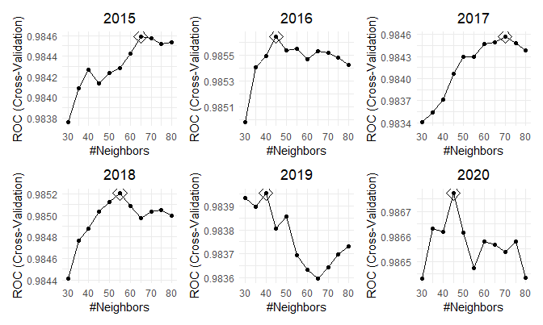

``` r
plot_mars = map(.x = c(1:6), ~ggplot(mods_df$mod_mars[[.x]], highlight = T) + theme(plot.title = element_text(hjust = 0.5)))

(plot_mars[[1]] + labs(title = "2015")) + (plot_mars[[2]] + labs(title = "2016")) + (plot_mars[[3]] + labs(title = "2017")) + (plot_mars[[4]] + labs(title = "2018")) + (plot_mars[[5]] + labs(title = "2019")) + (plot_mars[[6]] + labs(title = "2020"))
```

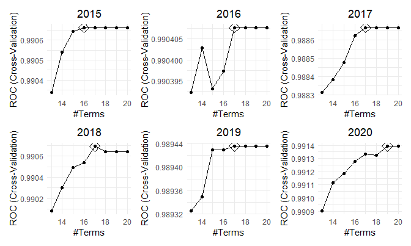

``` r
res = map(.x = c(1:6), ~resamples(list(GLM = mods_df$mod_glm[[.x]], MARS = mods_df$mod_mars[[.x]], KNN = mods_df$mod_knn[[.x]])))

bwplot(res[[1]], metric = "ROC", main = "2015")
```

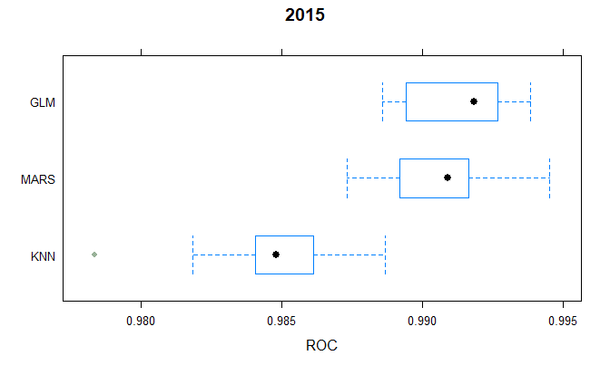

``` r
bwplot(res[[2]], metric = "ROC", main = "2016")
```

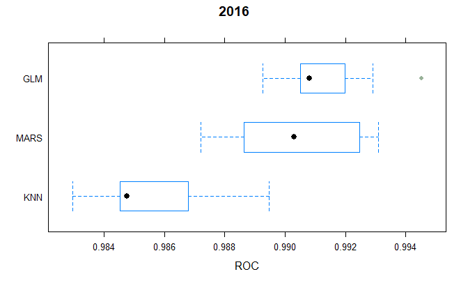

``` r
bwplot(res[[3]], metric = "ROC", main = "2017")
```

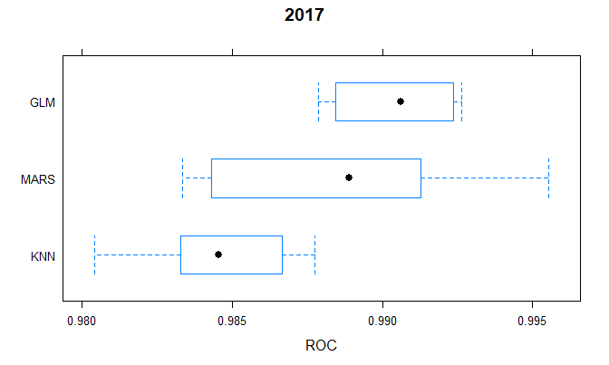

``` r
bwplot(res[[4]], metric = "ROC", main = "2018")
```

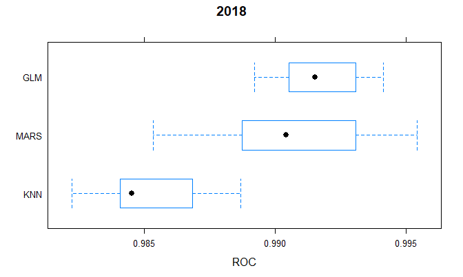

``` r
bwplot(res[[5]], metric = "ROC", main = "2019")
```

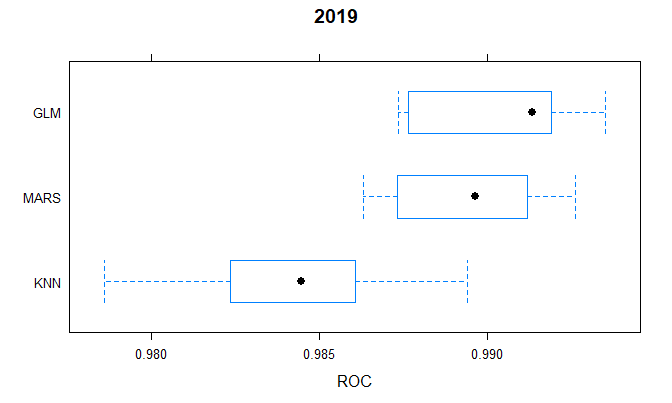

``` r
bwplot(res[[6]], metric = "ROC", main = "2020")
```

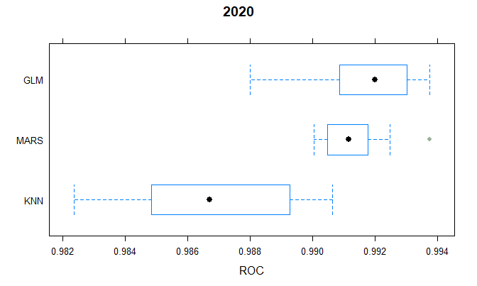

  - 10-fold CV determined that the GLM using logistic regression is the
    best model to use.

  - Now, we test the GLM model for each season, excluding 2020 since
    that will be used for the Tournament predictions.

<!-- end list -->

``` r
pred_df = 
  mods_df %>% 
  filter(Year < 2020) %>% 
  dplyr::select(-mod_mars, -mod_knn) %>% 
  mutate(pred = map2(.x = mod_glm, .y = test, ~predict(.x, .y, type = "prob")[, 2])) %>% 
  unnest(test, pred) %>% 
  dplyr::select(Season, outcome, pred)
```

    ## Warning: unnest() has a new interface. See ?unnest for details.
    ## Try `df %>% unnest(c(test, pred))`, with `mutate()` if needed

``` r
plot(roc(pred_df$outcome, pred_df$pred), legacy.axes = TRUE, print.auc = TRUE)
```

    ## Setting levels: control = loss, case = win

    ## Setting direction: controls < cases

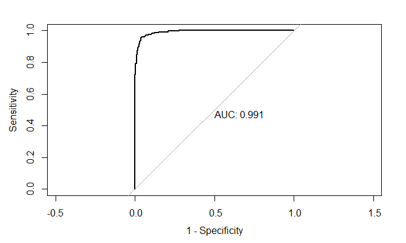

  - The AUC of the ROC using the logisitic regression model is
    **0.991**, suggesting that this model does a great job of predicting
    outcomes.

  - Now, let’s

<!-- end list -->

``` r
team_df = 
  read_csv("./data/MTeams.csv") %>% 
  mutate(TeamID = as.factor(TeamID), 
         TeamName = as.factor(TeamName))
```

    ## Parsed with column specification:
    ## cols(
    ##   TeamID = col_double(),
    ##   TeamName = col_character(),
    ##   FirstD1Season = col_double(),
    ##   LastD1Season = col_double()
    ## )

``` r
reg2020 = 
  regszn_df[[6]] %>% 
  left_join(team_df) %>% 
  select(Season, TeamID, TeamName, OR:ft_pct)
```

    ## Joining, by = "TeamID"

``` r
model = mods_df$mod_glm[[6]]
summary(model)
```

    ## 
    ## Call:
    ## NULL
    ## 
    ## Deviance Residuals: 
    ##    Min      1Q  Median      3Q     Max  
    ## -3.349  -0.056   0.000   0.056   3.349  
    ## 
    ## Coefficients:
    ##               Estimate Std. Error z value Pr(>|z|)    
    ## (Intercept)  3.063e-16  5.221e-02   0.000     1.00    
    ## OR_diff      3.817e-01  1.866e-02  20.461  < 2e-16 ***
    ## DR_diff      2.009e-01  2.535e-02   7.925 2.27e-15 ***
    ## Ast_diff     1.515e-01  1.254e-02  12.080  < 2e-16 ***
    ## TO_diff     -6.027e-01  2.645e-02 -22.790  < 2e-16 ***
    ## Stl_diff     2.927e-02  1.983e-02   1.476     0.14    
    ## Blk_diff     1.057e-01  1.963e-02   5.385 7.24e-08 ***
    ## PF_diff     -3.108e-01  1.394e-02 -22.300  < 2e-16 ***
    ## FGpct_diff   4.762e+01  2.058e+00  23.140  < 2e-16 ***
    ## FG3pct_diff  1.231e+01  5.279e-01  23.327  < 2e-16 ***
    ## FTpct_diff   8.210e+00  4.403e-01  18.644  < 2e-16 ***
    ## ---
    ## Signif. codes:  0 '***' 0.001 '**' 0.01 '*' 0.05 '.' 0.1 ' ' 1
    ## 
    ## (Dispersion parameter for binomial family taken to be 1)
    ## 
    ##     Null deviance: 14764.0  on 10649  degrees of freedom
    ## Residual deviance:  2459.5  on 10639  degrees of freedom
    ## AIC: 2481.5
    ## 
    ## Number of Fisher Scoring iterations: 8

``` r
matchup = function(Team1, Team2) {
  
  t1_df = 
    reg2020 %>% 
    filter(TeamID %in% c(Team1, Team2))

  t2_df = 
    reg2020 %>% 
    filter(TeamID %in% c(Team1, Team2)) %>% 
    arrange(desc(TeamID)) %>% 
    select(OR:ft_pct) %>% 
    rename_all(~paste0("opp", .x))
  
  test2020 = 
    t1_df %>% 
    cbind(t2_df) %>% 
    as_tibble() %>%
    mutate(
      OR_diff = OR - oppOR,
      DR_diff = DR - oppDR,
      Ast_diff = Ast - oppAst,
      TO_diff = TO - oppTO,
      Stl_diff = Stl - oppStl,
      Blk_diff = Blk - oppBlk,
      PF_diff = PF - oppPF,
      FGpct_diff = fg_pct - oppfg_pct,
      FG3pct_diff = fg3_pct - oppfg3_pct,
      FTpct_diff = ft_pct - oppft_pct
    ) %>% 
    select(Season, TeamID, OR_diff:FTpct_diff)
  
  win_prob = predict(model, test2020, type = "prob")[1, 2]
  
 if (Team1 < Team2) {if (win_prob > 0.5) {
    print(Team1) 
  } else {
    print(Team2)
  }} else {if (win_prob > 0.5) {
    print(Team2) 
  } else {
    print(Team1)
  }}
  
}
```

  - For the first four play-in games:

<!-- end list -->

``` r
reg2020 %>% 
  filter(TeamName %in% 
           c("Norfolk St", "Wichita St", "TX Southern", "UCLA", "Michigan St", "Drake", "Appalachian St", "Mt St Mary's")) %>% 
  select(TeamName, TeamID)

matchup(1111, 1313)
matchup(1111, 1313)
matchup(1111, 1313)
matchup(1111, 1313)
```

  - Now, to create the 4 regions and seed all the teams:

<!-- end list -->

``` r
seed2020 = 
  read_csv("./data/MNCAATourneySeeds.csv") %>% 
  filter(Season == "2021") %>% 
  select(-Season) %>% 
  mutate(TeamID = as.factor(TeamID)) %>% 
  left_join(reg2020) %>% 
  mutate(Region = as.factor(case_when(
    str_detect(Seed, "^W") ~ "East", 
    str_detect(Seed, "^X") ~ "West", 
    str_detect(Seed, "^Y") ~ "Midwest", 
    str_detect(Seed, "^Z") ~ "South"))) %>% 
  separate(Seed, c(NA, "Seed"), sep = "[W-Z]") %>% 
  filter(TeamName %nin% c("Norfolk St", "Wichita St", "TX Southern", "UCLA")) %>%
  mutate(Seed = as.numeric(str_remove(Seed, "[ab]"))) %>% 
  mutate(TeamID = as.character(TeamID), 
         TeamID = as.numeric(TeamID))
```

    ## Parsed with column specification:
    ## cols(
    ##   Season = col_double(),
    ##   Seed = col_character(),
    ##   TeamID = col_double()
    ## )

    ## Joining, by = "TeamID"

``` r
East = 
  seed2020 %>% 
  filter(Region == "East")
West = 
  seed2020 %>% 
  filter(Region == "West")
Midwest = 
  seed2020 %>% 
  filter(Region == "Midwest")
South = 
  seed2020 %>% 
  filter(Region == "South")
```

  - Simulate tournament by regions, using self-created `region_sim()`
    function:

<!-- end list -->

``` r
region_sim = function(region) {
  
  r1 = region %>% 
    filter(Seed %in% c(1, 16)) %>% 
    arrange(TeamID) %>% 
    pull(TeamID)
  
  r2 = region %>% 
    filter(Seed %in% c(2, 15)) %>% 
    arrange(TeamID) %>% 
    pull(TeamID)
  
  r3 = region %>% 
    filter(Seed %in% c(3, 14)) %>% 
    arrange(TeamID) %>% 
    pull(TeamID)
  
  r4 = region %>% 
    filter(Seed %in% c(4, 13)) %>% 
    arrange(TeamID) %>% 
    pull(TeamID)
  
  r5 = region %>% 
    filter(Seed %in% c(5, 12)) %>% 
    arrange(TeamID) %>% 
    pull(TeamID)
  
  r6 = region %>% 
    filter(Seed %in% c(6, 11)) %>% 
    arrange(TeamID) %>% 
    pull(TeamID)
  
  r7 = region %>% 
    filter(Seed %in% c(7, 10)) %>% 
    arrange(TeamID) %>% 
    pull(TeamID)
  
  r8 = region %>% 
    filter(Seed %in% c(8, 9)) %>% 
    arrange(TeamID) %>% 
    pull(TeamID)

  res1 = matchup(r1[1], r1[2])
  res2 = matchup(r2[1], r2[2])
  res3 = matchup(r3[1], r3[2])
  res4 = matchup(r4[1], r4[2])
  res5 = matchup(r5[1], r5[2])
  res6 = matchup(r6[1], r6[2])
  res7 = matchup(r7[1], r7[2])
  res8 = matchup(r8[1], r8[2])
  
  quart1 = matchup(res1, res8)
  quart2 = matchup(res2, res7)
  quart3 = matchup(res3, res6)
  quart4 = matchup(res4, res5)
  
  sem1 = matchup(quart1, quart4)
  sem2 = matchup(quart2, quart3)
  
  fin1 = matchup(sem1, sem2)
  
  rd1 = c(res1, res2, res3, res4, res5, res6, res7, res8) %>% 
    as_tibble() %>% 
    rename(TeamID = value) %>% 
    mutate(TeamID = as.factor(TeamID)) %>% 
    left_join(mutate(seed2020, TeamID = as.factor(TeamID))) %>% 
    dplyr::select(TeamID, Seed, TeamName)
  
  quart = c(quart1, quart2, quart3, quart4) %>% 
    as_tibble() %>% 
    rename(TeamID = value) %>% 
    mutate(TeamID = as.factor(TeamID)) %>% 
    left_join(mutate(seed2020, TeamID = as.factor(TeamID))) %>% 
    dplyr::select(TeamID, Seed, TeamName)
  
  sem = c(sem1, sem2) %>% 
    as_tibble() %>% 
    rename(TeamID = value) %>% 
    mutate(TeamID = as.factor(TeamID)) %>% 
    left_join(mutate(seed2020, TeamID = as.factor(TeamID))) %>% 
    dplyr::select(TeamID, Seed, TeamName)
  
  fin = c(fin1) %>% 
    as_tibble() %>% 
    rename(TeamID = value) %>% 
    mutate(TeamID = as.factor(TeamID)) %>% 
    left_join(mutate(seed2020, TeamID = as.factor(TeamID))) %>% 
    dplyr::select(TeamID, Seed, TeamName)

  rbind(rd1, quart, sem, fin)
  
}

region_sim(East)
```

    ## [1] 1276
    ## [1] 1104
    ## [1] 1400
    ## [1] 1199
    ## [1] 1207
    ## [1] 1140
    ## [1] 1268
    ## [1] 1261
    ## [1] 1261
    ## [1] 1268
    ## [1] 1140
    ## [1] 1207
    ## [1] 1261
    ## [1] 1140
    ## [1] 1140

    ## Joining, by = "TeamID"
    ## Joining, by = "TeamID"
    ## Joining, by = "TeamID"
    ## Joining, by = "TeamID"

    ## # A tibble: 15 x 3
    ##    TeamID  Seed TeamName  
    ##    <fct>  <dbl> <fct>     
    ##  1 1276       1 Michigan  
    ##  2 1104       2 Alabama   
    ##  3 1400       3 Texas     
    ##  4 1199       4 Florida St
    ##  5 1207      12 Georgetown
    ##  6 1140       6 BYU       
    ##  7 1268      10 Maryland  
    ##  8 1261       8 LSU       
    ##  9 1261       8 LSU       
    ## 10 1268      10 Maryland  
    ## 11 1140       6 BYU       
    ## 12 1207      12 Georgetown
    ## 13 1261       8 LSU       
    ## 14 1140       6 BYU       
    ## 15 1140       6 BYU

``` r
region_sim(West)
```

    ## [1] 1211
    ## [1] 1234
    ## [1] 1242
    ## [1] 1325
    ## [1] 1166
    ## [1] 1179
    ## [1] 1332
    ## [1] 1328
    ## [1] 1211
    ## [1] 1332
    ## [1] 1242
    ## [1] 1166
    ## [1] 1211
    ## [1] 1242
    ## [1] 1211

    ## Joining, by = "TeamID"
    ## Joining, by = "TeamID"
    ## Joining, by = "TeamID"
    ## Joining, by = "TeamID"

    ## # A tibble: 15 x 3
    ##    TeamID  Seed TeamName 
    ##    <fct>  <dbl> <fct>    
    ##  1 1211       1 Gonzaga  
    ##  2 1234       2 Iowa     
    ##  3 1242       3 Kansas   
    ##  4 1325      13 Ohio     
    ##  5 1166       5 Creighton
    ##  6 1179      11 Drake    
    ##  7 1332       7 Oregon   
    ##  8 1328       8 Oklahoma 
    ##  9 1211       1 Gonzaga  
    ## 10 1332       7 Oregon   
    ## 11 1242       3 Kansas   
    ## 12 1166       5 Creighton
    ## 13 1211       1 Gonzaga  
    ## 14 1242       3 Kansas   
    ## 15 1211       1 Gonzaga

``` r
region_sim(Midwest)
```

    ## [1] 1228
    ## [1] 1222
    ## [1] 1452
    ## [1] 1251
    ## [1] 1333
    ## [1] 1361
    ## [1] 1353
    ## [1] 1260
    ## [1] 1260
    ## [1] 1222
    ## [1] 1361
    ## [1] 1251
    ## [1] 1251
    ## [1] 1361
    ## [1] 1251

    ## Joining, by = "TeamID"
    ## Joining, by = "TeamID"
    ## Joining, by = "TeamID"
    ## Joining, by = "TeamID"

    ## # A tibble: 15 x 3
    ##    TeamID  Seed TeamName      
    ##    <fct>  <dbl> <fct>         
    ##  1 1228       1 Illinois      
    ##  2 1222       2 Houston       
    ##  3 1452       3 West Virginia 
    ##  4 1251      13 Liberty       
    ##  5 1333      12 Oregon St     
    ##  6 1361       6 San Diego St  
    ##  7 1353      10 Rutgers       
    ##  8 1260       8 Loyola-Chicago
    ##  9 1260       8 Loyola-Chicago
    ## 10 1222       2 Houston       
    ## 11 1361       6 San Diego St  
    ## 12 1251      13 Liberty       
    ## 13 1251      13 Liberty       
    ## 14 1361       6 San Diego St  
    ## 15 1251      13 Liberty

``` r
region_sim(South)
```

    ## [1] 1124
    ## [1] 1331
    ## [1] 1159
    ## [1] 1317
    ## [1] 1437
    ## [1] 1429
    ## [1] 1196
    ## [1] 1458
    ## [1] 1458
    ## [1] 1331
    ## [1] 1159
    ## [1] 1437
    ## [1] 1437
    ## [1] 1159
    ## [1] 1159

    ## Joining, by = "TeamID"
    ## Joining, by = "TeamID"
    ## Joining, by = "TeamID"
    ## Joining, by = "TeamID"

    ## # A tibble: 15 x 3
    ##    TeamID  Seed TeamName    
    ##    <fct>  <dbl> <fct>       
    ##  1 1124       1 Baylor      
    ##  2 1331      15 Oral Roberts
    ##  3 1159      14 Colgate     
    ##  4 1317      13 North Texas 
    ##  5 1437       5 Villanova   
    ##  6 1429      11 Utah St     
    ##  7 1196       7 Florida     
    ##  8 1458       9 Wisconsin   
    ##  9 1458       9 Wisconsin   
    ## 10 1331      15 Oral Roberts
    ## 11 1159      14 Colgate     
    ## 12 1437       5 Villanova   
    ## 13 1437       5 Villanova   
    ## 14 1159      14 Colgate     
    ## 15 1159      14 Colgate

  - Finish tournament by simulating the Final Four, using self-created
    `f4_sim()` function:

<!-- end list -->

``` r
f4_sim = function(regE, regW, regMW, regS){
  
  winEast = region_sim(regE)[[15, 1]] %>% as.character() %>% as.numeric()
  winWest = region_sim(regW)[[15, 1]] %>% as.character() %>% as.numeric()
  winMidwest = region_sim(regMW)[[15, 1]] %>% as.character() %>% as.numeric()
  winSouth = region_sim(regS)[[15, 1]] %>% as.character() %>% as.numeric()
  
  nat_sem1 = matchup(winEast, winWest)
  nat_sem2 = matchup(winMidwest, winSouth)
  
  nat_fin = matchup(nat_sem1, nat_sem2)
  
  nat_sem = c(nat_sem1, nat_sem2) %>% 
    as_tibble() %>% 
    rename(TeamID = value) %>% 
    mutate(TeamID = as.factor(TeamID)) %>% 
    left_join(mutate(seed2020, TeamID = as.factor(TeamID))) %>% 
    dplyr::select(TeamID, Seed, TeamName)
  
  nat_fin = c(nat_fin) %>% 
    as_tibble() %>% 
    rename(TeamID = value) %>% 
    mutate(TeamID = as.factor(TeamID)) %>% 
    left_join(mutate(seed2020, TeamID = as.factor(TeamID))) %>% 
    dplyr::select(TeamID, Seed, TeamName)
  
  rbind(nat_sem, nat_fin)

}

f4_sim(East, West, Midwest, South)
```

    ## [1] 1276
    ## [1] 1104
    ## [1] 1400
    ## [1] 1199
    ## [1] 1207
    ## [1] 1140
    ## [1] 1268
    ## [1] 1261
    ## [1] 1261
    ## [1] 1268
    ## [1] 1140
    ## [1] 1207
    ## [1] 1261
    ## [1] 1140
    ## [1] 1140

    ## Joining, by = "TeamID"
    ## Joining, by = "TeamID"
    ## Joining, by = "TeamID"
    ## Joining, by = "TeamID"

    ## [1] 1211
    ## [1] 1234
    ## [1] 1242
    ## [1] 1325
    ## [1] 1166
    ## [1] 1179
    ## [1] 1332
    ## [1] 1328
    ## [1] 1211
    ## [1] 1332
    ## [1] 1242
    ## [1] 1166
    ## [1] 1211
    ## [1] 1242
    ## [1] 1211

    ## Joining, by = "TeamID"
    ## Joining, by = "TeamID"
    ## Joining, by = "TeamID"
    ## Joining, by = "TeamID"

    ## [1] 1228
    ## [1] 1222
    ## [1] 1452
    ## [1] 1251
    ## [1] 1333
    ## [1] 1361
    ## [1] 1353
    ## [1] 1260
    ## [1] 1260
    ## [1] 1222
    ## [1] 1361
    ## [1] 1251
    ## [1] 1251
    ## [1] 1361
    ## [1] 1251

    ## Joining, by = "TeamID"
    ## Joining, by = "TeamID"
    ## Joining, by = "TeamID"
    ## Joining, by = "TeamID"

    ## [1] 1124
    ## [1] 1331
    ## [1] 1159
    ## [1] 1317
    ## [1] 1437
    ## [1] 1429
    ## [1] 1196
    ## [1] 1458
    ## [1] 1458
    ## [1] 1331
    ## [1] 1159
    ## [1] 1437
    ## [1] 1437
    ## [1] 1159
    ## [1] 1159

    ## Joining, by = "TeamID"
    ## Joining, by = "TeamID"
    ## Joining, by = "TeamID"
    ## Joining, by = "TeamID"

    ## [1] 1211
    ## [1] 1251
    ## [1] 1211

    ## Joining, by = "TeamID"
    ## Joining, by = "TeamID"

    ## # A tibble: 3 x 3
    ##   TeamID  Seed TeamName
    ##   <fct>  <dbl> <fct>   
    ## 1 1211       1 Gonzaga 
    ## 2 1251      13 Liberty 
    ## 3 1211       1 Gonzaga
